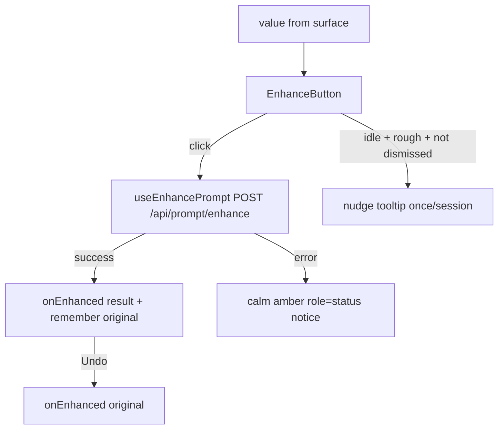

# EnhanceButton.tsx — AI component doc

> AI-facing sidecar for `EnhanceButton.tsx`. Created 2026-07-21. Keep this in sync with the code on every change.

## Purpose
The shared prompt-enhancer affordance: a quiet sparkle icon that lives inside a prompt
field and rewrites a rough draft into one cinematic prompt in a click. One component so
the /create composer and the Cinema shot prompt cannot drift; each surface only passes
the current text + a setter, so there is no duplicated wiring and no cross-module import.

## What it does (for an AI reader)
- Responsibilities: three behaviours on one icon — (1) enhance + one-click Undo,
  (2) a calm floating error notice, (3) an occasional idle nudge tooltip (once per session).
- Public API / exports / props / endpoints: `EnhanceButton` +
  `EnhanceButtonProps = { value: string; onEnhanced: (next: string) => void; className?: string }`;
  also exports `MIN_ENHANCE_LENGTH` and `ENHANCE_NUDGE_IDLE_MS` (tuning constants). Drives
  `POST /api/prompt/enhance` (mode `enhance`) via `useEnhancePrompt`.
- Inputs → Outputs: `value` (current draft) → on click, posts the raw text → `onEnhanced(result)`
  replaces the field; `onEnhanced(original)` on Undo restores it exactly. `[[eN]]` cast
  tokens are never touched (pass-through both directions).
- Side effects (I/O, network, state): the enhance mutation (network); a `setTimeout` idle
  timer for the nudge (cleaned up on value change / unmount); reads+writes the shared
  `useEnhanceNudge` session flag; local `undo` + `showNudge` state.

## Dependencies
- Imports / depends on: `react` (`useEffect`/`useId`/`useState`), `react-i18next`,
  `shared/libs/apiClient` (`ApiClientError`), `shared/model` (`useEnhancePrompt`, `useEnhanceNudge`).
- Used by: `modules/Generator/components/ChatComposer.tsx`,
  `modules/Cinema/components/ShotInspector.tsx`; exported from `shared/ui`.

## Diagram

## Key decisions / gotchas
- Undo visibility is DERIVED (`undo.enhanced === value`), never synced in render: a manual
  edit or an undo makes it false, so the affordance retires without an effect.
- Enhance errors are amber `role="status"` (polite, non-blocking), not red `alert`: a
  key-gated backend being off is not user error (storyboard-not-configured precedent).
- The nudge marks the session flag the instant it SHOWS — "at most once" = one appearance.
  Floating chips are opaque `bg-ridge` (menu material, no shadow); enter is CSS
  `@starting-style` gated by `motion-safe:` so reduced-motion gets no motion.
- Icon is `size-8` (dense in-field chrome scale), swapping sparkle↔spinner in the same
  box so the pending state causes no layout shift.

## Commits
- _no commit yet_
