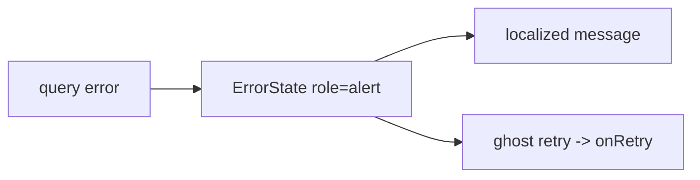

# ErrorState.tsx — AI component doc

> AI-facing sidecar for `ErrorState.tsx`. Created 2026-07-06. Keep this in sync with the code on every change.

## Purpose
Error state for failed data loads/actions (4-states rule), in the v3 "Bioluminescent Terminal" voice: a calm white/10 hairline frame on the void with an amber ghost "Try again" — deliberately NOT red-primary panic styling (frontend-error-ux).

## What it does (for an AI reader)
- Responsibilities: announce the failure (`role="alert"`), show a user-safe localized message, optionally render the localized retry button.
- Public API / exports / props / endpoints: `ErrorState`, `ErrorStateProps` = `{ message: string; onRetry?: (() => void) | undefined }`.
- Inputs → Outputs: already-localized message (+ optional callback) → alert frame; no `onRetry` → no button.
- Side effects: none (retry is the caller's callback).

## Dependencies
- Imports / depends on: `react-i18next` (`common.retry` label), `./Button` (ghost variant).
- Used by: Gallery/Generator/Credits/pricing data surfaces; composable inside `Modal role="alertdialog"` for blocking failures (design.md error-UX contract).

## Diagram

## Key decisions / gotchas
- `message` must already be localized and user-safe — NEVER raw backend/exception text (copy rule, design.md).
- v3 restyle intent: `border-white/10 rounded-lg` frame on the void matching EmptyState; the retry stays the quiet ghost pill — now the AMBER specimen tint (ghost variant), which also reads as "in-between/attention" in the triad. The RED triad is reserved for failure STATUS (failed cards, destructive buttons), never for the recovery surface — recovery must feel calm. Roles/behavior unchanged (tests query by role/name).

## Commits
- 51d80a6 2026-07-06 feat(web): paper&ink design system, shared ui kit, error-ux surfaces
- 3305c12 2026-07-07 restyle(web): editorial design system — tokens, fonts, ui kit
- 252ab38 2026-07-07 restyle(web): terminal design system — cosmic void tokens, jetbrains mono, specimen pills + docs
