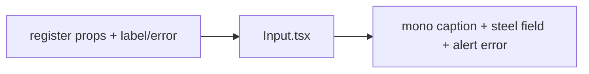

# Input.tsx — AI component doc

> AI-facing sidecar for `Input.tsx`. Created 2026-07-06. Keep this in sync with the code on every change.

## Purpose
Labelled text input in the v3 "Bioluminescent Terminal" style: a filled field on the steel surface (`bg-steel`, 8px radius, white/10 hairline) under a quiet lowercase mono caption. RHF-ready via ref-as-prop.

## What it does (for an AI reader)
- Responsibilities: visible label (never placeholder-only), auto-wired ids (`useId`), `aria-invalid` + `aria-describedby` + `role="alert"` error message, surface-step focus/error styling.
- Public API / exports / props / endpoints: `Input`, `InputProps` = `{ label: string; error?: string | undefined }` + all native input props incl. `ref` (react-hook-form `register()` spreads straight in).
- Inputs → Outputs: props → `<label> + <input> + optional error `.
- Side effects: none.

## Dependencies
- Imports / depends on: `react` (`useId`); tokens via utilities (`bg-steel`, `border-white/10`, `focus-visible:border-portal`, `border-glow-red`, `text-glow-red`, `text-mist-dim`).
- Used by: `modules/Auth/AuthForm` (email/password); any future form field.

## Diagram

## Key decisions / gotchas
- v3 restyle intent: the v2 "hairline underline on paper" field made no sense on the void — on a dark theme the field must BE a surface step (`bg-steel`, `rounded-lg` = the 8px card/input radius; pills stay the only rounded-full shape). Focus swaps the white/10 hairline for portal blue — a color-plus-border cue replacing the old vermillion rule (a11y "never remove outlines without a replacement" still satisfied).
- Error state = `border-glow-red` + `text-glow-red` `role="alert"` message; failure never borrows the portal focus color (failure ≠ focus).
- The label lost its uppercase/tracking treatment on purpose: the terminal voice is lowercase mono; accessible names / `getByLabelText` were never affected (uppercase was CSS-only in v2 too).
- `error?: string | undefined` keeps RHF's `errors.x?.message` assignable under `exactOptionalPropertyTypes`.

## Commits
- 51d80a6 2026-07-06 feat(web): paper&ink design system, shared ui kit, error-ux surfaces
- 3305c12 2026-07-07 restyle(web): editorial design system — tokens, fonts, ui kit
- (pending) restyle(web): terminal design system — cosmic void tokens, jetbrains mono, specimen pills + docs
