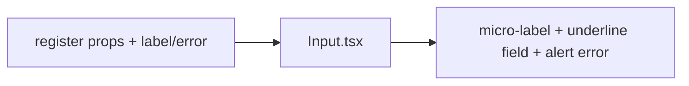

# Input.tsx — AI component doc

> AI-facing sidecar for `Input.tsx`. Created 2026-07-06. Keep this in sync with the code on every change.

## Purpose
Labelled text input in the editorial "hairline underline" style (v2): no box — an uppercase micro-label over a transparent field with a single 1px rule that turns vermillion (and visually 2px) on focus. RHF-ready via ref-as-prop.

## What it does (for an AI reader)
- Responsibilities: visible label (never placeholder-only), auto-wired ids (`useId`), `aria-invalid` + `aria-describedby` + `role="alert"` error message, underline focus/error styling.
- Public API / exports / props / endpoints: `Input`, `InputProps` = `{ label: string; error?: string | undefined }` + all native input props incl. `ref` (react-hook-form `register()` spreads straight in).
- Inputs → Outputs: props → `<label> + <input> + optional error `.
- Side effects: none.

## Dependencies
- Imports / depends on: `react` (`useId`); tokens via utilities (`border-ink/30`, `focus-visible:border-vermillion`, `border-danger`, `text-danger`).
- Used by: `modules/Auth/AuthForm` (email/password); any future form field.

## Diagram

## Key decisions / gotchas
- Focus indicator = underline recolors vermillion AND gains 1px via `shadow-[0_1px_0_0_var(--color-vermillion)]` — no layout shift, and a stronger-than-color-only cue (replaces the old focus ring; a11y rule "never remove outlines without a replacement" is satisfied by the thickened rule).
- Error state keeps the danger-red rule + `role="alert"` message; failure never borrows the vermillion accent.
- The uppercase label is CSS `text-transform` only — DOM text (and therefore accessible names / `getByLabelText`) is unchanged.
- `error?: string | undefined` keeps RHF's `errors.x?.message` assignable under `exactOptionalPropertyTypes`.

## Commits
- 51d80a6 2026-07-06 feat(web): paper&ink design system, shared ui kit, error-ux surfaces
- 3305c12 2026-07-07 restyle(web): editorial design system — tokens, fonts, ui kit
