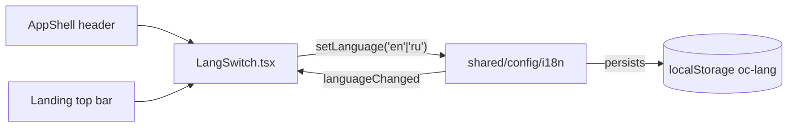

# LangSwitch.tsx — AI component doc

> AI-facing sidecar for `LangSwitch.tsx`. Created 2026-07-06. Keep this in sync with the code on every change.

## Purpose
Compact EN/RU language toggle for the "Paper & Ink" kit — the only UI surface
that switches the app locale, always through `setLanguage` from
`shared/config/i18n` so persistence and `<html lang>` sync stay in one place.

## What it does (for an AI reader)
- Responsibilities: render one `aria-pressed` toggle pill per supported locale
  (`en`, `ru`) inside a labelled `role="group"`; report clicks to `setLanguage`.
- Public API / exports / props / endpoints: `LangSwitch` (no props).
- Inputs → Outputs: `i18n.resolvedLanguage` (anything not `ru` counts as `en`,
  mirroring `fallbackLng`) → pill group JSX with the active pill highlighted.
- Side effects (I/O, network, state): none of its own — `setLanguage` performs
  the localStorage write + i18next `changeLanguage`; re-render arrives via
  react-i18next's language-change signal.

## Dependencies
- Imports / depends on: `react-i18next` (`useTranslation`), `shared/config/i18n` (`setLanguage`).
- Used by: `shared/ui/AppShell.tsx` (header) and `modules/Landing` landing top
  bar — the 2+ consumers that justified promotion to `shared/ui` (design.md §9).

## Diagram

## Key decisions / gotchas
- Stateless by design: the active pill derives from `i18n.resolvedLanguage`, so
  a language change made anywhere else keeps every LangSwitch instance in sync.
- The e2e contract (plan Task 21) clicks this switch on the LANDING page — that
  is why it lives in `shared/ui`, not inside AppShell.
- v3 terminal restyle intent: white/10 hairline pill container (transparent —
  sits on whatever surface hosts it); the ACTIVE locale is a `bg-ridge text-white`
  mini-pill — a LIT SEGMENT one surface step up, because v3 bans solid brand
  fills and the surface ladder carries state instead. White on ridge keeps AA
  contrast at 12px. `aria-pressed`/labels unchanged.

## Commits
- 01c29ab 2026-07-06 feat(web): app shell with nav, balance, language switch
- 3305c12 2026-07-07 restyle(web): editorial design system — tokens, fonts, ui kit
- 252ab38 2026-07-07 restyle(web): terminal design system — cosmic void tokens, jetbrains mono, specimen pills + docs
