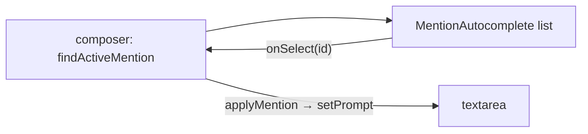

# MentionAutocomplete.tsx — AI component doc

> AI-facing sidecar for `shared/ui/MentionAutocomplete.tsx`. Created 2026-07-23; moved out of `modules/Generator` 2026-07-24. Keep this in sync with the code on every change.

## Purpose
The inline `@` mention popup for ANY composer: renders the list of taggable items (thumbnail + name) that matches the current `@query`, so the user can pick one and let the composer splice an opaque token into the prompt. Purely presentational.

## What it does (for an AI reader)
- Responsibilities: render a `listbox` of options (each = picture thumbnail or initial + name), highlight the active row, report select/hover intent.
- Public API / exports:
  - `type MentionItem = { id, name, imageUrl? }`.
  - `MentionAutocomplete({ items, activeIndex, label, emptyText, className?, onSelect, onHover })`.
- Inputs → Outputs: filtered items + activeIndex → rendered options; `onSelect(id)` / `onHover(index)` callbacks.
- Side effects: none (caret math + open/close live in the consuming composer).

## Dependencies
- Imports / depends on: `./surfaces` (`STEEL_SURFACE`) — internal relative import, no i18n.
- Used by: `modules/Generator/components/ChatComposer.tsx` (/create composer) and `modules/Cinema/components/ShotInspector.tsx` (shot composer) — both render it while an `@query` is active.

## Diagram

## Key decisions / gotchas
- MOVED to shared/ui (2026-07-24) because the Cinema shot composer grew the same inline `@` picker and modules may not import each other — one popup, two composers, zero drift.
- Strings (`label`, `emptyText`) are PROPS: the kit owns no locale keys; each composer passes its own namespace (`generator.mention.*` / `cinema.mention.*`).
- The ANCHOR is a `className` prop (default = the /create arrangement `absolute bottom-full left-0 z-20 mb-2`, opening UPWARD off a bottom dock); Cinema passes its own anchor over its tall prompt plate.
- `STEEL_SURFACE` (opaque), not glass — names must stay readable over media behind it.
- Options use `onMouseDown` + `preventDefault`, NOT `onClick` — selecting must not blur the textarea first (the caret we splice into would be lost).
- Thumbnail = the item's picture (an entity's primary reference image, or an attached shot photo); falls back to the name's initial.

## Commits
- _no commit yet_
