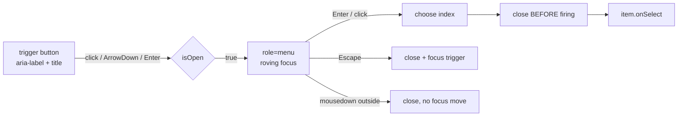

# Menu.tsx — AI component doc

> AI-facing sidecar for `Menu.tsx`. Created 2026-07-08. Keep this in sync with the code on every change.

## Purpose

The kit's **action menu**: a caller-supplied trigger plus a popup of labelled,
icon-led items. Deliberately distinct from `Select` — a Select CHOOSES a value
and keeps it, a Menu FIRES an action and forgets. Conflating them is how
"delete" ends up looking like a selected option.

In practice it is also the primitive behind the **chip-dropdown** pattern
(design.md §13.3): a set-once property renders its options as menu items with a
leading check on the active one — a "choose" wearing menu clothes, sharing the
single popup implementation.

## What it does (for an AI reader)

- Responsibilities: open/close state, the WAI-ARIA menu-button keyboard contract
  (Arrows move, Enter/Space activate, Escape closes + restores focus, Tab closes
  and leaves, Home/End jump), roving DOM focus, click-outside close, and hiding
  (never disabling) actions that cannot apply.
- Public API / props:
  - `label: string` — accessible name for BOTH the trigger and the popup.
  - `items: MenuItem[]` — `{ id, label, icon?, variant?: 'default' | 'danger',
    onSelect, isAvailable? }`. `id` is the React key (never the index).
  - `children: ReactNode` — the trigger's visible content (usually an icon).
  - `align?: 'start' | 'end'` — which horizontal edge the popup aligns to.
  - `triggerClassName?: string` — the trigger's classes (the kit gives it none).
  - `title?: string` — native hover tooltip on the trigger (see the update below).
- Inputs → Outputs: user intent → the chosen item's `onSelect()`. Renders `null`
  when every item is unavailable.
- Side effects: two `useEffect`s bound to `isOpen` — roving focus into the active
  item, and a `document` mousedown listener for click-outside (both cleaned up).

## Dependencies

- Imports: React only (`useEffect`, `useId`, `useRef`, `useState`). No portal —
  the popup is absolutely positioned inside a `relative` wrapper.
- Used by: `CinemaEditorHeader` (`AspectChip` — the FILM canvas ratio),
  `PresetPickers` (the shot's style + per-shot aspect icon chips), and any
  surface needing an overflow `⋯` cluster. Exported via `shared/ui/index.ts`.

## Diagram

## Key decisions / gotchas

- **Close BEFORE firing `onSelect`.** A handler may open a `Modal`, and Modal
  captures `document.activeElement` to restore focus later — if the menu were
  still open, that capture would point at a button about to unmount.
- **Roving focus, not `aria-activedescendant`.** Menu items are individually
  focusable buttons (unlike listbox options), so DOM focus moves.
- **Unavailable ≠ disabled.** `isAvailable: false` removes the row entirely: an
  action that cannot apply must not sit there looking disabled and mysterious.
- **Opaque steel popup, never glass.** It floats over user media, where a
  translucent surface makes labels unreadable.
- The popup opens DOWNWARD (`top-full`) and is capped at `max-h-[22rem]` with its
  own scroller — the same height the kit's `Select` popup uses. A menu of ACTIONS
  is always short, but the same popup now backs value lists the user can grow
  without limit (their own styles in the composer's style chip), and an uncapped
  panel runs past the bottom of whatever scroll container holds it (the shot
  composer's drawer is `max-h-[40svh] overflow-y-auto`). Roving focus scrolls the
  active item into view for free.

## Update 2026-08-02 — `title` on the trigger

One optional prop, `title`, forwarded to the trigger button. Purely additive —
every existing call site is unchanged. It exists because the composer's new style
and per-shot-aspect chips are **icon-only**: `aria-label` names them for
assistive tech, but a pointer user sees a bare glyph. The tooltip is where "what
this control does, and what it is set to right now" gets said. Do not use it to
duplicate a trigger's already-visible text.

## Commits
- _no commit yet_
