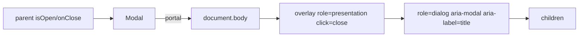

# Modal.tsx — AI component doc

> AI-facing sidecar for `Modal.tsx`. Created 2026-07-06. Keep this in sync with the code on every change.

## Purpose

The design-system modal dialog: portal render, Escape + overlay close, body scroll
lock, focus restore. With `role="alertdialog"` it is the project's blocking
error-modal pattern (frontend-error-ux).

## What it does (for an AI reader)

- Responsibilities: controlled dialog rendering into `document.body`; keyboard (Escape)
  and overlay dismissal; focus management (move in on open, restore on close); page
  scroll lock while open.
- Public API / exports / props / endpoints: `Modal({ isOpen, onClose, title, children, role? })`,
  `ModalProps`; `role: 'dialog' | 'alertdialog'` (default `dialog`).
- Inputs → Outputs: `isOpen=false` → renders nothing; open → overlay + labelled dialog
  with heading, close button (localized aria-label), and `children`.
- Side effects (I/O, network, state): document listeners (keydown), `body.style.overflow`
  mutation, focus moves — all cleaned up on close/unmount.

## Dependencies

- Imports / depends on: `react` (useEffect/useRef), `react-dom` (createPortal),
  `react-i18next` (close-button label).
- Used by: `modules/Credits/components/TransactionsList.tsx`; the blocking-error-modal
  pattern for future failures needing acknowledgement (design.md §8).

## Diagram

## Key decisions / gotchas

- FIXED 2026-07-06 (Task 15): the overlay previously had `aria-hidden="true"`, which
  removed the ENTIRE dialog inside it from the accessibility tree (screen readers and
  role queries could not see it). The overlay is now `role="presentation"` — it stays
  semantically invisible while the dialog remains exposed.
- Clicks inside the dialog call `stopPropagation()` so they never reach the overlay's
  close handler.
- Focus restore uses the element that was active before opening (`previousFocusRef`).

## Commits

- 51d80a6 2026-07-06 feat(web): paper&ink design system, shared ui kit, error-ux surfaces
