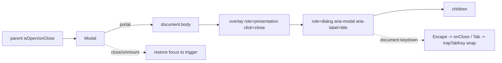

# Modal.tsx — AI component doc

> AI-facing sidecar for `Modal.tsx`. Created 2026-07-06. Keep this in sync with the code on every change.

## Purpose

The design-system modal dialog: portal render, dependency-free FOCUS TRAP
(Tab/Shift+Tab cycle inside the dialog), Escape + overlay close, body scroll
lock, focus restore to the trigger. With `role="alertdialog"` it is the
project's blocking error-modal pattern (frontend-error-ux) and the
destructive-confirm pattern (gallery delete).

## What it does (for an AI reader)

- Responsibilities: controlled dialog rendering into `document.body`; keyboard (Escape)
  and overlay dismissal; focus management (move in on open, TRAP while open, restore to
  the trigger on close); page scroll lock while open.
- Public API / exports / props / endpoints: `Modal({ isOpen, onClose, title, children, role? })`,
  `ModalProps`; `role: 'dialog' | 'alertdialog'` (default `dialog`).
- Inputs → Outputs: `isOpen=false` → renders nothing; open → overlay + labelled dialog
  with heading, close button (localized aria-label), and `children`. While open: Tab on
  the last focusable wraps to the first, Shift+Tab on the first wraps to the last, focus
  landing outside (or on the dialog shell) is pulled back to the boundary element;
  Escape → `onClose`; close/unmount → focus returns to the pre-open active element.
- Side effects (I/O, network, state): document keydown listener (Escape + Tab trap),
  `body.style.overflow` mutation, focus moves — all cleaned up on close/unmount.

## Dependencies

- Imports / depends on: `react` (useEffect/useRef), `react-dom` (createPortal),
  `react-i18next` (close-button label). The trap is dependency-free — no focus-trap lib.
- Used by: `modules/Credits/components/TransactionsList.tsx`,
  `modules/Gallery/components/GenerationDetail.tsx`, the gallery delete confirmation
  (`GenerationCard.tsx`, `role="alertdialog"`); the blocking-error-modal pattern for
  failures needing acknowledgement (design.md §9).

## Diagram

## Key decisions / gotchas

- FIXED 2026-07-06 (Task 15): the overlay previously had `aria-hidden="true"`, which
  removed the ENTIRE dialog inside it from the accessibility tree (screen readers and
  role queries could not see it). The overlay is now `role="presentation"` — it stays
  semantically invisible while the dialog remains exposed.
- Clicks inside the dialog call `stopPropagation()` so they never reach the overlay's
  close handler.
- Focus restore uses the element that was active before opening (`previousFocusRef`),
  captured BEFORE the dialog steals focus.
- FIXED 2026-07-07 (review finding): the modal previously let Tab walk OUT of the open
  dialog into the page behind it. `trapTabKey` now enumerates the dialog's focusable
  elements AT KEYDOWN TIME (`FOCUSABLE_SELECTOR` incl. `video[controls]`) — so content
  that swaps while open (skeleton → ledger rows in TransactionsList) never leaves the
  trap holding stale nodes — and wraps last→first / first→last; with nothing focusable
  it parks focus on the dialog shell. Dependency-free by design (no focus-trap lib).
- FIXED 2026-07-07 (same commit): `onClose` moved out of the lifecycle effect's deps
  behind `onCloseRef`. Consumers pass fresh inline arrows every render, and the old
  `[isOpen, onClose]` deps re-ran the cleanup on every parent re-render — restoring
  focus to the TRIGGER while the dialog was still open. The lifecycle now keys on
  `isOpen` alone; Escape reads the latest handler through the ref.
- v3 terminal restyle: the sheet is a STEEL surface step (`bg-steel`, 8px `rounded-lg`,
  `border-white/10`) over a `bg-void/70` overlay — elevation is the surface color, so the
  v2 `shadow-lg` is gone (the pill double-shadow is the only allowed shadow app-wide);
  the title is JetBrains Mono weight 400 (`text-2xl font-normal text-white` — headings are
  never bold in v3); the close button is a white/10 hairline circle that steps up to
  `bg-ridge` on hover. Behavior/roles unchanged.

## Commits

- 51d80a6 2026-07-06 feat(web): paper&ink design system, shared ui kit, error-ux surfaces
- da1318e 2026-07-06 feat(web): credits balance chip + transactions modal (overlay aria-hidden → role=presentation a11y fix)
- 252ab38 2026-07-07 restyle(web): terminal design system — cosmic void tokens, jetbrains mono, specimen pills + docs
- 9db4082 2026-07-07 fix(web): modal focus trap + escape/restore
