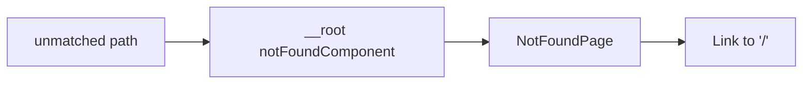

# NotFoundPage.tsx — AI component doc

> AI-facing sidecar for `NotFoundPage.tsx`. Created 2026-07-06. Keep this in sync with the code on every change.

## Purpose
Custom 404 screen — the frontend-error-ux contract's unknown-route surface, in the "Light Editorial" voice: vermillion micro-label stamp ("404"), oversized Fraunces serif headline, one line, one ink-pill action home. Wired as the root route's `notFoundComponent`.

## What it does (for an AI reader)
- Responsibilities: render the 404 marker (decorative, `aria-hidden`), localized title/description (`errors.notFound.*`), and a TanStack `<Link to="/">` styled with the Button-primary classes.
- Public API / exports / props / endpoints: `NotFoundPage` — no props.
- Inputs → Outputs: rendered by the router on any unmatched path → full-screen 404 with a way home.
- Side effects (I/O, network, state): none.

## Dependencies
- Imports / depends on: `@tanstack/react-router` (`Link` — SPA navigation, no full page load), `react-i18next`.
- Used by: `routes/__root.tsx` (`notFoundComponent: NotFoundPage`); exported through `shared/ui/index.ts`.

## Diagram

## Key decisions / gotchas
- Uses `Link` (not `<a>`) because `notFoundComponent` always renders inside `RouterProvider` — tests therefore mount it through a real router at a bad path (`routes/__root.test.tsx`), which also proves the wiring.
- The link intentionally mirrors `Button` primary/md classes — a navigation is a link semantically, but the single main action visually (design.md §5).
- Copy is calm and blame-free per design.md error-UX rules; standalone screens sit directly on the cream canvas.
- v2 editorial restyle: headline moved to `font-display text-5xl/6xl` (serif), the "404" became an uppercase tracked micro-label in vermillion (decorative, aria-hidden), the home link is the ink pill with vermillion hover. i18n keys and roles unchanged.

## Commits
- 51d80a6 2026-07-06 feat(web): paper&ink design system, shared ui kit, error-ux surfaces
- 3305c12 2026-07-07 restyle(web): editorial design system — tokens, fonts, ui kit
