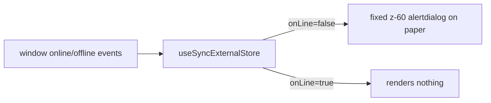

# OfflineOverlay.tsx — AI component doc

> AI-facing sidecar for `OfflineOverlay.tsx`. Created 2026-07-06. Keep this in sync with the code on every change.

## Purpose
Screen-blocking "no internet" overlay — the frontend-error-ux contract's offline surface. Prevents the user from interacting with a dead app while connectivity is gone and clears itself automatically on reconnect.

## What it does (for an AI reader)
- Responsibilities: mirror `navigator.onLine` into React via `useSyncExternalStore` (subscribe = window `online`/`offline` events); render `null` while online; render a fixed full-screen `role="alertdialog"` blocker on paper while offline.
- Public API / exports / props / endpoints: `OfflineOverlay` — no props, fully self-managed.
- Inputs → Outputs: browser connectivity events → blocking overlay (offline) or nothing (online).
- Side effects (I/O, network, state): window event listeners (added/removed by the hook's subscribe contract — no manual cleanup bugs possible).

## Dependencies
- Imports / depends on: `react` (`useSyncExternalStore`), `react-i18next` (`errors.offline.*` copy), design tokens via Tailwind classes.
- Used by: `routes/__root.tsx` (rendered once inside the providers, above `<Outlet />`); exported through `shared/ui/index.ts`.

## Diagram

## Key decisions / gotchas
- `useSyncExternalStore` (not `useState`+`useEffect`): the store IS external (browser connectivity), the hook guarantees subscribe/unsubscribe symmetry and tear-safe reads.
- `z-[60]` deliberately outranks `Modal` (`z-50`) — losing connectivity must block even an open dialog.
- Copy comes from `errors.offline.*` (EN+RU); tests override the read-only `navigator.onLine` getter per test via `Object.defineProperty`.
- `getServerSnapshot` returns `true` (assume online) — required by the hook contract even though the SPA never SSRs.
- v2 editorial restyle: cream canvas + Fraunces serif headline (`font-display text-4xl/5xl`) + one line — no action button, the overlay auto-clears on reconnect. Role/keys unchanged.

## Commits
- 51d80a6 2026-07-06 feat(web): paper&ink design system, shared ui kit, error-ux surfaces
- 3305c12 2026-07-07 restyle(web): editorial design system — tokens, fonts, ui kit
