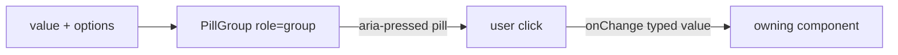

# PillGroup.tsx — AI component doc

> AI-facing sidecar for `PillGroup.tsx`. Created 2026-07-06. Keep this in sync with the code on every change.

## Purpose

Design-system segmented pill selector: a labelled group of toggle buttons with
exactly one selected value. Added to `shared/ui` because 2+ modules need it
(design.md §9 governance rule).

## What it does (for an AI reader)

- Responsibilities: render pills, expose selection via `aria-pressed`, report clicks.
  Fully controlled; no internal state.
- Public API / exports: `PillGroup<T extends string | number>` with
  `PillGroupProps<T> = { label, options: PillOption<T>[], value: T | undefined, onChange(value: T) }`;
  `PillOption<T> = { value: T; label: string }`.
- Inputs → Outputs: options + current value → clicks call `onChange(option.value)` (typed).
- Side effects: none.

## Dependencies

- Imports: none (pure JSX + Tailwind tokens).
- Used by: `modules/Generator` (type toggle, `AspectPicker`, `DurationPicker`),
  `modules/Gallery` (`GalleryFilterChips`).

## Diagram

## Key decisions / gotchas

- Buttons with `aria-pressed` (not radios): no form semantics needed, and tests
  query `role=group` + `role=button` by accessible name.
- The visible caption is `aria-hidden` — the group's `aria-label` is the single
  accessible name (avoids double announcement).
- v3 terminal restyle intent: selected = AMBER specimen tint
  (`bg-specimen-amber/20 text-lumen-amber` + white/10 hairline) — the reference
  taxonomy files picking/exploring under amber, and solid fills are banned;
  unselected = white/10 hairline that steps up to `bg-ridge` on hover (surface
  ladder, not outline drama); caption is a quiet lowercase mono `text-xs
  text-mist-dim`. min-h-10 keeps the 40px hit area.
- `aria-pressed` contract and accessible names unchanged — tests stay green.

## Commits

- 2b7dd54 2026-07-06 feat(web): generator module — prompt, model/aspect/duration, i2v upload, cost
- 3305c12 2026-07-07 restyle(web): editorial design system — tokens, fonts, ui kit
- 252ab38 2026-07-07 restyle(web): terminal design system — cosmic void tokens, jetbrains mono, specimen pills + docs
