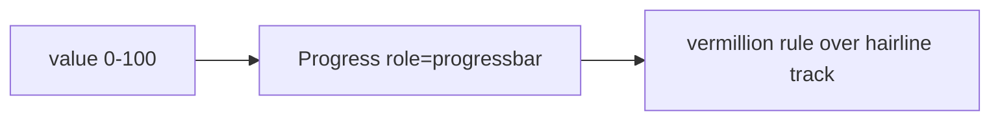

# Progress.tsx — AI component doc

> AI-facing sidecar for `Progress.tsx`. Created 2026-07-06. Keep this in sync with the code on every change.

## Purpose
Determinate progress bar (video generation %) in the "Light Editorial" treatment: a thin square-ended vermillion rule advancing over a hairline ink track — progress is an active state, so it is a sanctioned accent use.

## What it does (for an AI reader)
- Responsibilities: clamp/round `value` to 0–100, expose a proper `role="progressbar"` (`aria-valuenow/min/max`, `aria-label` falling back to localized "Loading"), render the width-animated fill.
- Public API / exports / props / endpoints: `Progress`, `ProgressProps` = `{ value: number; label?: string | undefined }`.
- Inputs → Outputs: percentage → 1.5px-ish rule (`h-1.5 bg-ink/10` track, `bg-vermillion` fill at `width: n%`).
- Side effects: none.

## Dependencies
- Imports / depends on: `react-i18next` (fallback label).
- Used by: `modules/Gallery/GenerationCard` (processing video wells).

## Diagram

## Key decisions / gotchas
- Documented exception to the no-inline-styles rule (design.md governance): the runtime-computed `width: n%` cannot be a static Tailwind utility. No other inline styles allowed.
- v2 restyle: `rounded-full h-2 bg-accent` → square-ended `h-1.5 bg-vermillion` (prints as a rule, not a pill); width transition 200ms.
- Defensive clamp keeps out-of-range backend values from breaking `aria-valuenow`.

## Commits
- 51d80a6 2026-07-06 feat(web): paper&ink design system, shared ui kit, error-ux surfaces
- 3305c12 2026-07-07 restyle(web): editorial design system — tokens, fonts, ui kit
