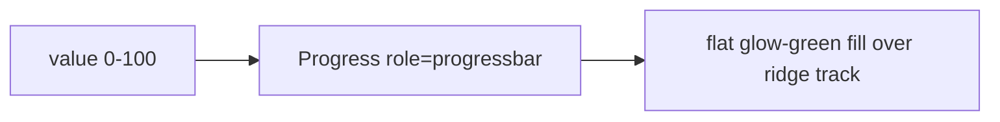

# Progress.tsx — AI component doc

> AI-facing sidecar for `Progress.tsx`. Created 2026-07-06. Keep this in sync with the code on every change.

## Purpose
Determinate progress bar (video generation %) in the v3 "Bioluminescent Terminal" treatment: a thin square-ended FLAT glow-green fill advancing over the ridge surface step — a terminal meter line, no gradient/shine.

## What it does (for an AI reader)
- Responsibilities: clamp/round `value` to 0–100, expose a proper `role="progressbar"` (`aria-valuenow/min/max`, `aria-label` falling back to localized "Loading"), render the width-animated fill.
- Public API / exports / props / endpoints: `Progress`, `ProgressProps` = `{ value: number; label?: string | undefined }`.
- Inputs → Outputs: percentage → thin meter (`h-1.5 bg-ridge` track, `bg-glow-green` fill at `width: n%`).
- Side effects: none.

## Dependencies
- Imports / depends on: `react-i18next` (fallback label).
- Used by: `modules/Gallery/GenerationCard` (processing video wells).

## Diagram

## Key decisions / gotchas
- v3 restyle intent: fill = `#00bc7d` (glow-green — completion trends toward the "succeeded" status color) on the `#314062` ridge track (the elevated surface step doubles as the track so the bar needs no extra border). Ends stay square: v3 allows only pill and 8px radii, and a 6px rule earns neither.
- Documented exception to the no-inline-styles rule (design.md governance): the runtime-computed `width: n%` cannot be a static Tailwind utility. No other inline styles allowed.
- Defensive clamp keeps out-of-range backend values from breaking `aria-valuenow`.

## Commits
- 51d80a6 2026-07-06 feat(web): paper&ink design system, shared ui kit, error-ux surfaces
- 3305c12 2026-07-07 restyle(web): editorial design system — tokens, fonts, ui kit
- 252ab38 2026-07-07 restyle(web): terminal design system — cosmic void tokens, jetbrains mono, specimen pills + docs
