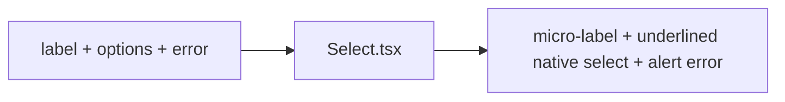

# Select.tsx — AI component doc

> AI-facing sidecar for `Select.tsx`. Created 2026-07-06. Keep this in sync with the code on every change.

## Purpose
Labelled native `<select>` in the editorial "hairline underline" style (v2) — the exact field voice of `Input.tsx` (uppercase micro-label, transparent body, vermillion focus rule), same accessibility contract, RHF-ready.

## What it does (for an AI reader)
- Responsibilities: visible label, auto-wired ids (`useId`), options as native `<option>`s, `aria-invalid` + `aria-describedby` + `role="alert"` error, underline focus/error styling.
- Public API / exports / props / endpoints: `Select`, `SelectProps` = `{ label: string; options: SelectOption[]; error?: string | undefined }` + native select props incl. `ref`; `SelectOption` = `{ value: string; label: string }`.
- Inputs → Outputs: props → `<label> + <select><option/>…</select> + optional error `.
- Side effects: none.

## Dependencies
- Imports / depends on: `react` (`useId`); tokens via utilities (`border-ink/30`, `focus-visible:border-vermillion`, `border-danger`).
- Used by: available to any module form (kept in the kit for parity with Input).

## Diagram

## Key decisions / gotchas
- Mirrors Input.tsx exactly (focus = vermillion rule + 1px box-shadow thickening, error = danger rule) — if one changes, change both.
- Uppercase label is CSS-only; accessible names / `getByLabelText` are unaffected.
- Native select keeps the platform picker (mobile a11y) — no custom dropdown until a real product need exists.

## Commits
- 51d80a6 2026-07-06 feat(web): paper&ink design system, shared ui kit, error-ux surfaces
- (pending) restyle(web): editorial design system — tokens, fonts, ui kit
