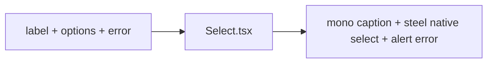

# Select.tsx — AI component doc

> AI-facing sidecar for `Select.tsx`. Created 2026-07-06. Keep this in sync with the code on every change.

## Purpose
Labelled native `<select>` in the v3 "Bioluminescent Terminal" style — the exact field voice of `Input.tsx` (lowercase mono caption, steel filled body, 8px radius, portal focus), same accessibility contract, RHF-ready.

## What it does (for an AI reader)
- Responsibilities: visible label, auto-wired ids (`useId`), options as native `<option>`s, `aria-invalid` + `aria-describedby` + `role="alert"` error, surface-step focus/error styling.
- Public API / exports / props / endpoints: `Select`, `SelectProps` = `{ label: string; options: SelectOption[]; error?: string | undefined }` + native select props incl. `ref`; `SelectOption` = `{ value: string; label: string }`.
- Inputs → Outputs: props → `<label> + <select><option/>…</select> + optional error `.
- Side effects: none.

## Dependencies
- Imports / depends on: `react` (`useId`); tokens via utilities (`bg-steel`, `border-white/10`, `focus-visible:border-portal`, `border-glow-red`, `text-glow-red`, `text-mist-dim`).
- Used by: available to any module form (kept in the kit for parity with Input).

## Diagram

## Key decisions / gotchas
- Mirrors Input.tsx exactly (steel body, focus = portal border, error = glow-red border) — if one changes, change both.
- v3 dropped the v2 underline/uppercase treatment for the same reason as Input: on the void, fields must be surface steps, and the terminal voice is lowercase mono. Accessible names / `getByLabelText` unaffected.
- Native select keeps the platform picker (mobile a11y) — no custom dropdown until a real product need exists.

## Commits
- 51d80a6 2026-07-06 feat(web): paper&ink design system, shared ui kit, error-ux surfaces
- 3305c12 2026-07-07 restyle(web): editorial design system — tokens, fonts, ui kit
- (pending) restyle(web): terminal design system — cosmic void tokens, jetbrains mono, specimen pills + docs
