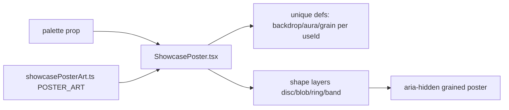

# ShowcasePoster.tsx — AI component doc

> AI-facing sidecar for `ShowcasePoster.tsx`. Created 2026-07-07. Keep this in sync with the code on every change.

## Purpose
Poster-grade decorative SVG art for the landing showcase spread ("Light Editorial" brief): renders one of six deliberate compositions — layered gradients, organic/geometric shapes, feTurbulence grain — replacing the gray placeholder gradients v1 was rejected for.

## What it does (for an AI reader)
- Responsibilities: pick the `PosterArt` for the requested palette, emit unique per-instance defs (backdrop linearGradient, optional aura radialGradient, grain filter) via `useId`, paint shape layers back-to-front, overlay grain at 0.38 opacity.
- Public API / exports / props / endpoints: `ShowcasePoster`, `ShowcasePosterProps` = `{ palette: ShowcasePalette; className?: string }`; re-exports `SHOWCASE_PALETTES` + `ShowcasePalette` from `showcasePosterArt.ts`.
- Inputs → Outputs: `palette` → `<svg aria-hidden data-palette viewBox="0 0 400 500" preserveAspectRatio="xMidYMid slice">`; `className` merges for caller sizing (e.g. `aspect-[4/5] w-full`).
- Side effects: none (pure render; deterministic — no randomness, SSR/prerender-safe).

## Dependencies
- Imports / depends on: `react` (`useId`), `./showcasePosterArt` (palette data + `PosterShape` union).
- Used by: exported via `shared/ui/index.ts`; consumed by the landing "Selected works" spread in redesign stage 2 (with i18n'd figure captions OUTSIDE the art).

## Diagram

## Key decisions / gotchas
- `useId`-prefixed defs ids: several posters render on one page — duplicate SVG ids would make every poster paint with the FIRST instance's gradients (tested: no id collisions across two mounts).
- NO text inside the art and `aria-hidden` (brief rule): captions are the consumer's job so screen readers only hear the honest localized caption.
- `preserveAspectRatio="xMidYMid slice"` lets the magazine spread crop posters to any card aspect (2-col, 9:16 tall) without distortion.
- `PosterShapeElement` is an exhaustive switch over the `PosterShape` union with a `never` guard — new shape kinds fail compilation, not silently no-op.
- Grain = monochrome `feTurbulence` fractal noise whose alpha derives from the noise itself (`feColorMatrix` last row) — fine dark specks, no extra assets.
- Behavior tests: `ShowcasePoster.test.tsx` (decorative contract, grain present, 6 distinct paint fingerprints, unique ids, className merge).

## Commits
- 9d0106d 2026-07-07 feat(web): showcase poster art component
