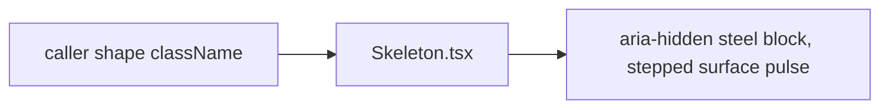

# Skeleton.tsx — AI component doc

> AI-facing sidecar for `Skeleton.tsx`. Created 2026-07-06. Keep this in sync with the code on every change.

## Purpose
Loading placeholder of the v3 "Bioluminescent Terminal" kit: a solid `bg-steel` block whose pulse STEPS through the surface ladder (abyss → steel → ridge → steel). Never a gradient shimmer — the no-gradient law covers shimmer sweeps too. The 4-states rule bans bare spinners on data surfaces.

## What it does (for an AI reader)
- Responsibilities: render one decorative pulsing block; the caller supplies shape/size utilities.
- Public API / exports / props / endpoints: `Skeleton`, `SkeletonProps` = `{ className?: string }`.
- Inputs → Outputs: `className` (e.g. `"h-4 w-32"`, `"aspect-square w-full"`) → `
`.
- Side effects: none.

## Dependencies
- Imports / depends on: nothing (pure markup); `--animate-skeleton` keyframes + surface tokens from `shared/config/theme.css`.
- Used by: AppShell (session placeholder), routes/login, Credits (chip skeleton + TransactionsList rows), Generator (form silhouette), Gallery (card grid), pricing route (table rows).

## Diagram

## Key decisions / gotchas
- v3 restyle intent: `animate-pulse bg-sand rounded-sm` → `animate-skeleton bg-steel rounded-lg`. The custom keyframes (theme.css, `steps(1, end)` over `background-color`) make loading literally "elevation breathing" through the system's own surface steps — a stepped SOLID pulse, flat at every frame, because gradient shimmer is banned.
- `bg-steel` is the resting frame: visible before the first animation frame and under reduced-motion setups.
- Tests query `.animate-skeleton` (GalleryGrid/GeneratorPanel/TransactionsList/GenerationCard) — renaming the animation class breaks them deliberately.
- `aria-hidden` — skeletons are decorative; the owning surface announces loading.
- Callers may still override the radius via `className` (later utilities win in Tailwind v4).

## Commits
- 51d80a6 2026-07-06 feat(web): paper&ink design system, shared ui kit, error-ux surfaces
- 3305c12 2026-07-07 restyle(web): editorial design system — tokens, fonts, ui kit
- 252ab38 2026-07-07 restyle(web): terminal design system — cosmic void tokens, jetbrains mono, specimen pills + docs
