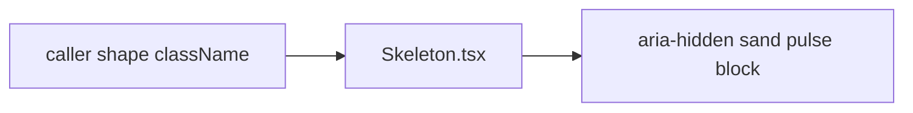

# Skeleton.tsx — AI component doc

> AI-facing sidecar for `Skeleton.tsx`. Created 2026-07-06. Keep this in sync with the code on every change.

## Purpose
Loading placeholder of the "Light Editorial" kit: a cream-shimmer block (pulsing sand tint = "unprinted paper") shaped by the caller to mirror the eventual content. The 4-states rule bans bare spinners on data surfaces.

## What it does (for an AI reader)
- Responsibilities: render one decorative pulsing block; the caller supplies shape/size utilities.
- Public API / exports / props / endpoints: `Skeleton`, `SkeletonProps` = `{ className?: string }`.
- Inputs → Outputs: `className` (e.g. `"h-4 w-32"`, `"aspect-square w-full"`) → `
`.
- Side effects: none.

## Dependencies
- Imports / depends on: nothing (pure markup); `--color-sand` token via `bg-sand`.
- Used by: AppShell (session placeholder), routes/login, Credits (chip skeleton), Generator (form silhouette), Gallery (card grid), Credits TransactionsList rows.

## Diagram

## Key decisions / gotchas
- v2 restyle: `bg-ink/10 rounded-xl` → `bg-sand rounded-sm`. Sand keeps the shimmer warm and on-palette — gray placeholder blocks were an explicit rejection reason of v1.
- `aria-hidden` — skeletons are decorative; the owning surface announces loading.
- Callers may still override the radius via `className` (later utilities win in Tailwind v4).

## Commits
- 51d80a6 2026-07-06 feat(web): paper&ink design system, shared ui kit, error-ux surfaces
- 3305c12 2026-07-07 restyle(web): editorial design system — tokens, fonts, ui kit
