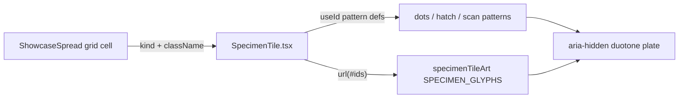

# SpecimenTile.tsx — AI component doc

> AI-facing sidecar for `SpecimenTile.tsx`. Created 2026-07-07 (Stage 2 —
> replaces `ShowcasePoster.tsx`). Keep this in sync with the code on every change.

## Purpose
The v3 showcase tile: one square blue-violet duotone SVG "specimen" plate
(eye/brain/hand/arch/moon symbolism family). Owns the `<svg>` shell, the flat
ground rect and the three reusable `<pattern>` textures; the drawing itself
comes from `specimenTileArt.tsx`.

## What it does (for an AI reader)
- Responsibilities: render an aria-hidden 200×200 decorative SVG with
  `preserveAspectRatio="xMidYMid slice"` (the plate crops to any box); mint
  per-instance pattern ids via `useId` (dots / 45° hatch / scanlines) and hand
  their `url(#…)` strings to the kind's glyph function.
- Public API / exports: `SpecimenTile`, `SpecimenTileProps`
  (`kind: SpecimenKind`, `className?`), re-exports `SPECIMEN_KINDS` +
  `SpecimenKind` so consumers (and the shared/ui index) never deep-import the
  art file.
- Inputs → Outputs: `kind` → the specimen plate; `className` merges onto the
  svg for caller sizing (`h-full w-full` inside an `aspect-square` cell).
- Side effects: none — pure render.

## Dependencies
- Imports / depends on: `react` (`useId`), `./specimenTileArt`
  (`SPECIMEN_GLYPHS`, `SPECIMEN_GROUND`, `SPECIMEN_INK`, `SpecimenKind`).
- Used by: `modules/Landing/components/ShowcaseSpread.tsx` (4-col grid);
  exported through `shared/ui/index.ts`.

## Diagram

## Key decisions / gotchas
- **useId per instance**: eight tiles per page — duplicate pattern ids would
  silently repaint every tile with the FIRST tile's textures (same bug class
  the old ShowcasePoster guarded against for its defs).
- **No gradients / no filters** — asserted by SpecimenTile.test on the
  rendered markup (the NO-GRADIENTS owner rule).
- **Chrome-free art**: the video marker chip and the honest "sample style"
  caption are the consumer's job (minimal chrome per the v3 reference).
- `data-specimen` is the stable test/QA hook (mirror of the old
  `data-palette`).

## Commits
- 3ce8dbf 2026-07-07 restyle(web): terminal landing with ascii-sphere hero + pricing
