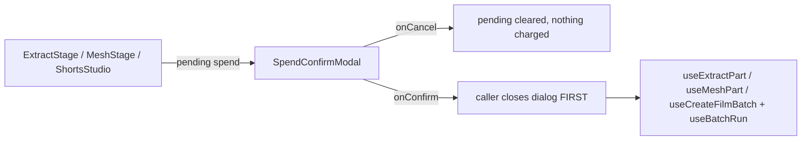

# SpendConfirmModal.tsx — AI component doc

> AI-facing sidecar for `shared/ui/SpendConfirmModal.tsx`. Created 2026-07-20.
> MOVED from `modules/Assets3D/components/` to `shared/ui/` on 2026-08-20 (ADR shorts-studio §4)
> and given `balance` + `children`. Keep this in sync with the code on every change.

## Purpose
The app's ONE blocking spend primitive: a `role="alertdialog"` sheet that restates a credit cost and
only spends from its confirm pill. It exists because a credit is not undoable — design.md §9
requires the number to be said twice before it moves.

## Why it lives in shared/ui now
It began inside Assets3D because that was the only paid batch surface. The Shorts Studio batch is the
second, and a module may not import another module's internals — so rather than a second copy of the
app's most safety-critical dialog, the primitive moved to the kit. There is exactly one place in the
codebase where "is this affordable?" is answered.

## What it does (for an AI reader)
- Responsibilities:
  - Guarantee the SHAPE of a spend moment: restated cost → cancel (free) → confirm (charges).
  - Disable the confirm when `credits === null` (an unpriceable action must not be confirmable).
  - Disable it when a known `balance` is short of `credits`, and STATE the shortfall. A dialog that
    lets you confirm a purchase you cannot afford just moves the failure to item 1 of 40.
  - Own almost no copy — callers pass already-localized title/description/confirm label. It owns
    only `common.cancel`, `spend.balance`, `spend.shortfall`, `spend.credits`.
- Public API:
  - `SpendConfirmModal({ isOpen, title, description, confirmLabel, credits, balance?, children?,
    onCancel, onConfirm })`
  - `SpendConfirmModalProps` (exported type)
- Side effects: none. The CALLER closes the dialog first, then mutates.

## Dependencies
- Imports: `./Modal`, `./Button`, `react-i18next`.
- Used by: `Assets3D/ExtractStage.tsx` (extract-ALL), `Assets3D/MeshStage.tsx` (every single mesh),
  `Shorts/ShortsStudio.tsx` (the batch gate, with `balance` and an itemisation in `children`).

## Diagram

## Key decisions / gotchas
- `role="alertdialog"` not `dialog`: the interruption is deliberate and assistive tech should say so.
- `balance === undefined` disables NOTHING — a slow `/api/me` must never make the product look out of
  stock (TierPicker's rule). The shortfall line is `role="status"`, not `alert`: the dialog IS the
  interruption; the line is its content.
- The body scrolls and the actions are PINNED. A forty-row itemisation must never push the confirm
  out of reach — on a spend gate that is the worst version of the bug.
- The caller closes BEFORE mutating, so the user watches the work happen rather than a spinner on a
  question they already answered.
- Callers must NOT reuse this for the single-part `extract`: that stays click-to-spend by owner
  decision 2026-07-20 (cheap, high-repetition — a dialog per part makes the grid unusable).

## Commits
- _no commit yet_
