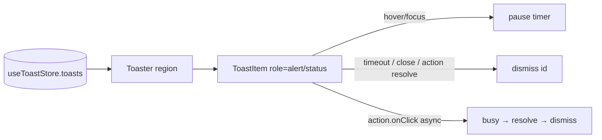

# Toaster.tsx — AI component doc

> AI-facing sidecar for `Toaster.tsx`. Created 2026-07-21. Keep this in sync with the code on every change.

## Purpose
The toast portal — mounted ONCE in the shell root. It subscribes to `toastStore` and renders the live stack in a corner, owning the whole lifecycle the pure store does not: auto-dismiss, pause-on-hover/focus, the async-action pending state, and manual/keyboard dismissal.

## What it does (for an AI reader)
- Responsibilities: portal-render `toastStore.toasts` into `document.body`; per toast: map variant → live-region role (error = `role="alert"`, info/success = `role="status"`), run a per-variant auto-dismiss timer that PAUSES while hovered/focused or while its action runs, render an optional async action button (busy while in flight, dismiss on resolve), render a keyboard-reachable close button.
- Public API / exports / props / endpoints: `Toaster` — no props, fully self-managed (reads the store).
- Inputs → Outputs: `toastStore.toasts` → a fixed corner region of toast cards; user interactions → `dismiss(id)`.
- Side effects (I/O, network, state): `setTimeout`/`clearTimeout` per item (auto-dismiss); calls the action's `onClick` (which may be async and may itself raise a fallback toast); `createPortal` to `document.body`.

## Dependencies
- Imports / depends on: `react` (`useEffect`/`useState`), `react-dom` (`createPortal`), `react-i18next` (`toasts.region`, `common.close`), `i18next` (`TFunction` type), `./Button`, `./toastStore`.
- Used by: `routes/__root.tsx` (mounted once inside the providers, above `<Outlet />`); exported through `shared/ui/index.ts`.

## Diagram

## Key decisions / gotchas
- OPAQUE STEEL surface, never frosted glass — a translucent toast over the editor's moving media is unreadable (design.md §12; same asymmetry as Select's popup / ViewSettingsMenu). Lift is the existing `shadow-glass-lg` float token, not a bespoke shadow.
- Triad status color rides a `border-l-2 border-<glow>` LEFT RULE (proven SubmitErrorBanner/RenderBar idiom): `border-<color>` colors all sides but only the left has width — no per-side color conflict, no gradient.
- Per-ITEM live-region roles satisfy the "aria-live polite for info/success, assertive for errors" contract; the outer `role="region"` gives the stack an accessible name.
- Timer pauses on `isPaused` (hover/focus) AND `isActing` (action running) so a "soften & retry" never vanishes mid-flight.
- `z-[55]`: above Modal (z-50), below OfflineOverlay (z-[60]).
- Container is `pointer-events-none`, each toast re-enables — the empty gutter never eats a canvas click.

## Commits
- (pending) feat(web): toast system + generation-failure surfacing, soften/retry, transient retry
