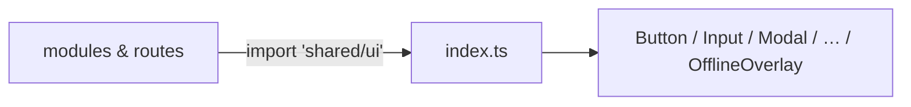

# index.ts — AI component doc

> AI-facing sidecar for `shared/ui/index.ts`. Created 2026-07-06. Keep this in sync with the code on every change.

## Purpose
Public API of the v3 "Bioluminescent Terminal" design-system kit (`shared/ui`). The modular-architecture law says consumers import from `'shared/ui'` only — this barrel is the single legal entry point.

## What it does (for an AI reader)
- Responsibilities: re-export every kit component and its prop types; nothing else (no logic, no side effects).
- Public API / exports / props / endpoints: `AppErrorBoundary`, `AppShell`(+`AppShellProps`,`AppShellUser`), `AsciiSphere`(+`AsciiSphereProps`), `Badge`(+`BadgeProps`,`BadgeVariant`), `Button`(+`ButtonProps`,`ButtonSize`,`ButtonVariant`), `EmptyState`(+`EmptyStateProps`), `ErrorState`(+`ErrorStateProps`), `Input`(+`InputProps`), `LangSwitch`, `Modal`(+`ModalProps`), `NotFoundPage`, `OfflineOverlay`, `PillGroup`(+`PillGroupProps`,`PillOption`), `Progress`(+`ProgressProps`), `SpecimenTile`(+`SpecimenTileProps`,`SpecimenKind`,`SPECIMEN_KINDS`), `Skeleton`(+`SkeletonProps`).
- Inputs → Outputs: import from `'shared/ui'` → any kit component.
- Side effects (I/O, network, state): none.

## Dependencies
- Imports / depends on: every `./` component file in `shared/ui/`.
- Used by: `routes/__root.tsx` today; every module (Auth, Generator, Gallery, Credits, Landing) from Task 14 on.

## Diagram

## Key decisions / gotchas
- Deep imports (`shared/ui/Button`) are banned outside this folder — keeps the kit swappable and the inventory in design.md §6 authoritative.
- Type re-exports use `export type` (required by `verbatimModuleSyntax`).
- New shared components must be added here AND to design.md §6 in the same task.
- `SPECIMEN_KINDS` (a value, not just a type) is exported so the landing can iterate the whole grid without hardcoding specimen names.
- Stage 2 (2026-07-07): `ShowcasePoster`/`SHOWCASE_PALETTES`/`showcasePosterArt` were RETIRED and replaced by `SpecimenTile`/`SPECIMEN_KINDS`/`specimenTileArt` (v3 duotone specimen art); `AsciiSphere` joined the kit as the hero visual.
- Dead-code cleanup (2026-07-07 QA): `Select` (+`SelectProps`,`SelectOption`) was DELETED — grep confirmed zero consumers anywhere in src/e2e (the generator uses `PillGroup` pills, not native selects). Revive it from git history only when a real product need appears (design.md §10: 2+ modules).

## Commits
- 51d80a6 2026-07-06 feat(web): paper&ink design system, shared ui kit, error-ux surfaces
- 2b7dd54 2026-07-06 feat(web): generator module — prompt, model/aspect/duration, i2v upload, cost (adds `PillGroup` — first component needed by 2+ modules per design.md §9)
- 01c29ab 2026-07-06 feat(web): app shell with nav, balance, language switch (adds `AppShell` + `LangSwitch`)
- 9d0106d 2026-07-07 feat(web): showcase poster art component (adds `ShowcasePoster` + palettes)
- 252ab38 2026-07-07 restyle(web): terminal design system — cosmic void tokens, jetbrains mono, specimen pills + docs (comment-only: kit renamed to v3 terminal)
- 3ce8dbf 2026-07-07 restyle(web): terminal landing with ascii-sphere hero + pricing (adds `AsciiSphere` + `SpecimenTile`, retires `ShowcasePoster`)
