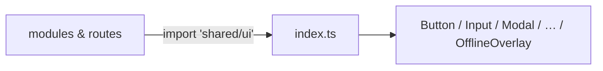

# index.ts — AI component doc

> AI-facing sidecar for `shared/ui/index.ts`. Created 2026-07-06. Keep this in sync with the code on every change.

## Purpose
Public API of the "Paper & Ink" design-system kit (`shared/ui`). The modular-architecture law says consumers import from `'shared/ui'` only — this barrel is the single legal entry point.

## What it does (for an AI reader)
- Responsibilities: re-export every kit component and its prop types; nothing else (no logic, no side effects).
- Public API / exports / props / endpoints: `AppErrorBoundary`, `Badge`(+`BadgeProps`,`BadgeVariant`), `Button`(+`ButtonProps`,`ButtonSize`,`ButtonVariant`), `EmptyState`(+`EmptyStateProps`), `ErrorState`(+`ErrorStateProps`), `Input`(+`InputProps`), `Modal`(+`ModalProps`), `NotFoundPage`, `OfflineOverlay`, `Progress`(+`ProgressProps`), `Select`(+`SelectProps`,`SelectOption`), `Skeleton`(+`SkeletonProps`).
- Inputs → Outputs: import from `'shared/ui'` → any kit component.
- Side effects (I/O, network, state): none.

## Dependencies
- Imports / depends on: every `./` component file in `shared/ui/`.
- Used by: `routes/__root.tsx` today; every module (Auth, Generator, Gallery, Credits, Landing) from Task 14 on.

## Diagram

## Key decisions / gotchas
- Deep imports (`shared/ui/Button`) are banned outside this folder — keeps the kit swappable and the inventory in design.md §5 authoritative.
- Type re-exports use `export type` (required by `verbatimModuleSyntax`).
- New shared components must be added here AND to design.md §5 in the same task.

## Commits
- 51d80a6 2026-07-06 feat(web): paper&ink design system, shared ui kit, error-ux surfaces
