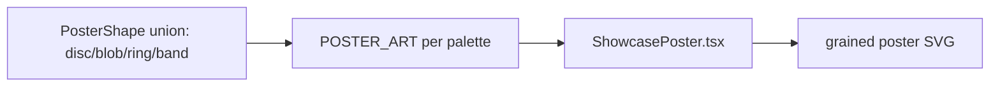

# showcasePosterArt.ts — AI component doc

> AI-facing sidecar for `showcasePosterArt.ts`. Created 2026-07-07. Keep this in sync with the code on every change.

## Purpose
Art-direction data for `ShowcasePoster`: six deliberate poster compositions (backdrop gradient + optional radial aura + shape layers on a 400×500 canvas) — the editorial answer to the gray placeholder gradients v1 was rejected for.

## What it does (for an AI reader)
- Responsibilities: declare the palette union and one `PosterArt` composition per palette; hold the reusable organic path silhouettes (leaf, waves, koi body).
- Public API / exports / props / endpoints: `SHOWCASE_PALETTES` (readonly tuple: `dusk | sea | botanical | mono | ultraviolet | koi`), `ShowcasePalette` type, `POSTER_ART: Record<ShowcasePalette, PosterArt>`, types `PosterArt`, `PosterShape` (discriminated union: `disc | blob | ring | band`), `PosterStop`.
- Inputs → Outputs: pure data — no runtime logic.
- Side effects: none.

## Dependencies
- Imports / depends on: nothing.
- Used by: `shared/ui/ShowcasePoster.tsx` (renderer); `SHOWCASE_PALETTES`/`ShowcasePalette` re-exported through `shared/ui/index.ts` for the landing showcase (stage 2 consumer).

## Diagram

## Key decisions / gotchas
- The hex values here are ART CONTENT (like a photo's pixels), NOT UI chrome — the documented exception to the tokens-only rule; the palette table lives in `docs/frontend/design.md` §5. Do not "fix" them to tokens.
- Compositions must stay DISTINCT arrangements, not recolors — the ShowcasePoster test fingerprints each palette's paint set and asserts all six differ.
- Every shape has a stable string `id` (used as the React key — index keys are banned).
- `koi` is the 6th palette (brief lists five + asks for 6 posters): the brand plate reusing vermillion/ink/cream.

## Commits
- 9d0106d 2026-07-07 feat(web): showcase poster art component
