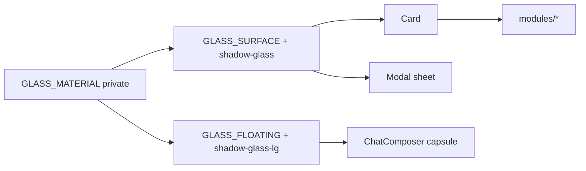

# surfaces.ts — AI component doc

> AI-facing sidecar for `surfaces.ts`. Created 2026-07-09. Keep this in sync with the code on every change.

## Purpose
The single source of truth for the v4 surface language (`docs/frontend/design.md` §3.5). Holds the three
class strings that define how deep a surface sits: frosted glass, opaque steel, recessed well.

## What it does (for an AI reader)
- Responsibilities: own the frosted recipe so it cannot drift. Nothing else.
- Public API / exports:
  - `GLASS_SURFACE` — frosted card/sheet at REST (`GLASS_MATERIAL` + `shadow-glass`).
  - `GLASS_FLOATING` — the same material with a longer throw (`shadow-glass-lg`), for chrome that
    hovers over scrolling content (the composer capsule).
  - `STEEL_SURFACE` — opaque working surface (`border-white/10 bg-steel`).
  - `WELL_SURFACE` — recessed plate (`border-white/10 bg-abyss`).
  - (private) `GLASS_MATERIAL` — the material with NO elevation; never exported.
- Consumers supply their own `border` width and radius; the constants carry colour, not geometry.
- Inputs → Outputs: none — plain string constants consumed as Tailwind class lists.
- Side effects: none.

## Dependencies
- Imports / depends on: nothing.
- Used by: `Card.tsx` (glass/steel/well), `Modal.tsx` (`glass`/`steel` sheet),
  `modules/Generator/components/ChatComposer.tsx` (`GLASS_FLOATING`). All four re-exported from
  `shared/ui/index.ts`. `Select.tsx` keeps its own trigger-scoped glass string (a trigger is a
  control, not a surface) and its popup panel is deliberately opaque.

## Diagram

## Key decisions / gotchas
- **`bg-steel` is the BASELINE, not a fallback.** Every frosted utility is behind
  `supports-[backdrop-filter]:`. Without that guard a browser lacking `backdrop-filter` renders an
  unreadable translucent card.
- **`backdrop-blur` is a no-op over a flat fill.** The page is a flat `--color-void`, so blurring it
  returns the same color. Glass genuinely reads only where there is texture behind it: media wells,
  thumbnails, the dimmed page under a modal. The translucent wash + hairline + `shadow-glass` carry
  the look elsewhere. Do NOT compensate with a background gradient — no-gradient is a hard owner rule.
- **The specular highlight is `border-t-white/25`**, a brighter top border — never a gradient sheen.
  That is how the iOS-glass edge is reproduced under the no-gradient law.
- Popup/menu panels deliberately stay OPAQUE (`STEEL_SURFACE`): a translucent dropdown over moving
  media is unreadable. The asymmetry with cards is intentional.
- **Exactly two elevations, and adding a third means adding it HERE.** Tailwind resolves competing
  shadow utilities by stylesheet order, not class order, so a consumer cannot write
  "`GLASS_SURFACE` plus my own shadow" — that is why the capsule's bespoke
  `shadow-2xl shadow-black/50` became the named `GLASS_FLOATING`.

## Commits
- _no commit yet_
