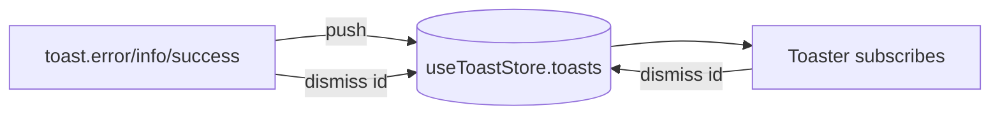

# toastStore.ts — AI component doc

> AI-facing sidecar for `toastStore.ts`. Created 2026-07-21. Keep this in sync with the code on every change.

## Purpose
The state core of the toast-notification system: a tiny Zustand store holding the LIVE toast stack. Deliberately pure — no timers, no DOM, no i18n — so the state is trivially testable and any module can raise a toast without a cross-module import. The `<Toaster>` owns the lifecycle; the imperative `toast` API (./toast) writes here.

## What it does (for an AI reader)
- Responsibilities: hold `toasts: Toast[]`; add (`push`), remove (`dismiss`), reset (`clear`). Enforce two policies: DEDUPE (a push whose `dedupeKey` matches a live toast collapses to it — the first push wins, its id is returned) and a STACK CAP of 3 (oldest drops, newest survives).
- Public API / exports / props / endpoints: `useToastStore` (Zustand hook + `.getState()`/`.setState()`); types `Toast`, `ToastInput`, `ToastAction`, `ToastVariant`.
- Inputs → Outputs: `ToastInput` (variant/title/description?/action?/durationMs?/dedupeKey?) → a `Toast` with a session-unique `id`; `push` returns that id (or the deduped live id).
- Side effects (I/O, network, state): none. Pure in-memory state.

## Dependencies
- Imports / depends on: `zustand` (`create`).
- Used by: `./toast` (imperative API calls `useToastStore.getState().push/dismiss`), `./Toaster` (subscribes to `toasts`), Cinema's `shotFailureToast`/`promptEnhance` (via the `toast` API), tests.

## Diagram

## Key decisions / gotchas
- PURE store, no timers: auto-dismiss + pause-on-hover live in the `<Toaster>` item, so the store stays unit-testable without fake timers.
- `dedupeKey` collapses to the LIVE toast only (freed on dismiss) — it is the generic "don't stack duplicates" mechanism. Permanent per-domain dedupe (e.g. never re-toast a generationId even across remounts) is the CALLER's job (Cinema's module-level Set in `shotFailureToast`), not the store's.
- Cap trims from the FRONT (`slice(next.length - 3)`) so the newest three always win.
- `clear()` exists for tests and for a hard reset; it also frees all dedupe keys.

## Commits
- (pending) feat(web): toast system + generation-failure surfacing, soften/retry, transient retry
