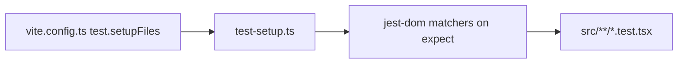

# test-setup.ts — AI component doc

> AI-facing sidecar for `test-setup.ts`. Created 2026-07-06. Keep this in sync with the code on every change.

## Purpose
Vitest global setup: registers `@testing-library/jest-dom` matchers for the jsdom environment so component tests can assert on DOM state semantically.

## What it does (for an AI reader)
- Responsibilities: side-effect import of `@testing-library/jest-dom/vitest` (the vitest-specific entry — required, the bare package entry targets jest).
- Public API / exports: none (setup module, referenced from `vite.config.ts` → `test.setupFiles`).
- Inputs → Outputs: none → extends `expect` with `toBeInTheDocument`, `toBeDisabled`, `toHaveTextContent`, etc.
- Side effects: mutates Vitest's `expect` matcher registry once per test run.

## Dependencies
- Imports / depends on: `@testing-library/jest-dom/vitest`.
- Used by: every `*.test.tsx` via `test.setupFiles` in `vite.config.ts`; matcher types come from tsconfig `types: ["@testing-library/jest-dom"]`.

## Diagram

## Key decisions / gotchas
- Must import the `/vitest` subpath — importing plain `@testing-library/jest-dom` would try to patch Jest's expect and fail under Vitest.

## Commits
- _no commit yet_
