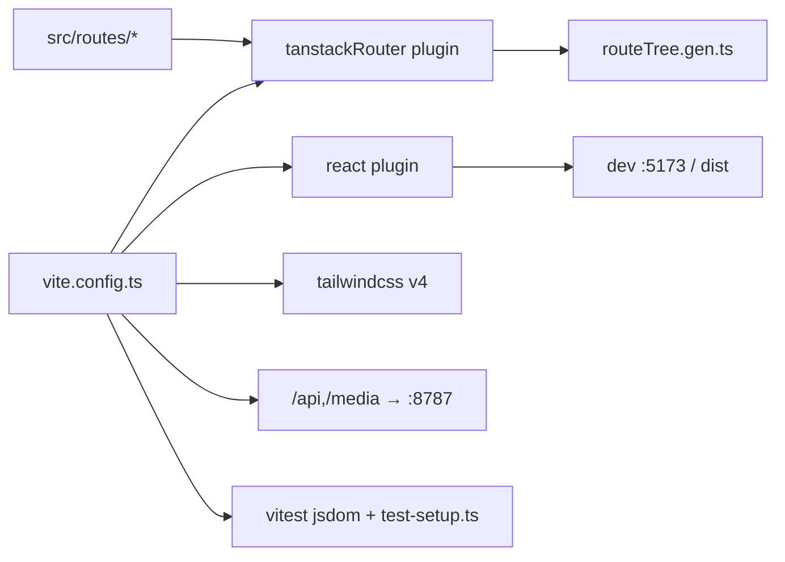

# vite.config.ts — AI component doc

> AI-facing sidecar for `vite.config.ts`. Created 2026-07-06. Keep this in sync with the code on every change.

## Purpose
Single build/dev/test config for `@opencreate/web`: Vite 8 bundling, TanStack Router file-based codegen, Tailwind v4, path aliases, dev proxy to the API, and the Vitest jsdom environment.

## What it does (for an AI reader)
- Responsibilities: register plugins in the required order (`tanstackRouter` BEFORE `react()` so `src/routeTree.gen.ts` is generated before JSX transform), map `modules/ shared/ routes/` aliases, proxy `/api` and `/media` to `http://localhost:8787`, configure Vitest (`jsdom`, `globals`, `src/test-setup.ts`).
- Public API / exports: default export — Vite/Vitest `UserConfig` via `defineConfig` from `vitest/config` (typed `test` block).
- Inputs → Outputs: `src/**` sources → dev server on :5173 / production bundle / test runs. Route files in `src/routes/` → generated `src/routeTree.gen.ts`.
- Side effects: writes `src/routeTree.gen.ts` on dev/build/test start (router plugin codegen).

## Dependencies
- Imports / depends on: `vitest/config`, `@vitejs/plugin-react`, `@tailwindcss/vite`, `@tanstack/router-plugin/vite`, `node:url` (needs `@types/node`, added to tsconfig `types`).
- Used by: `pnpm dev/build/test` scripts; Vitest picks up the `test` block from this same file.

## Diagram

## Key decisions / gotchas
- Installed `@tanstack/router-plugin` exports BOTH `tanstackRouter` and legacy `TanStackRouterVite`; the modern `tanstackRouter({ target: 'react', autoCodeSplitting: true })` is used (verified against node_modules).
- `routeFileIgnorePattern: '\\.test\\.(ts|tsx)$'` — tests are co-located in `src/routes/` (e.g. `__root.test.tsx`); without the pattern the generator warns and would try to treat them as routes.
- `defineConfig` is imported from `vitest/config` (not `vite`) so the `test` option typechecks — vitest 4 supports vite ^8.
- Aliases must stay mirrored with `tsconfig.json` `paths`; relative `../../..` imports are banned by the frontend standard.
- Proxying `/api` + `/media` keeps auth cookies first-party in dev — no CORS config needed anywhere.

## Commits
- _no commit yet_
