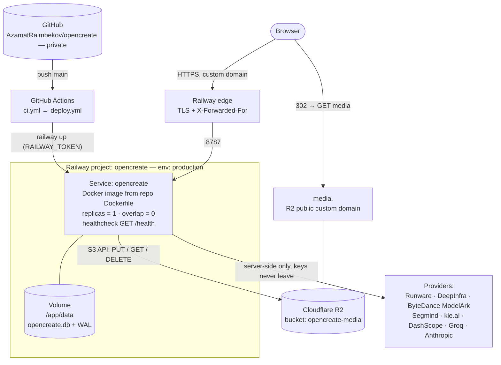
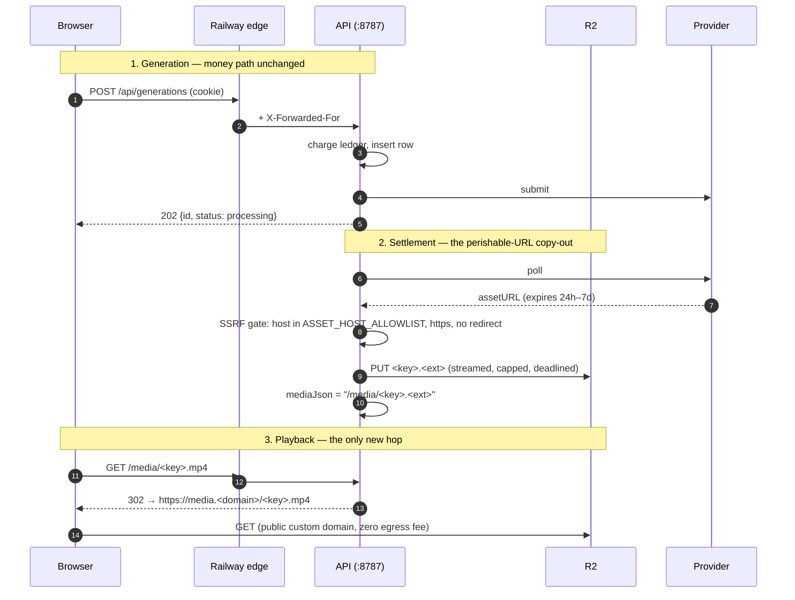
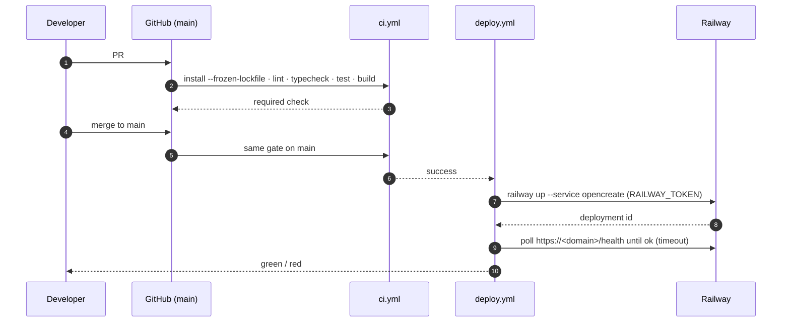

# Infrastructure spec: openCreate on Railway

Implements [[railway-deployment]]. This is the document the deploy is executed from;
every number, path and variable here is meant to be copied, not paraphrased. Everything
marked **⚠ verify** is a platform behaviour that must be confirmed on the first deploy
rather than trusted from this page.

## 1. Target topology

One Railway service, one image, one process, one volume, one bucket.



The process boundary is unchanged from `PROD.md`: **one origin** serves the SPA, the JSON
API and `/media/*`. Railway's edge replaces the nginx/Caddy hop; the volume replaces the
`./data` bind mount; R2 replaces the media half of that directory.

### What the request paths look like



## 2. Environment matrix (production values)

Set on the Railway service. `apps/api/src/config.ts` validates every one of these at boot
and **fails fast** on a bad value — a misconfigured deploy dies at start instead of serving
half-broken. Anything absent from this table keeps its schema default.

| Variable | Production value | Why this value |
| --- | --- | --- |
| `NODE_ENV` | `production` | Switches on single-origin SPA serving in `app.ts`. |
| `API_PORT` | `8787` | Matches `EXPOSE 8787` and the health check. See R2 in §5 for the `PORT` question. |
| `BETTER_AUTH_SECRET` | **new** `openssl rand -hex 32` | ≥32 chars. **Never reuse the dev value.** Rotating invalidates all sessions. |
| `BETTER_AUTH_URL` | `https://<public-domain>` | Session cookies, OAuth callbacks and the CSRF check all derive from it. Must equal the domain users actually hit. |
| `TRUSTED_ORIGINS` | `https://<public-domain>` | Same value — single-origin deploy. Comma list; empty falls back to `WEB_ORIGIN`, which would be wrong here. |
| `TRUST_PROXY` | `1` (hop count) | Behind Railway's edge. **Requires the code change in §5 R3** — the current parser cannot express a hop count and `true` is unsafe against an appending proxy. |
| `DATABASE_PATH` | `./data/opencreate.db` | Resolves inside the mounted volume. |
| `STORAGE_DIR` | `./data/media` | Vestigial once R2 is on; kept so a credential outage degrades to disk rather than crashing. |
| `RUNWARE_API_KEY` | secret | Primary provider. Required — boot fails without it. |
| `R2_ENDPOINT` | `https://<account>.r2.cloudflarestorage.com` | See §4. |
| `R2_BUCKET` | `opencreate-media` | |
| `R2_ACCESS_KEY_ID` / `R2_SECRET_ACCESS_KEY` | secret | Scoped to that one bucket, read+write, nothing else. |
| `R2_PUBLIC_BASE_URL` | `https://media.<domain>` | Where `/media/*` redirects. Public bucket domain. |
| `LOG_LEVEL` | `info` | pino JSON to stdout → Railway logs. |
| `SIGNUP_BONUS_CREDITS` | `200` | Product decision, unchanged. |
| `DEEPINFRA_TOKEN`, `ARK_API_KEY`, `SEGMIND_API_KEY`, `KIE_API_KEY`, `GROQ_API_KEY`, `ANTHROPIC_API_KEY`, `DASHSCOPE_API_KEY` + `DASHSCOPE_WORKSPACE_ID`, `COMFY_BASE_URL`, `GOOGLE_CLIENT_ID` + `GOOGLE_CLIENT_SECRET` | set what is paid for, omit the rest | **All optional by design.** An unset key hides that provider's models from `/api/catalog` — boot stays healthy and nobody can select a model whose backend cannot run. Set them deliberately, not defensively. |
| `ASSET_HOST_ALLOWLIST` | leave unset (default `runware.ai`) | Each configured provider folds its own asset host in automatically (`withArkHost`, `withKieHost`, …). Widening it by hand re-opens the SSRF gate for nothing. |
| `ASSET_FETCH_TIMEOUT_MS` / `ASSET_MAX_BYTES` | leave unset | Defaults (120s / 512MB) are already the reviewed values. |

Two settings that are **not** environment variables and are just as load-bearing:

- **Replicas = 1.** SQLite invariant (`PROD.md` "Scaling & the SQLite single-instance rule").
- **Deploy overlap = 0** (`RAILWAY_DEPLOYMENT_OVERLAP_SECONDS=0`, ⚠ verify the current
  field name). Default overlap runs two processes against one database file.

### Post-deploy configuration outside Railway

- **Google OAuth**: add `https://<public-domain>/api/auth/callback/google` to the
  authorized redirect URIs, or Google sign-in 400s on first use.
- **DNS**: `CNAME <domain> → <service>.up.railway.app`, and `media.<domain>` → the R2
  public bucket domain.

## 3. Service configuration as code

`railway.json` at the repo root, so the service shape is reviewable in a PR instead of
living only in a dashboard (⚠ verify field names against the current Railway schema —
this file is advisory config, and an unknown key is silently ignored, which is exactly how
a "configured" invariant quietly stops being configured):

```json
{
  "$schema": "https://railway.app/railway.schema.json",
  "build": { "builder": "DOCKERFILE", "dockerfilePath": "Dockerfile" },
  "deploy": {
    "numReplicas": 1,
    "healthcheckPath": "/health",
    "healthcheckTimeout": 60,
    "restartPolicyType": "ON_FAILURE",
    "restartPolicyMaxRetries": 10,
    "overlapSeconds": 0
  }
}
```

`.dockerignore` already excludes `.env`, `docs`, agent-runtime state and `data` — the build
context is clean and no secret can be baked into an image. No change needed.

## 4. Media on R2 — the storage seam

### 4.1 What the interface looks like today

`StorageProvider` (`apps/api/src/storage/local.ts`) has six members. Four are already
storage-agnostic and survive untouched:

- `saveFromUrl(url, key, ext) → "/media/<key>.<ext>"` — the SSRF-gated copy-out.
- `saveDataUri(dataUri, key) → "/media/<key>.<ext>"` — user uploads, raster-only.
- `readAsDataUri(publicPath) → "data:…"` — reference images fed back to providers.
- `remove(key, ext)` — idempotent delete.

Two are filesystem concepts that do not exist in object storage, and replacing them is the
entire cost of this migration:

- **`dir: string`** — an absolute directory handed to `@fastify/static` (`app.ts:547`).
- **`localPath(key, ext): string`** — an absolute file path handed to ffmpeg. Five call
  sites: `films/service.ts:670` (shot media in), `:749` (mp3 in), `:831` (mp4 out),
  `models3d/service.ts:160` (raw mp4 in), `:161` (mp4 out).

### 4.2 What replaces them

```ts
// Replaces `dir`. app.ts asks the provider HOW to answer a /media/* GET.
serve(publicPath: string): Promise<{ kind: 'file'; root: string } | { kind: 'redirect'; url: string }>

// Replaces `localPath` on the READ side. Guarantees a real local file for ffmpeg;
// local provider returns the file itself with a no-op release, R2 downloads to a
// scratch dir and unlinks on release.
materialize(key: string, ext: string): Promise<{ path: string; release(): Promise<void> }>

// Replaces `localPath` on the WRITE side: where ffmpeg may write, then how the
// result becomes a stored asset. Local provider's publish is a rename into place.
scratchPath(key: string, ext: string): string
publishLocalFile(path: string, key: string, ext: string): Promise<string> // → "/media/<key>.<ext>"
```

Three properties this shape is chosen to preserve:

1. **The public path contract never changes.** Every provider still returns
   `/media/<key>.<ext>`, which is what `generation.mediaJson`, `film.coverImagePath`,
   `asset3d.conceptImagePath` and shot references already hold in the database. **No row
   migration, no dual-read window, no backfill.**
2. **`release()` is mandatory, in a `finally`.** An R2 render that throws mid-ffmpeg must
   not leave scratch files behind; the container's ephemeral disk is small and shared with
   nothing that can clean it up.
3. **The local provider stays the zero-config development default.** Provider selection
   follows the same discipline every optional provider in `config.ts` already uses:
   all four R2 variables present → R2; any missing → local disk. Half-set is a
   misconfiguration and must fail at boot, not silently fall back (the exact trap
   `dashscopeConfigured` exists to prevent for DashScope).

### 4.3 Serving `/media/*`

`app.ts` stops registering `@fastify/static` for the media prefix unconditionally and asks
`serve()` instead: `{ kind: 'file' }` keeps today's static registration verbatim;
`{ kind: 'redirect' }` answers `302` to `${R2_PUBLIC_BASE_URL}/<key>.<ext>`.

The SPA fallback in `setNotFoundHandler` must keep excluding `/media` so a missing asset
stays a real 404 and never returns `index.html` to an `` tag — that guard already
exists at `app.ts:574` and must survive the edit.

**This does not weaken confidentiality.** `/media/*` is unauthenticated *today* — the
comment at `app.ts:543-545` states it outright: public by design, unguessable UUID keys,
because ``/`<video>` cannot send auth headers. A public R2 domain has exactly the same
model: the opaque key is the capability. If that ever needs to change, it changes in
`serve()` for both providers at once (presigned URLs with a short TTL) — which is a reason
this indirection is worth having even though today both answers are "just serve it".

### 4.4 Dependency and tests

`@aws-sdk/client-s3` as an api dependency (R2 speaks S3; the SDK is external to the esbuild
bundle like every other runtime dep). No presigner needed while reads are a public-domain
redirect.

Tests are written **against the interface, not the implementation**, and run for both
providers, because the R2 provider will otherwise only ever execute in production:

- round-trip: `saveDataUri` → `readAsDataUri` returns the same bytes;
- `saveFromUrl` keeps its SSRF gate, byte cap, deadline and partial-file cleanup — the
  existing local tests are the spec and must pass against R2 with a stubbed S3 client;
- `materialize`/`release` leaves no scratch file behind, including on the throw path;
- `publishLocalFile` returns a path that `serve()` can resolve;
- half-set R2 credentials fail `loadConfig` at boot.

## 5. Risks, traps and their acceptance criteria

Numbered so the execution phase can report against them.

**R1 — Volume ownership vs the non-root user.** The image runs `USER node` (uid 1000) and
`createDb` writes to `/app/data` at boot. If Railway mounts the volume root-owned, the
process dies on the first write with `EACCES` and the deploy never goes healthy.
*Resolution order*: (a) deploy and look — if it boots, nothing to do; (b) if it fails, add
a root entrypoint that `chown`s the mount and drops back to `node` before `exec`;
(c) last resort `RAILWAY_RUN_UID=0`, documented as a deliberate single-tenant trade-off,
not silently. **Accept when**: `/health` is green *and* a signup writes a row that survives
a redeploy.

**R2 — Port contract.** The app listens on `API_PORT` (default 8787, `index.ts` binds
`0.0.0.0`); Railway injects `PORT` and expects the app to use it, falling back to detecting
the target port from `EXPOSE`. Setting `API_PORT=8787` explicitly plus `EXPOSE 8787` should
be sufficient, but a mismatch here presents as a 502 with a perfectly healthy container —
an expensive way to learn. *Hardening (one line + one test)*: make `API_PORT` optional and
resolve `port: API_PORT ?? PORT ?? 8787`, so the platform-native contract is honoured
whatever the dashboard says. **Accept when**: the public domain answers `/health` and the
logs show the expected port.

**R3 — `X-Forwarded-For` trust.** `parseTrustProxy` returns `true | false | string`, never a
number, so a hop count cannot be expressed today. `TRUST_PROXY=true` trusts the *leftmost*
XFF entry, which is safe only if the edge **overwrites** the header — if it appends, an
attacker sends their own `X-Forwarded-For` and picks a fresh rate-limit bucket per request.
Leaving it unset is the opposite failure: every user shares the edge's IP and one bucket,
so 10 auth requests/min lock everyone out of sign-in (the exact scenario `PROD.md`
documents). *Change*: accept a numeric `TRUST_PROXY` and pass the number through to
fastify (proxy-addr counts hops from the socket peer). **Accept when**: two requests with a
forged `X-Forwarded-For: 1.2.3.4` and different real clients land in *different* buckets,
and the forged value does not appear as `req.ip` in logs.

**R4 — Two processes, one SQLite file.** Deploy overlap or a replica bump silently violates
the single-writer rule; the symptom is not a clean error but WAL corruption under
concurrency. **Accept when**: overlap is 0 and replicas is 1 in the live service config,
and a deploy shows the old instance stopping before the new one starts in the logs.

**R5 — Builder limits.** The image build runs a full workspace install plus tsc, vite, an
SSR pass and the landing prerender. If the Railway builder OOMs or times out, the fallback
is to build in GitHub Actions (which already has the toolchain for CI) and deploy a
prebuilt image from GHCR. **Accept when**: a cold build (no cache) completes.

**R6 — `ffmpeg-static` in the runtime image.** Verified present, not assumed: the postinstall
that downloads the binary is allowlisted in `pnpm-workspace.yaml` (`allowBuilds:
ffmpeg-static: true`) and the `prod-deps` stage installs it under linux, so the runtime
image carries a real ffmpeg with no `apt` step. The R2 change is what puts this at risk —
ffmpeg gains network-dependent inputs. **Accept when**: a film render produces a playable
mp4 in production.

## 6. CI/CD



**`.github/workflows/ci.yml`** — triggers `pull_request` + `push: main`. Node 22, pnpm
11.8.0 via corepack (the version is pinned by the root `packageManager` field — do not
re-declare it in the workflow and let the two drift), pnpm store cached,
`pnpm install --frozen-lockfile`, then `pnpm lint`, `pnpm typecheck`, `pnpm test`,
`pnpm build`. A lockfile that does not match `package.json` fails the install — that is the
point of `--frozen-lockfile` and it is the same flag the Dockerfile uses, so CI green means
the image can be built.

**`.github/workflows/deploy.yml`** — triggers on CI success on `main`, plus
`workflow_dispatch` for a manual redeploy. Uses `RAILWAY_TOKEN` (a **project** token,
scoped to this project only) from GitHub secrets. After `railway up`, polls
`https://<domain>/health` until `{"ok":true}` or a timeout, and fails loudly if the new
deployment never becomes healthy. `concurrency: production` so two merges cannot deploy
simultaneously.

**`.github/workflows/e2e.yml`** — Playwright, `workflow_dispatch` + nightly. Explicitly out
of the deploy path (browser downloads, minutes of wall clock).

**Branch protection on `main`**: require the CI check, no force-push. GitHub secret scanning
and push protection on — the history is currently clean (verified: `.env` never committed,
no blob over 1 MB, `.git` is 21 MB across 1639 tracked files) and the job is to keep it so.

## 7. Rollout phases

Each phase ends with a check that can fail. Nothing in a later phase starts before the
earlier one's check passes.

| # | Phase | Done when |
| --- | --- | --- |
| 0 | **Publish the repo.** Commit the working tree (currently ~90 modified files), create private `AzamatRaimbekov/opencreate`, push `main`, enable secret scanning + branch protection. | `git push` clean; GitHub shows no secret alert; `PROD.md`, `Dockerfile`, `docs/` present. |
| 1 | **Deploy-readiness code.** R2 port fallback + R3 numeric `TRUST_PROXY`, each with a test written first. | New tests red before, green after; full suite still green (`contracts 166 · api 835 · web 908` baseline). |
| 2 | **R2 storage provider** (§4): interface change, provider, 5 call sites, tests for both providers. | Both providers pass one shared interface suite; local dev unchanged with no R2 vars set. |
| 3 | **Railway service.** Project + service from the Dockerfile, volume at `/app/data`, all §2 variables, replicas 1, overlap 0, health check, custom domain, R2 bucket + public domain + DNS. | `https://<domain>/health` → `{"ok":true}`; R1/R2/R4 accepted. |
| 4 | **CI/CD** (§6): three workflows, `RAILWAY_TOKEN`, branch protection. | A merge to `main` deploys with no human step and the health poll passes. |
| 5 | **Live acceptance.** Sign up, generate an image, generate a video, render a film, reload after a redeploy. | Media plays from `media.<domain>`; credits charge and refund correctly; data survives the redeploy; R6 accepted. |
| 6 | **Ops.** Nightly SQLite backup to R2, `PROD.md` gains a Railway section, [[repository-publication]] records the new repo. | A backup object exists in R2 and a restore has been rehearsed once. |

## 8. Operations after the move

`PROD.md` stays the source of truth for the container itself; the deltas Railway introduces:

- **Logs**: `railway logs` (or the dashboard) instead of `docker compose logs -f`. Same
  structured pino JSON; secrets are still redacted and unexpected 5xx bodies still
  sanitized to `internal_error`.
- **Deploy**: merge to `main`. Manual override: `railway up` or `workflow_dispatch`.
- **Rollback**: redeploy the previous deployment from the Railway UI. Note the asymmetry —
  **code rolls back, the database does not.** A migration that changed data is not undone
  by a rollback; the DDL bootstrap is idempotent and additive, which is what makes this
  survivable, and any future destructive migration needs a backup taken first, by hand.
- **Backup**: the volume holds only SQLite once R2 is live. Nightly
  `sqlite3 .backup` → R2 under `backups/`, plus whatever snapshotting the plan includes.
  A backup that has never been restored is a hypothesis, so phase 6 rehearses one.
- **Cost shape** (order of magnitude, not a quote — check the current pricing page):
  a single small always-on container is the dominant line, the volume is a few GB, R2 is
  ~$0.015/GB-month with **zero egress**, which is the reason video sits there. Expect
  single-digit dollars a month at MVP traffic.

## 9. Explicitly out of scope

Postgres (own ADR, own trigger), horizontal scaling (blocked by SQLite by design), staging
environments (one environment until there is a reason for two), CDN in front of the SPA
(Railway's edge is enough at this size), and any change to the credit ledger, generation
lifecycle, provider gating or SSRF allowlist — this move is a change of *address*, not of
behaviour.
