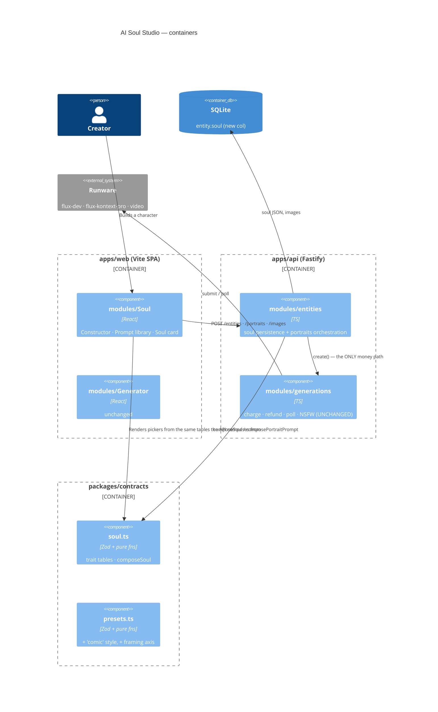
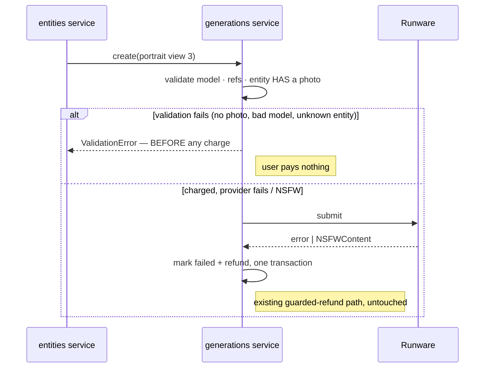
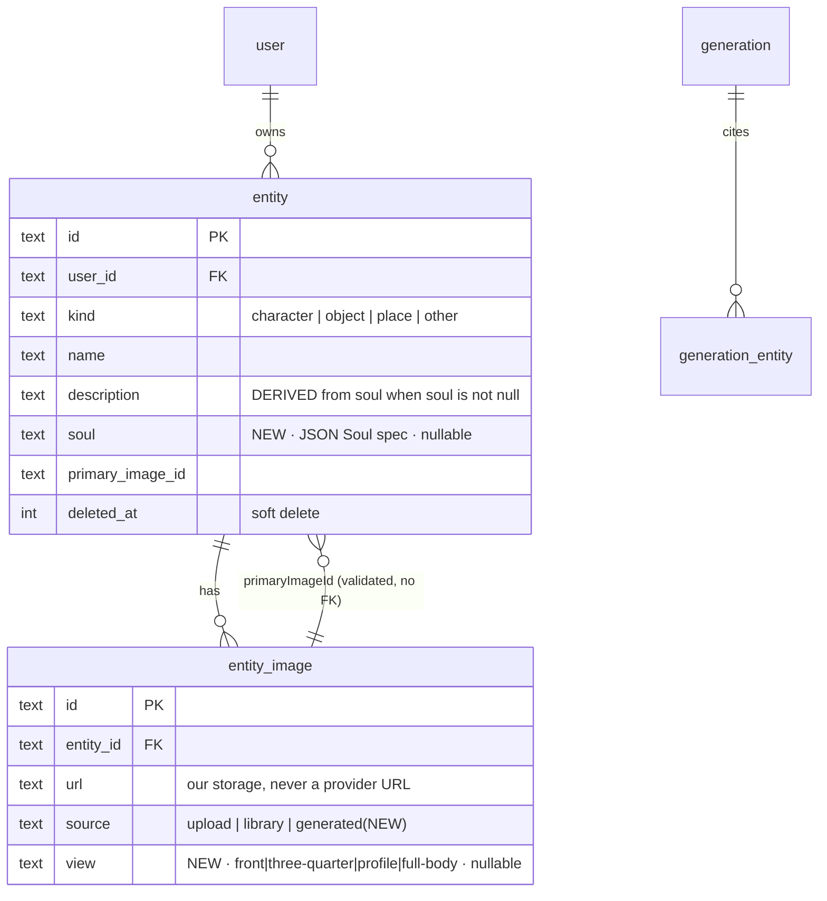
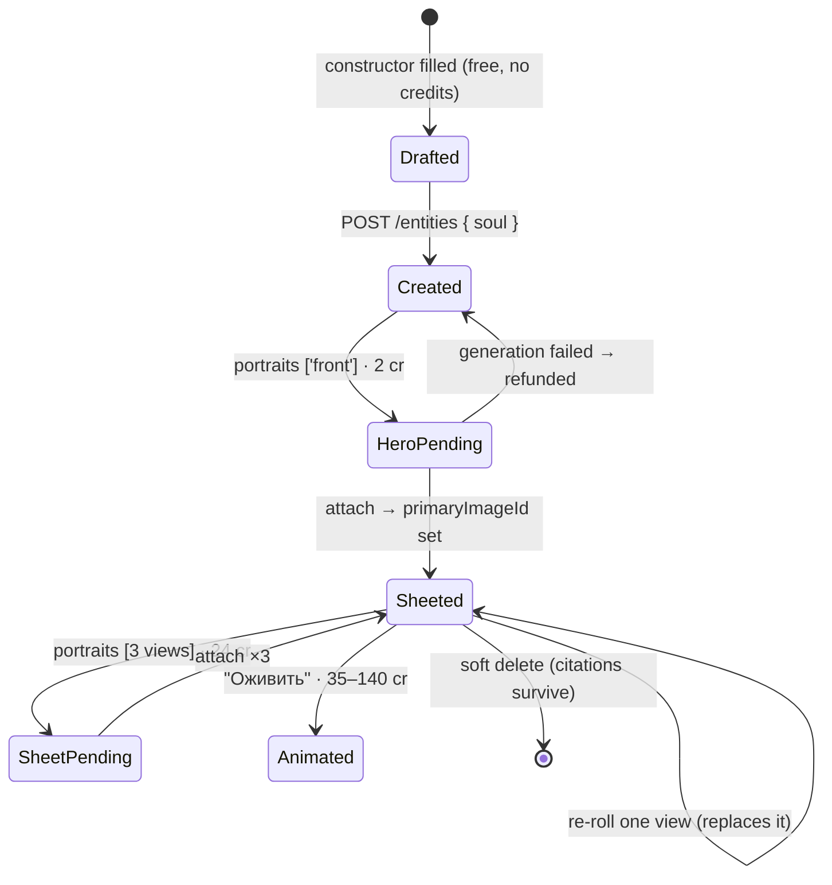

# ADR: AI Soul Studio — a structured character constructor over the entity library

- **Status:** ACCEPTED — approved by the owner 2026-07-13; implemented in the same session
- **Date:** 2026-07-10 (proposed) · 2026-07-13 (accepted + built)
- **Feature / area:** `packages/contracts/src/soul.ts`, `apps/api/src/modules/entities`, `apps/web/src/modules/Soul`
- **Deciders:** owner + agent
- **Related:** [[entity-library-reference-tagging]], [[cinema-studio]], [[opencreate-mvp-architecture]]

## Context

The owner wants an **AI Soul Studio**: a section where you build characters — women, men,
creatures — from a constructor rather than a text box. You pick a picture style (Pixar, 2D, 3D,
comic), you pick characteristics from a broad catalogue (missing eye, iron arm, horns, scars…),
and the studio turns that into a character you can see: **photos, a video, and a readable list of
its characteristics**. The photos must be *clean and unambiguous* — a character sheet, not a
random scene.

Four facts already in this codebase decide most of the design before any preference does.

### 1. The character already exists — it is `entity`

`entity(kind: 'character', name, description, images[], primaryImageId)` ships today, with
soft-delete, per-user scoping, and `@mention` tagging into prompts. Soul Studio is **not** a new
subject store. Building one would fork ownership, deletion, and the `[[e1]]` tagging protocol.

What `entity` lacks is *structure*: `description` is free prose. A constructor cannot round-trip
prose. So Soul Studio adds a structured spec **beside** the prose, not a new table beside the
entity.

### 2. A preset is structure, never prose — and a soul is a preset

[[cinema-studio]] §3 established the rule: the client sends structured ids
(`{ styleId, cameraShot, … }`), the server composes the model-facing text. If the client
concatenated fragments and shipped the result as `prompt`, the stored prompt becomes fragment
soup, "Regenerate" shows the user 300 characters they never wrote, and changing one phrase needs
a new SPA build.

A soul is exactly that argument again, one level up. **`soul` is stored structured; the server
composes the description and every portrait prompt.** The constructor never concatenates.

Consequence for the "ready list of prompts" the owner asked for: each library entry is a **`Soul`
literal**, rendered in the UI as its *composed prompt text* with a Copy button (what the owner
picked) plus "Open in constructor" (free, because the structure is there). We ship copyable text
without paying for it in lost structure.

### 3. Exactly one model in the catalogue can render a *given* character

`flux-kontext-pro` (`referenceMode: 'both'`, `maxReferenceImages: 2`) is the only catalogue entry
that accepts `referenceImages`; `flux-schnell` and `flux-dev` do not. This single fact dictates
how a consistent multi-view character sheet is possible at all:

- the **first** portrait has no reference, so it renders on `flux-dev` (2 credits);
- every **subsequent** portrait references the first, so it renders on `flux-kontext-pro`
  (8 credits) with `entityRefs: [{ placeholder: 'e1', entityId }]` — the character referencing
  *itself*.

The face therefore stays the same across views. Without this, a four-view sheet is four
strangers. The model choice is a **server-side rule** — "no primary image → `flux-dev`; primary
image exists → `flux-kontext-pro` + self-reference" — living in one place, not a client toggle.

### 4. The money path is a single choke point

`modules/generations/service.ts` owns charge-at-submit, guarded fail+refund inside one
transaction, the stale-processing reaper, the poll throttle, and the NSFW gate. A portrait is a
paid image. **Soul Studio spends no credits of its own**: the portraits endpoint calls
`generationService.create()` N times and lets that service do the only thing it does. No new
ledger code, no new refund path, no new stale sweep.

### Non-functional drivers

- **Cost is user-visible.** A four-view sheet costs 2 + 3×8 = **26 credits**. It must be a
  deliberate act with the price shown, never a side effect of pressing "Create".
- **Consistency.** Views 2–4 must be the same person as view 1 (see §3).
- **Prompt dilution.** Diffusion text encoders drop concepts past a handful. `traits` is capped
  at **6**; a 15-trait character silently becomes a 4-trait character and the user blames us.
- **Safety.** Trait/outfit tables are SFW by construction (owner's choice). Provider NSFW flags
  remain the enforcement mechanism; Soul Studio adds no new moderation surface. Note the known
  gap in [[wan-selfhost-video-provider]]: the self-hosted Wan tier has no provider-side check.
- **SSRF.** Attaching a generated portrait copies **inside our own storage** by `generationId`
  (`readAsDataUri` → `saveDataUri`). The API never fetches a client-supplied URL. Unchanged.

## Decision

Add a **`Soul`** — a structured character specification — as an optional, additive column on
`entity`, plus a pure composer in `@opencreate/contracts`, plus one new endpoint that mints a
reference sheet through the existing generation service.

### Contracts — `packages/contracts/src/soul.ts` (new)

Pure data + pure functions, next to `presets.ts` for the same reason `presets.ts` lives there:
the web renders the pickers from these tables and the API composes from the *same* tables.

```ts
soul = {
  archetype,            // female | male | androgynous | child | elder | creature | robot | anthro
  styleId,              // reuses StyleId from presets.ts (see below)
  age, build,           // single-select axes
  hairColor, hairStyle,
  eyeColor, skin, outfit, vibe,
  traits: TraitId[],    // MULTI-select, max 6 — prosthetics, marks, fantasy anatomy
  notes: string,        // free-text tail, appended last
}
composeSoul(soul): { positivePrompt, negativePrompt }        // fixed fragment order
composePortraitPrompt(soul, view): string                    // + PORTRAIT_VIEWS[view]
PROMPT_LIBRARY: { id, labelKey, soul }[]                     // the "ready list of prompts"
```

Roughly 10 groups / 120+ options, covering the owner's examples explicitly: `missing-eye`,
`eyepatch`, `iron-arm`, `prosthetic-leg`, `cybernetic-spine`, `horns`, `wings`, `tail`,
`pointed-ears`, `fangs`, `third-eye`, `heterochromia`, `vitiligo`, `burn-scars`, …

### Contracts — `presets.ts` (extended, additive)

- `styleIdSchema` gains **`'comic'`** (the owner asked for comics; Pixar is the existing
  `disney`). **One style table, shared with CinemaStudio** — a character built in `anime` and
  then animated in an `anime` film must agree, and two enums would drift.
- `promptPresetSchema` gains **`framing?: 'none' | 'reference-sheet'`**, an axis carrying both a
  fragment *and* a negative. This is what makes "clean and understandable" a **named, tested
  thing** instead of a magic string: neutral background, even studio light, one centred subject,
  no props; negative pushes away `busy background, multiple characters, text, watermark, cropped`.
- `applyPromptPreset` now **joins negatives** from every axis that has one (today only style did).

### Persistence

- `entity.soul` — `TEXT` (JSON), nullable. **Invariant: `soul != null ⟹ description is derived.**
  The service write-throughs `description = composeSoul(soul).positivePrompt` on every soul
  change. A legacy/manual entity keeps `soul = null` and free-text prose. One rule, no override
  flag, no drift.
- `entity_image.source` enum gains **`'generated'`**.
- `entity_image.view` — `TEXT`, nullable (`front | three-quarter | profile | full-body`) so the
  sheet renders in order and re-rolling one view replaces that view.

### API

- `POST /api/entities` / `PATCH /api/entities/:id` accept an optional `soul`. When present,
  `kind` is forced to `'character'` and any client-sent `description` is **ignored** (§2).
- `POST /api/entities/:id/portraits { views: PortraitView[] }` — **new**. For each view the
  service picks the model by the §3 rule, composes the prompt server-side, and delegates to
  `generationService.create()`. Returns `{ portraits: [{ generationId, view }] }`. Credits are
  charged by that service, once, as for any other image.
- `POST /api/entities/:id/images` becomes a discriminated union:
  `{ source: 'upload', dataUri }` (unchanged) | `{ source: 'generated', generationId, view }`
  (new — validates the generation is the caller's, succeeded, and of type `image`; copies within
  our storage). First attached image, or the `front` view, becomes `primaryImageId`.
- **No endpoint for `PROMPT_LIBRARY`.** It is static data in contracts, shipped with the bundle.

### Web — `apps/web/src/modules/Soul` (new module)

- `/soul` — the studio: `SoulConstructor` (grouped pickers, live composed-prompt preview),
  `PromptLibrary` (copyable text + open-in-constructor), and the user's character gallery.
- `/soul/$entityId` — the **soul card**: the reference sheet, the characteristics list, an
  "Оживить" button, and the video.
- Video is an **explicit action** (owner's choice): the primary photo is sent as `inputImage` to a
  catalogue video model. 35–140 credits, never spent implicitly.
- `/entities` remains the generic library (objects, places, uploads). Soul Studio owns characters.

## Diagrams

### Container — what changes, what does not



### Sequence — the four-view reference sheet (the load-bearing flow)

```mermaid
sequenceDiagram
  actor U as Creator
  participant W as modules/Soul
  participant E as entities service
  participant G as generations service
  participant R as Runware

  U->>W: Picks style + traits, "Создать персонажа"
  W->>E: POST /entities { soul }
  E->>E: description = composeSoul(soul).positive
  E-->>W: entity (primaryImageId = null)

  Note over W,E: Step 1 — the hero shot has no reference
  W->>E: POST /entities/:id/portraits { views:['front'] }
  E->>E: no primary ⇒ flux-dev, no entityRefs
  E->>G: create({ flux-dev, prompt, preset:{styleId, framing:'reference-sheet'} })
  G->>G: charge credits (2) — in one txn with the row insert
  G->>R: imageInference
  R-->>G: image URL
  G->>G: save into OUR storage
  W->>E: POST /entities/:id/images { generationId, view:'front' }
  E->>E: copy in storage; primaryImageId = this image

  Note over W,E: Step 2 — the rest reference the hero, so the face holds
  W->>E: POST /entities/:id/portraits { views:['three-quarter','profile','full-body'] }
  loop each view
    E->>E: primary exists ⇒ flux-kontext-pro + entityRefs:[{e1,id}]
    E->>G: create(...)
    G->>G: charge (8) · load primary photo as data URI · [[e1]] → name + description
    G->>R: imageInference + referenceImages
  end
  R-->>G: 3 images
  W->>E: POST .../images ×3
  E-->>W: entity with a 4-view sheet

  Note over U,W: "Оживить" is a separate, priced action — never implicit
  U->>W: Оживить
  W->>G: POST /generations { video model, inputImage: primary photo }
```

### Failure path — nothing is half-charged



### Data model



### State — a character's life



## Consequences

- **Positive.** Zero new money code, zero new storage code, zero new subject store. The character
  built in Soul Studio is *already* a taggable `@entity`, so it drops straight into the Generator
  and into CinemaStudio shots. One style enum keeps character and film visually agreed.
- **Positive.** "Clean and understandable" is a named preset axis (`framing: 'reference-sheet'`)
  with its own negative prompt — testable, tunable without a schema change, reusable by Cinema.
- **Trade-off accepted.** A full sheet is 26 credits, which is expensive. Mitigated by pricing the
  action in the UI before the click and by making views 2–4 a second, separate confirmation.
- **Trade-off accepted.** `soul != null ⟹ description is derived` means a Soul-built character
  cannot have hand-written prose. That is the point (a constructor cannot round-trip prose), but
  `notes` exists as the escape hatch and is appended verbatim.
- **Trade-off accepted.** Adding `'comic'` to the shared `StyleId` makes it appear in CinemaStudio's
  style picker too. Judged desirable, not a leak.
- **Risk to watch.** `flux-kontext-pro` at 8 credits is priced provisionally (see its catalogue
  comment). A four-view sheet is 3 of them; a wrong price loses money three times per character.
  Re-verify with `scripts/verify-catalog.ts` before this reaches paying users.
- **Risk to watch.** Identity drift across views is a *quality* property no test can assert. Needs
  a human eyeball pass on a real key before launch.

## Alternatives considered

| Option | Pros | Cons | Why not chosen |
|--------|------|------|----------------|
| **A. `soul` JSON on `entity`; portraits via `generationService`** | No new money/storage path; character is instantly taggable; one style enum | `description` becomes derived | **(chosen)** |
| B. New `character` table + own generation flow | Clean slate, no legacy prose | Forks ownership, soft-delete, `[[e1]]` tagging, charge/refund. Guaranteed drift from the invariants those paths earned | Rejected: duplicates the one choke point ADR [[cinema-studio]] §1 exists to protect |
| C. Client composes the prompt, sends a string | Trivial; no contracts work | Fragment soup in `prompt`; "Regenerate" lies; a fragment change needs an SPA release; row cannot answer "which style?" | Rejected: violates [[cinema-studio]] §3 verbatim |
| D. Free-text description + an LLM to structure it | Most expressive input | A model call per edit, latency, non-determinism: the same clicks stop yielding the same words. Also re-litigates the `entityPresets.ts` decision (owner already chose "presets over LLM") | Rejected |
| E. Four independent portraits, no self-reference | Cheaper (4×2 = 8 cr) | `flux-dev` cannot condition on a reference, so the four views are four different people — the feature's whole promise | Rejected: fails the requirement |
| F. Auto-generate the video on create | Impressive first run | 60–170 credits on one click; a constructor typo is paid for in full | Rejected by the owner |

## Refinements made during implementation

Two things the design got *wrong on paper* and right in the code. Both are recorded here rather
than quietly diverging, because the ADR is what the next reader will trust.

### 1. `composeSoul` returns a string, not `{ positivePrompt, negativePrompt }`

The Decision section above has `composeSoul(soul) → { positivePrompt, negativePrompt }`, implying
the soul composes its own style fragment. It must not, for two reasons that only became obvious once
the entity invariant was written down:

- `entity.description` is **derived** from this text, and a soul-built character is *taggable as
  `[[e1]]` in any prompt* — including a scene with a different style. A description that begins
  "3D animated Disney/Pixar style…" would fight the scene's own style at generation time.
- A style carries a **negative** prompt. Composing only its positive fragment here would silently
  drop the negative half — the exact class of failure `presets.ts` exists to prevent.

So `composeSoul(soul): string` yields the **subject only**, and `soulPromptPreset(soul)` returns
`{ styleId, framing: 'reference-sheet' }` for `applyPromptPreset` to expand — which owns both
halves. The negative-joining change to `applyPromptPreset` (below) is what makes this safe.

### 2. `applyPromptPreset` now JOINS negatives instead of assigning one

Style used to be the only axis with a negative, so `negativePrompt = style.negative` was enough.
`framing` is the second, and leaving the assignment would have meant a Disney reference sheet stopped
pushing away *"photorealistic"* the moment it started pushing away *"busy background"*. Negatives are
collected and joined; with a single negative present the output is byte-identical to before, so every
pre-existing request is unaffected.

### 3. The portraits endpoint attaches the images itself

The sequence diagram has the client POST `/portraits`, then POST `/images` to attach. But an **image
generation is synchronous** in this codebase (`generations/service.ts` resolves the asset before
returning), so that second call buys nothing and opens a window in which a client crash leaves the
user holding a **paid, orphaned portrait**. `POST /entities/:id/portraits` therefore generates *and*
attaches, returning the finished entity plus a per-view result array. A view that fails is reported
individually (`{ view, generationId: null, error }`) and does not abort the remaining views — it has
already been refunded by the generation service, and collapsing four paid jobs into one error would
hide which of them the user actually got.

## What minting a real sheet taught us (2026-07-13)

Both of these were invisible to the test suite — which was green — and only appeared when a real
sheet was minted against the live provider. They are the argument for driving the flow, not just
running the tests.

### 4. FLUX.1 Kontext has no negative channel — and Runware rejects the whole task

`flux-kontext-pro` (`bfl:3@1`) is an **edit** model: it is steered by the reference image, not by a
negative prompt, and it does not accept one. Runware does not ignore the parameter — it fails the
task outright (*"Invalid parameter detected. The parameter 'negativePrompt' is not recognized or
supported"*). Since a style preset **always** produces a negative, every referencing view (2–4) died
at the provider, was refunded, and delivered nothing: the sheet could never be more than its hero
shot.

Fixed exactly like the pre-existing `supportsSafetyParam` (ByteDance rejects `safety`): a
`supportsNegativePrompt` capability on the catalogue entry, enforced in the generation service.
The test that would have caught it now exists — the old one only asserted the negative on `calls[0]`
(flux-dev, which *does* take one), which is precisely how three broken calls hid behind a green suite.

**Consequence for the design:** the `reference-sheet` framing negative reaches the hero shot only.
Views 2–4 get its positive fragment and rely on the reference image (already clean-backed) to carry
the rest. Acceptable, but it means the framing axis is *half* as strong on the referencing model as
the ADR assumed.

### 5. The risk was mis-identified: identity holds, POSE does not

The ADR listed "identity drift across views" as the quality risk to watch. The live sheet shows the
opposite: identity is excellent (same beard, same iron arm, same vest across all four), but the
**views barely differ** — "profile" is not a true side view, and "full-body" came back cropped at the
thigh. Kontext preserves the reference's composition; asking it to *re-pose* the subject fights what
an edit model is for. The self-reference that buys us a consistent face is the same mechanism that
resists a new camera angle.

Not fixed here. The options, in rough order of appeal: strengthen the view fragment with explicit
camera language and let the framing positive do more work; try `nano-banana-pro` (better
instruction-following, but 28 credits a view — a 4-view sheet becomes 86); or generate views 2–4
from the hero with an explicit pose-transfer prompt rather than a plain view fragment. Worth a spike
before this is sold as a "four-view sheet".

## Links

- Feature docs: `apps/api/FEATURE.md`, `apps/web/FEATURE.md`
- Contracts: `packages/contracts/src/soul.ts` (+ its sidecar), `presets.ts` (`framing` axis)
- Related ADRs: [[entity-library-reference-tagging]], [[cinema-studio]], [[wan-selfhost-video-provider]]
