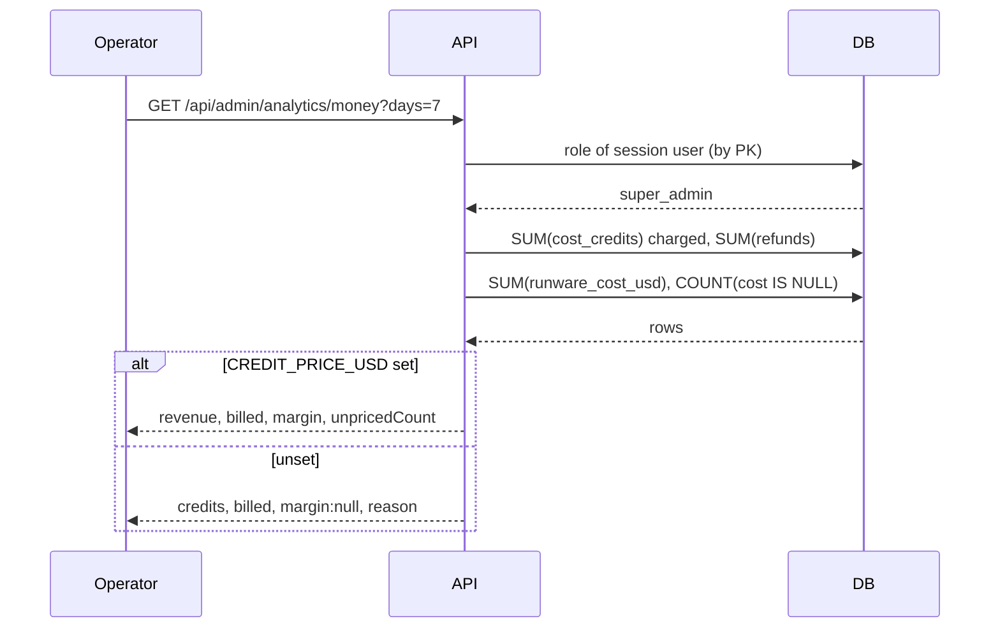

# Analytics — operator dashboard, personal usage, product telemetry

- **Status**: accepted
- **Date**: 2026-08-25
- **Supersedes**: nothing
- **Related**: [railway-deployment](railway-deployment.md), [opencreate-mvp-architecture](opencreate-mvp-architecture.md), [segmind-seedance-channel](segmind-seedance-channel.md)

## Context

The product is live on Railway and every generation spends real money at kie.ai,
Segmind, Runware, DeepInfra and ByteDance. Until now the only way to answer
"is video working?", "what did today cost?" or "which model is failing?" was to
read container logs by hand — which is exactly what the last week of operator
questions were.

The data to answer all three already exists. `generation` carries `status`,
`model_id`, `provider`, `cost_credits`, `runware_cost_usd` (neutral despite the
legacy name), `error_message`, `created_at`, `completed_at`. `credit_transaction`
is a signed ledger with `charge`/`refund`/`signup_bonus`. `film_render` and
`model_render` carry the same shape for their surfaces. **No new event-tracking
table is needed for the operator dashboard** — the money path already writes
every fact it would record, and a parallel event stream would be a second source
of truth that can disagree with the ledger.

Three audiences were requested, and they are genuinely different products:

| Audience | Question | Source |
|---|---|---|
| Operator (super_admin) | What is broken, what does it cost, what do we earn | Existing tables |
| Signed-in user | What did **I** spend it on | Existing tables, scoped to `user_id` |
| Product owner | Where do visitors come from, where do they drop off | Third-party script |

## Decisions

### 1. The operator dashboard reads the money path; it does not instrument a new one

Aggregations run as SQL over `generation` / `credit_transaction` / `film_render` /
`model_render`. The alternative — emitting analytics events at each call site —
was rejected: it doubles the write path on the money route, and the day the two
disagree the operator cannot tell which one lied. The ledger is already the
audited truth. Analytics is a **read model** over it.

Cost: admin queries scan by time across all users, and the only generation index
is `(user_id, created_at)`. One index is added: `idx_generation_created`.

### 2. Authorization reads the role from the database, never from the session

`requireSuperAdmin` looks `user.role` up by primary key on every admin request
rather than trusting a `role` claim carried in the session. One indexed read, and
it means revoking an admin takes effect on their **next request** instead of
whenever their session happens to expire. For the one role that can read every
user's spend, a stale claim is not an acceptable failure mode.

`role` has existed since the MVP but has never gated anything — this is its first
consumer, so there is no precedent to match and the strict option is free.

### 3. Provider cost is reported where it is billed, and blank where it is not — never estimated into the same number

`costUsd` is populated by kie (from `creditsConsumed × KIE_CREDIT_USD`), Runware,
DeepInfra and ByteDance. **Segmind reports no billed figure at all**, and its
adapter deliberately refuses to invent one — that refusal is correct and is not
being reversed here.

So the dashboard reports two separate figures and never adds them together:

- **Billed** — `SUM(runware_cost_usd)`, the money providers actually charged.
- **Unpriced** — the count of settled generations whose provider returned no
  figure, shown next to it.

A single blended number would be worse than either: it would look authoritative
while silently containing a guess, and the operator would make pricing decisions
on it. An estimate the reader can see is a datum; an estimate the reader cannot
see is a lie. If Segmind coverage ever matters enough, the fix is a per-model
list-price table shown in its own clearly-labelled column — not backfilling
`runware_cost_usd` with a guess, which would corrupt a column the money path
reads.

### 4. Revenue is configuration, because credits are not sold yet

There is no top-up, no Stripe, no price. `cost_credits` is what a user was
charged in credits; converting it to revenue needs a rate that does not exist in
the system.

`CREDIT_PRICE_USD` is therefore optional configuration. When it is unset the
dashboard shows credits charged and provider USD billed, and the margin panel
says *not configured* instead of rendering a zero. **A margin of "0" and a margin
of "unknown" must never look the same** — the first invites a decision, the
second forbids one.

When it is set, margin is `credits_charged × CREDIT_PRICE_USD − billed_usd`, and
the panel states the rate it used and how many generations were unpriced, so the
number carries its own error bar.

### 5. Refunds are subtracted from revenue, not hidden

A refunded generation charged the user and gave the money back. Revenue nets
`charge + refund` from the ledger (refunds are positive, charges negative), so a
provider that fails half its jobs cannot look profitable.

### 6. Personal usage is the same read model, scoped by `user_id`

`GET /api/me/usage` reuses the aggregation shapes with a `user_id` filter. It
reports **credits**, never provider USD or margin — a user has no business
knowing our cost basis, and the endpoint is the natural place to leak it.

### 7. Product telemetry is a config-gated cookieless script, off by default

`ANALYTICS_SCRIPT_URL` + `ANALYTICS_SITE_DOMAIN`. Unset → no script tag, no
third-party request, nothing to consent to. This shape fits Plausible and Umami,
both cookieless, both therefore outside the EU consent-banner requirement — which
is the actual reason to prefer them over PostHog's default configuration here,
not a taste preference. The site is public and unauthenticated visitors are
tracked, so the cheapest correct answer is to collect nothing that needs consent.

No user id, email or prompt text is ever passed to it. Prompts are user content
and frequently personal; a third-party analytics vendor is the wrong place for
them to land, and a URL-path-only integration cannot leak them by accident.

## Container view

```mermaid
flowchart LR
  subgraph Browser
    SPA[React SPA]
    ADM["/admin dashboard<br/>super_admin only"]
    USG["Personal usage"]
  end
  subgraph API[Fastify API]
    G[requireSuperAdmin<br/>DB role read]
    AS[analytics service<br/>read model]
    R[/api/admin/analytics/*/]
    RU[/api/me/usage/]
  end
  subgraph DB[(SQLite)]
    GEN[(generation)]
    LED[(credit_transaction)]
    FR[(film_render)]
    MR[(model_render)]
  end
  PLA[Plausible / Umami<br/>optional, cookieless]

  ADM --> R --> G --> AS
  USG --> RU --> AS
  AS --> GEN & LED & FR & MR
  SPA -. "path only, no ids" .-> PLA
```

## The money question, end to end



## Consequences

- The operator answers "what is broken and what did it cost" without SSH or logs.
- Margin is honest-by-construction: it either carries its rate and its gap count,
  or it refuses to render.
- One new index; no new write path on the money route; no new table.
- Segmind generations stay unpriced until Segmind reports a figure or a
  list-price table is added. This is visible in the UI, not silent.
- `CREDIT_PRICE_USD` is a number the operator invents until credits are sold.
  It is labelled as an assumption in the UI for that reason.

## Rejected

- **An `analytics_event` table written at each call site** — a second truth next
  to the ledger, extra writes on the money path, and no question it answers that
  SQL over the ledger does not.
- **Backfilling `runware_cost_usd` with list prices for Segmind** — corrupts a
  column the money path reads, to make one dashboard cell look complete.
- **Deriving revenue from a hardcoded credit price** — invents a business fact in
  source code and hides that it was invented.
- **PostHog with session recording / autocapture** — captures prompt text and
  requires a consent banner on a public marketing surface, for questions we are
  not yet asking.
