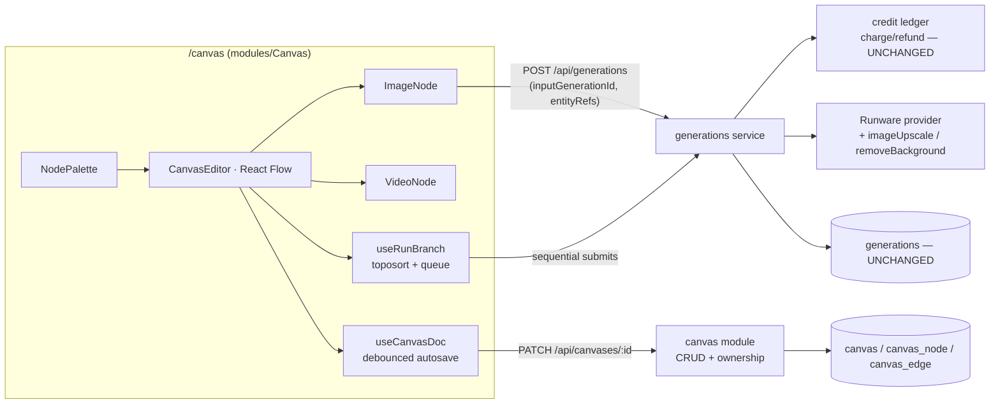
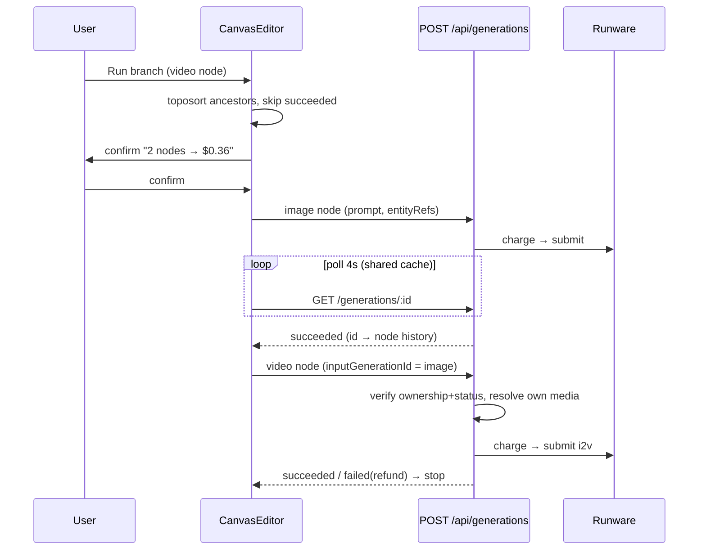
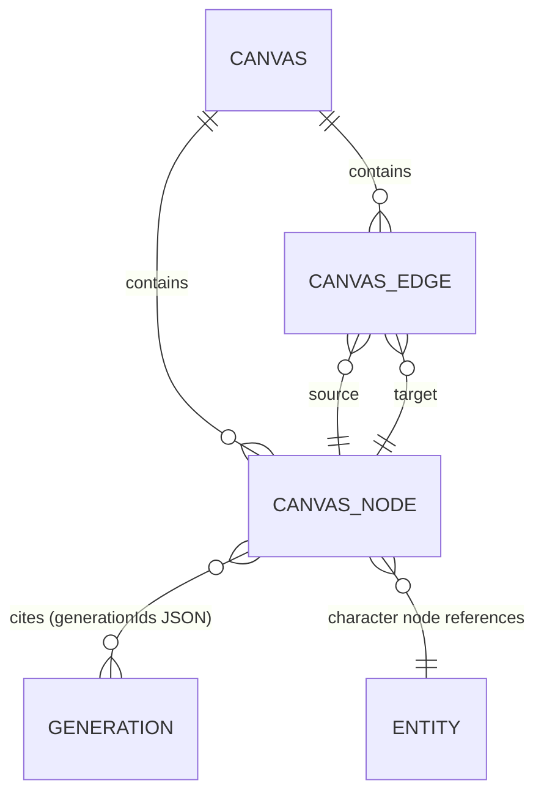

# ADR: Canvas Mode — node-graph chains over the unchanged generation lifecycle

## Status

**Proposed — 2026-07-29** (design approved by owner in visual brainstorm; spec at
`docs/superpowers/specs/2026-07-29-canvas-mode-design.md`). Owner decisions locked
during brainstorm: node graph with wires (not freeform board, not hybrid);
task-block nodes (not ComfyUI-atomic); per-node run + "run branch" (not auto-cascade);
MVP nodes = image · video · upload · character · upscale · remove-bg · note;
engine = `@xyflow/react`.

## Context

The owner wants a Freepik/Flora-style canvas: chains like
character → image → remix → video → upscale composed visually, with maximum ease of use.
openCreate already has everything below the UI: async generation lifecycle
(charge-at-submit / poll / refund), credit ledger, catalog, entityRefs (Soul),
media storage, Library. Films and Assets3D established the aggregate discipline:
**cite generations by id, never own money or media**.

What does NOT exist: any canvas surface, upscale/remove-bg operations, and a way to
feed one generation's output into another without a client-side base64 roundtrip
(`inputImage` is data-URI-only by SSRF design).

## Decision

### D1 — Canvas is a first-class aggregate that cites generations

`canvas` / `canvas_node` / `canvas_edge` tables + zod contracts; CRUD under
`/api/canvases`; PATCH carries the full document (debounced autosave,
last-write-wins, single owner). Node runs are ordinary `POST /api/generations`;
`generationIds` in the node is append-only version history. Zero new money code.

### D2 — `inputGenerationId` joins the generation contract

Optional, mutually exclusive with `inputImage`. The server validates ownership +
succeeded status, then resolves its OWN stored media as the provider reference image.
This is the chain edge: no SSRF (nothing user-addressable is fetched), no 14MB
base64 roundtrips.

### D3 — Upscale / Remove-BG are catalog pseudo-models, not new subsystems

`upscale-4x` and `remove-bg` enter the catalog as image-type, image-mode models with
fixed prices; the Runware provider maps them to `imageUpscale` / `removeBackground`
task types. The ledger, refunds, Library, and polling treat them as any other
generation. (Same "not a new subsystem" move as audio in CinemaStudio and model3d
in Studio3D.)

### D4 — Engine: `@xyflow/react`; nodes are DOM, composers embed directly

React Flow gives pan/zoom/wires/marquee/minimap; nodes are ordinary React components,
so `ModelSelect`, `PromptField`, `CostLabel`, the enhance sparkle, and the
`['generation', id]` polling embed unchanged. Rejected: hand-rolled canvas
(months of interaction edge cases) and Konva/Pixi (non-DOM nodes cannot host our
composer components).

### D5 — Execution is client-orchestrated, spend stays explicit

Per-node Generate, plus "Run branch": client topo-sorts ancestors, confirms with an
itemized credit total, runs sequentially, skips already-succeeded nodes, stops on
first failure (refund chip on the failed node; downstream never starts).
Auto-cascade re-runs are rejected — one edit must never trigger N unconfirmed
charges.

## Architecture

## Consequences

- The whole feature is one new web module + one new API module + two point changes
  (generation input, catalog rows); the money path, Library, and Soul are untouched.
- New frontend dependency `@xyflow/react` (~45KB gz, MIT) — the one dependency the
  bar "максимально удобно" justifies.
- Upload nodes store media without a generation row — the only node kind with its
  own storage write.
- Full-document PATCH autosave is O(canvas size); acceptable for MVP, revisit with
  op-based patches only if canvases grow into hundreds of nodes.

## Build phases

1. Contracts + canvas CRUD + `inputGenerationId`.
2. Editor with image/video/upload/note nodes, wires, autosave — usable.
3. Character node + run-branch.
4. Pseudo-models + upscale/remove-bg nodes.

Out of scope: multiplayer, auto-cascade, node templates, canvas-to-video export
(CinemaStudio's job).
