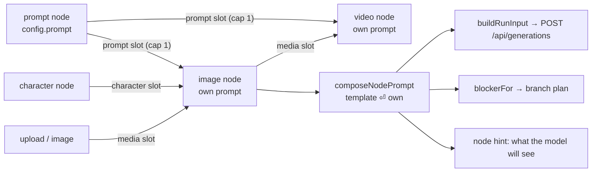
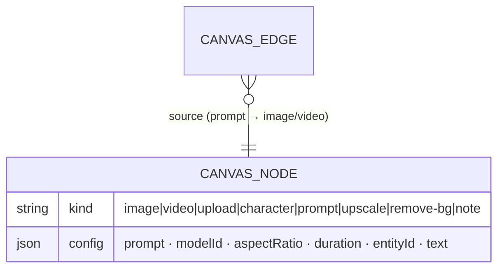

# ADR: Canvas — the `prompt` node (a shared prompt, wired)

## Status

**Accepted — 2026-08-02.** Owner asked for reusable prompts on the board and picked,
out of three offered shapes, the **node** one: a card holding prompt text, wired into
several image/video nodes. The two rejected shapes are recorded below because they are
the obvious next asks, and the reason they lost is a scope reason, not a quality one.

## Context

A board today has no way to say the same thing twice. Every image/video node owns a
private `config.prompt`, so a chain that renders one subject across five variants makes
the user paste the shared half into five textareas — and edit five textareas when the
shared half changes. `canvas-mode` listed "node templates" as out of scope for the MVP;
this is that line being retired.

What already exists and is NOT this: `/styles` (a style = name + positive/negative
fragment + up to three reference images, an owned ROW reusable across the whole app) and
`/templates` (the shipped catalog of ready films). A style is a *modifier*; the owner
asked for the *prompt itself*, on the board.

## Decision

### D1 — It is a node KIND, not a new entity

`canvasNodeKindSchema` gains `'prompt'`. The text lives in the node's existing
`config.prompt` (already capped at 2000). No table, no endpoint, no registry: the
document already stores every other node this way, and the service stores `kind` as
opaque text (it never interprets a kind), so the server change is one enum value.

The cost of this choice, stated plainly: a prompt node is reusable **within one board
only**. Cross-board reuse is a real want and a different shape — an owned row with CRUD
and a picker, i.e. the `/styles` architecture — and it stays out of scope until asked
for. Nothing here blocks it: a future registry would fill this node's text, not replace
the node.

### D2 — The wire carries TEXT, and it MERGES rather than replaces

Effective prompt = the template, then a newline, then the node's own text; either side
may be empty:

```
composeNodePrompt(node, nodes, edges) = [templateText, ownText].filter(Boolean).join('\n')
```

- **Merge, not replace**, because a template that overwrote the field would make every
  child identical — the whole point is one shared head plus a per-node variation.
- **Template first**, because it is the upstream card: the board reads left to right, and
  the composed text must read the way the graph looks.
- **A newline, not `", "`**, because inventing punctuation is how a template ending in a
  comma produces `neon city,, a fox`. Providers treat the newline as whitespace.

### D3 — ONE composition function, three callers

`composeNodePrompt` is pure and exported from `model/useNodeGeneration.ts`, and it is
what `buildRunInput` (the money path), `blockerFor` (the branch plan) and the node UI
all read. This is the whole risk of the feature in one line: the run path and the
Generate/plan gating must agree on what the prompt IS, or a node with an empty own field
but a wired template renders a disabled button over a perfectly runnable job — or, worse,
the reverse.

### D4 — One prompt wire per target, and no cycles (existing law)

`edgeRules` gains a third SLOT beside media and character: `prompt`, cap 1 on `image`
and `video`. Two templates into one node would need a merge ORDER the graph cannot
express, so the second wire is refused at drag time, exactly like a second character.
The prompt node itself takes no input.

### D5 — It never runs, never costs, and is not in the branch plan

`RUNNABLE_KINDS` is untouched (`image`, `video`), so a prompt node cannot appear as a
priced row. It wears `NodeShell` at a permanent `idle` with an output port and no input
— the `character` node's exact posture, so the board has one language for "furniture
that feeds a producer" rather than two.

Its textarea carries the mandatory `EnhanceButton` sparkle (owner law, 2026-07-30: every
prompt field has it). That is the one place the enhancement pays for itself most: one
improved template lifts every child at once.

## Architecture





## Rejected alternatives

- **A prompt-template registry** (save from a node, insert anywhere in the app). Bigger
  and genuinely useful, but it is a new owned entity with CRUD, a picker in four places
  and its own ADR — and the owner picked the board-native shape.
- **Placeholders / variables** (`{{subject}}` filled per child). Every child then needs a
  variable form, and an unfilled variable is a paid run that renders literal braces.
  Merge-by-append gets most of the value with none of that failure mode.
- **A per-node "insert" that copies the template text** into each child's field. Copies
  drift the moment the template is edited — the exact problem this solves.

## Consequences

- One contract line, zero API logic, one new frontend component, one new edge slot.
- `buildRunInput`'s length guard now runs against the COMPOSED prompt, so a node with an
  empty own field is runnable when a template feeds it — a deliberate behaviour change
  pinned by tests.
- A prompt node deleted (or its text emptied) silently shortens every child's prompt. That
  is legible on the board (the wire disappears) and the node hint restates the composed
  text, so it is a visible change rather than a silent one.
- Out of scope, unchanged: cross-board reuse, variables, prompt versioning.
