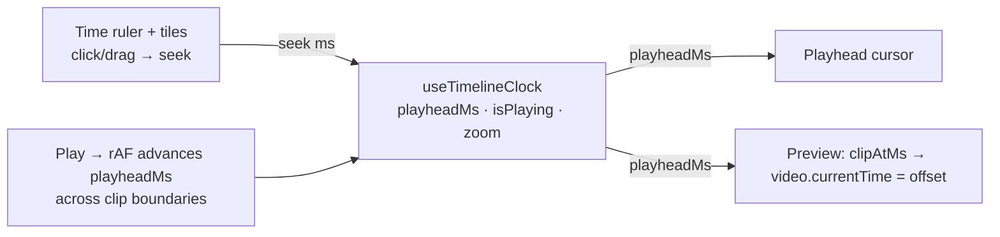

# ADR: Cinema NLE timeline — a playhead-driven editor (not a graft)

## Status

**Accepted — 2026-07-22** (owner approval). Build in our own stack; phased.

## Context

The owner needs CinemaStudio to make **10-minute films**, and the current editor
cannot: it is a shot **strip + a sequential auto-player**, not a non-linear editor.

Two concrete defects prove the gap (verified in code 2026-07-22):

- **`PreviewPlayer` never receives `selectedShotId`** — it holds its own internal
  `index` (`PreviewPlayer.tsx:46`) and advances by timer/`ended`. Clicking a shot
  tile changes the composer + tile highlight but the **preview does not jump** to
  the clicked shot.
- **No playhead, no seek, no scrub** — play/pause + auto-advance only. You cannot
  drag to a position, and there is no timeline cursor. Unusable at 10-minute scale.

The owner proposed pulling **OpenCut** (github.com/opencut-app/opencut) and
"installing the full editor."

## Decision

**Build a real NLE in our stack; use OpenCut only as a reference for proven
timeline-engine patterns.** Do NOT graft OpenCut wholesale (see Rejected).

The spine is a single Zustand store — the **timeline clock** — that is the one
source of truth for "where are we in the film":

```
useTimelineClock: { playheadMs, isPlaying, zoom /*px per second, Phase 2*/ }
  actions: seek(ms), play(), pause(), toggle()
```

Every surface hangs off it:

- **Ruler + tiles** turn a click/drag into `seek(ms)` (a tile click seeks to that
  shot's start — selection UNIFIES with the playhead).
- A **playhead** (vertical cursor) is rendered at `playheadMs × pxPerSec`.
- The **preview is playhead-driven**: given `playheadMs`, find the clip occupying
  that time (cumulative shot durations) and set `video.currentTime` to the offset
  within it — frame-accurate seek, not a sequential index.
- **Play** is a `requestAnimationFrame` loop advancing `playheadMs` across clip
  boundaries (swap the source at each boundary) until the film end.

### Diagram — the clock is the hub



### Phasing

1. **Phase 1 — spine + the two defects:** the clock store, a playhead, click/drag
   seek on ruler + tiles, preview follows the playhead (seek to frame). Fixes both
   bugs; is the NLE foundation.
2. **Phase 2 — 10-minute ergonomics:** timeline zoom (`pxPerSec`) + horizontal
   scroll + a ruler with time ticks; through-play across all clips with audio.
3. **Phase 3 — editing power:** trim handles (in/out), split, drag-reorder on the
   timeline, snapping; audio-lane waveforms.
4. **Phase 4 — polish:** keyboard shortcuts (space / ←→ frame step / J-K-L),
   frame counter, fit-to-window.

## Consequences

**Positive** — the clock store is small and pure-testable; the preview stops being
a sequential player and becomes seek-driven; selection and the playhead unify;
each phase ships a working editor. The generation model, server-side ffmpeg
render, and design system are untouched — the NLE is a client-side editing layer
over the same `shot`/`generation` data.

**Negative / cost** — through-play with audio (Phase 2) and trim/split (Phase 3)
are real engineering; a rAF playback loop must be cleaned up carefully (no leaks).
Frame-accuracy is bounded by `<video>` seek precision, which is fine for preview.

## Rejected alternatives

- **Graft OpenCut wholesale.** It is a separate **Next.js** app (we are Vite SPA +
  Fastify + TanStack Router) built around **local uploaded media**, not our
  generation-cited clips, with its own client-side export — not our server ffmpeg
  render. Vendoring it in would fight the framework, the data model, the render
  pipeline, and the design system: more work and more incoherence than building
  the NLE natively. Its timeline-engine ideas are reused; its code is not.
- **Keep the sequential auto-player.** Cannot scrub, cannot seek, cannot scale to
  10 minutes — it is exactly what the owner is blocked by.
