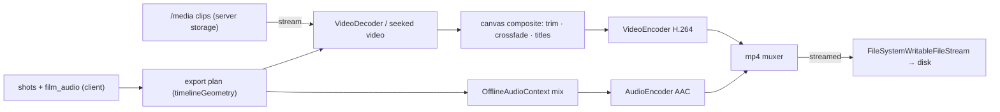

# ADR: Client-side final export (WebCodecs), server render retired from the path

## Status

**Accepted — 2026-07-23** (owner). The final film assembly/export moves into the
browser. The server ffmpeg render is NOT deleted but is no longer invoked by the
export action — the backend does nothing for export.

## Context

The whole NLE editing layer is already client-side (ADR `cinema-nle-timeline`).
The final EXPORT was still server-side: `apps/api/src/modules/films/render.ts`
builds an ffmpeg filter-graph and runs `ffmpeg-static` on the server (concat by
order, per-shot trim `[trimStartMs, +durationMs]`, crossfade transitions, drawtext
title cards, audio mix of `film_audio` tracks with gain/offset + clip native audio,
output at the film canvas size). The owner wants the export in the browser so the
backend does nothing for it (server compute + the render semaphore go away; export
scales on users' own devices, like OpenCut / CapCut-web / Canva).

**What CANNOT move (surfaced to and understood by the owner):** the AI CLIP
generation stays server-mediated — it uses provider API keys and charges credits;
keys can't reach the browser and money is counted server-side. "Backend does
nothing" applies to EXPORT only; clip generation and `/media` storage stay.

**The 30-minute question (owner):** yes, the browser handles long films — but ONLY
with a streaming pipeline. `ffmpeg.wasm` holds data in tab memory (~2–4 GB ceiling)
and OOMs on long 1080p — rejected. **WebCodecs** is a hardware encoder and, when the
pipeline decodes→composites→encodes→muxes clip-by-clip and writes output straight to
disk (File System Access API), memory stays FLAT regardless of length. Caveat, not a
blocker: very weak devices are slower.

## Decision

**Build a client-side, streaming WebCodecs export** that replaces the server render
as the export action.

- **Video:** a canvas at the film's output size. Per output frame (fps from the
  film), the active shot is found via the existing `timelineGeometry`; its clip
  frame at the right offset is decoded (`VideoDecoder`, or `requestVideoFrameCallback`
  off a seeked `<video>`), composited (crossfade at boundaries), title cards drawn on
  the canvas, then encoded via `VideoEncoder` (H.264).
- **Audio:** `film_audio` tracks (music/voice, gain/offset) + clip native audio mixed
  in an `OfflineAudioContext`, encoded via `AudioEncoder` (AAC).
- **Mux + output:** an mp4 muxer (a small lib — `mp4-muxer`/`mediabunny`, a new web
  dep) writes progressively to disk via `showSaveFilePicker` →
  `FileSystemWritableFileStream`. Memory never holds the whole film.
- **Clips** stream from `/media` (the server still stores + serves them; that is the
  only server involvement, and it is not "doing" the export).
- Progress + cancel; the 4 UI states; a capability gate (`isExportSupported()`:
  WebCodecs + File System Access) with a calm message where unsupported.
- `render.ts` + the render routes STAY in the repo, un-invoked — a dormant safety
  net, easy to re-enable, not on the export path.

### Diagram

## Consequences

**Positive** — no server render compute, no render semaphore/queue, no "render lost
on API restart" class; export scales per-device; the preview and export share one
client timeline model. Memory is flat (streaming), so length is not the limit.

**Negative / cost** — re-implements the whole `render.ts` filter-graph in the
browser (transitions, titles, audio mix); a new muxer dependency; device-dependent
speed and (worst case, weak device) failure with no server fallback on the default
path; File System Access API is Chromium-first (Safari/Firefox need a
whole-file-in-memory blob fallback → memory grows, so long films degrade there).
Determinism varies by device vs the server's fixed ffmpeg.

## Rejected alternatives

- **`ffmpeg.wasm` in the browser** — closest to porting `render.ts`, but holds data
  in tab memory and OOMs on long 1080p; the owner's 30-minute target rules it out.
- **Keep the server render** — works at any length and offloads the device, but is
  exactly the server export the owner wants gone. Kept dormant, not on the path.
- **Hybrid (client short / server long)** — the safe belt-and-braces; the owner chose
  pure client-side. Re-enabling the dormant `render.ts` restores it if ever wanted.
