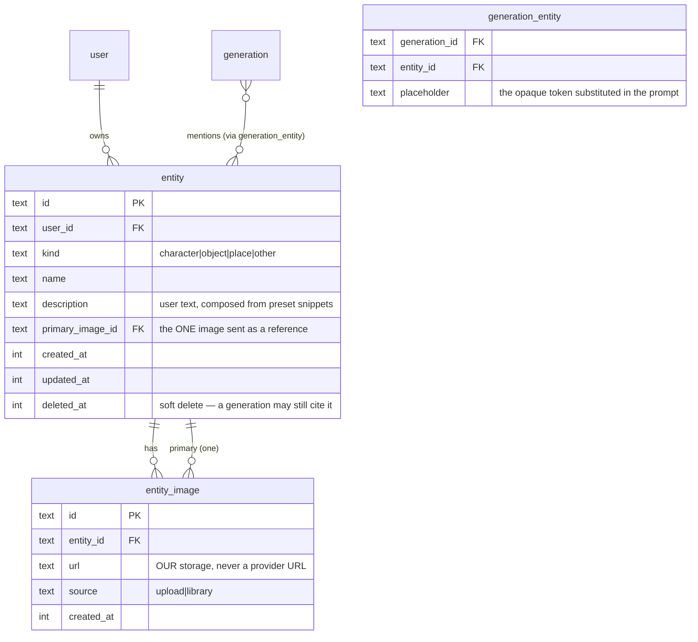

# ADR: Entity library (characters / objects / places) with reference tagging

- **Status:** ACCEPTED — approved by the owner 2026-07-09 (architecture gate, `project-kickoff`)
- **Date:** 2026-07-09
- **Supersedes:** —
- **Related:** [[wan-selfhost-video-provider]]

## Context

Users want a reusable library of **entities** — characters, objects, places, and a catch-all
"other" — each with a name, a description and photographs. An entity can then be *tagged*
inside a prompt so the model actually renders **that** character, not a stranger who happens
to match the words.

Three facts from the code decided this design before any preference did.

### 1. A "character" is not one thing — it is a provider capability

There are two industry mechanisms, and they are not interchangeable:

| | Reference image | Trained LoRA |
|---|---|---|
| Setup | none — send a photo per request | a GPU training job, minutes to tens of minutes |
| Storage | one image | a `.safetensors` per character **per model family** |
| Fidelity | good | best |
| Portability | works on any model that accepts references | FLUX-LoRA does **not** run on Kling |
| Cost model | per generation | per training + per generation |

Runware exposes **both**: `referenceImages` (character identity from a photo; currently
**one** image, one clear face) with ACE++ task types `Portrait` (faces) and `Subject`
(objects, logos), plus LoRA parameters and a Model Upload API.

The owner chose **reference images only** for v1. LoRA is a non-goal here, but the schema
must not make it a migration.

### 2. Capability is per-model, and 8 of our 9 models are not ours

`apps/api/src/modules/catalog/catalog.ts` ships nine models. Exactly one — `wan-2-2` —
runs on our own ComfyUI pod; the rest are Runware. And `apps/api/src/integrations/runware/types.ts`
models **no** `referenceImages` field today — the wire type has to grow one.

So "tag a character anywhere" is false as stated. Tagging works **only on models that
accept a reference**, and the UI must say so rather than silently drop the character.
The owner chose: **filter the model list when a tag is present.**

### 3. A tag in the prompt text cannot work

The prompt is a string. Wan's `CLIPTextEncode` — and every text encoder — reads `@аня`
as the literal word "аня". There is no lookup, no binding, nothing. If tags live in the
text, the user tags a character, pays credits, and receives a stranger. The bug is silent
and total.

**Therefore tags MUST be structure on the request**, and the prompt string the model sees
is *composed by the backend*, never typed by the user.

## Decision

Introduce an **Entity** aggregate owned by the user, and a **structured mention** channel
on the generation request. Reference images are the only binding mechanism in v1.

### Domain model



`kind` maps onto the provider's reference semantics: `character → Portrait`,
everything else → `Subject`. That mapping lives in the provider adapter, not in the domain.

### The mention protocol (the part that must not be improvised)

The client never sends `"@аня стоит у окна"`. It sends:

```jsonc
{
  "prompt": "[[e1]] стоит у окна",          // opaque placeholders, never natural text
  "entityRefs": [{ "placeholder": "e1", "entityId": "ent_123" }]
}
```

The backend resolves each placeholder to the entity's `name + description`, substitutes it
into the prompt, and attaches the entity's primary image as `referenceImages`.

Why opaque placeholders rather than matching the display name: a user may name a character
"Аня", write "Аня и её сестра Аня-младшая", or name one "the" — substring matching on a
display name is a correctness bug waiting for its first weird name. `[[e1]]` cannot collide
with prose because the composer is the only thing that can produce it.

```mermaid
sequenceDiagram
    participant U as User
    participant C as Composer (web)
    participant A as API
    participant P as Provider (Runware / pod)

    U->>C: types, picks @Аня from the mention picker
    C->>C: inserts chip; prompt text holds [[e1]]
    C->>C: model list filtered to reference-capable models
    C->>A: POST /generations { prompt:"[[e1]] у окна", entityRefs:[…] }
    A->>A: 400 if model lacks reference support (never trust the client)
    A->>A: 400 if entityRef count > provider max (Runware: 1)
    A->>A: load entity, authorize owner, resolve placeholder → name+description
    A->>P: task { positivePrompt: "Аня, женщина…, у окна", referenceImages:[url|b64] }
    P-->>A: asset
    A->>A: persist generation_entity rows (provenance: what was cited)
```

### Storage

Entity photos are copied into **our** storage. `apps/api/src/storage/local.ts` already
provides `saveFromUrl` behind an SSRF host allowlist — the seam exists; only the backing
target changes (local now, R2/S3 later, same as the Wan ADR's presigned-PUT plan).

This is non-negotiable, and not for tidiness: **Runware assets expire after 7 days.**
An entity whose reference image points at a provider URL is a character that silently
breaks a week after creation. Entities are long-lived assets; generations are not.

### Templates (owner's choice: free text + presets)

`description` is a free-text field. Below it, a row of preset chips per `kind` appends
canonical snippets ("cinematic lighting", "close-up portrait", "photorealistic"). The
snippets are i18n strings, not an LLM call: zero new dependency, zero latency, and the same
input always yields the same description.

### Frontend

A new `modules/Entities` module (public API via `index.ts`, no cross-module imports),
plus a mention picker inside `modules/Generator`'s composer. Per the Frontend Standard:
TanStack Query for the entity list, 4 UI states everywhere, test-first.

Composer wiring follows the precedent already set by "Regenerate": Gallery/Entities must
not reach into the Generator store — **the route composes them.**

## Consequences

- `packages/contracts` grows `entity.ts` and `createGenerationInput.entityRefs`.
- `catalog.ts` grows a capability flag (`referenceMode: 'portrait' | 'subject' | 'both' | null`).
  The composer filters on it; **the API re-validates it.** A capability the client can lie
  about is not a capability.
- `runware/types.ts` grows `referenceImages`. The pod's ComfyUI graph gains nothing in v1:
  `wan-2-2` has no reference node, so it is simply excluded when a tag is present.
- New endpoints: `GET/POST /api/entities`, `GET/PATCH/DELETE /api/entities/:id`,
  `POST /api/entities/:id/images`.
- Soft delete on `entity`: a past generation cites it, and provenance must survive.

### RESOLVED (2026-07-09, during implementation)

**Reference delivery → data URI.** Runware's `referenceImages` accepts a UUID, a public URL,
a bare base64 string, **or a data URI**. We send data URIs (`storage.readAsDataUri`), so the
public bucket is no longer a prerequisite for this feature. The risk below is closed.

**No existing model could carry a tag.** Verified against Runware's per-model docs: neither
`flux-schnell` nor `flux-dev` accepts `referenceImages` — reference conditioning lives in the
FLUX.1 Kontext family and in FLUX Fill (ACE++). The entity library therefore ships with a NEW
catalog entry, `flux-kontext-pro` (`bfl:3@1`, up to 2 references, $0.04/image). Without it the
feature would have had nothing to generate with — the UI would have offered a tag that no model
in the catalog could honour.

Kontext also accepts only its OWN dimension list, so `catalog.resolutionProfile: 'kontext'` was
added: the default `square1024` table's 1344×768 would have earned a provider 400 on every 16:9
tagged request.

**PRICE IS PROVISIONAL.** `flux-kontext-pro` is priced at 8 credits against $0.04 of raw cost.
Re-verify with `scripts/verify-catalog.ts` before this reaches paying users.

### Superseded risk (kept for the record)

**Runware cannot fetch `http://localhost`.** Today's local storage serves media at a relative
`/media/...` path. Passing that as a reference URL will fail in development and in any
deployment whose asset host is not publicly reachable. Two ways out: send the image as
base64 in the task, or stand up the public bucket (which the Wan ADR already wants). This
must be decided before the provider adapter is written, not discovered during it.

## Alternatives rejected

- **Tags as `@name` in the prompt text.** The encoder reads them as words. The failure is
  silent, the user pays, and the character never appears. Rejected on correctness, not taste.
- **Train a LoRA per character in v1.** Best fidelity, but drags in: a long-running GPU job
  type, `.safetensors` storage and lifecycle, per-model-family duplication, training billing,
  and a queue the current serverless worker cannot host. Deferred — `entity_image` and a
  future `entity_binding` table let it land without migrating anything.
- **Allow the tag on incompatible models with a warning banner.** The user pays credits for
  a result stripped of the one thing they asked for. A warning does not refund credits.
- **Auto-switch to a compatible model.** Silently changes price and quality under the user.
- **Store photos as data-URIs in SQLite.** No new infra, but bloats the DB and backups, and
  every entity list query drags megabytes over the wire.
- **Multiple reference images per entity.** Runware accepts one. Storing several and letting
  the user choose the primary is cheap and forward-compatible; sending several is not
  currently possible.

## Open questions (must close before implementation)

1. ~~Reference delivery~~ → **data URI**. Closed.
2. ~~Which models accept `referenceImages`~~ → **none did**; `flux-kontext-pro` added. Closed.
3. Are entities billed? (Storage is cheap; a per-reference surcharge is a product call.)
4. Video models + references: tagging is **image-only** in v1 — no video model in the catalog
   declares a `referenceMode`, and the API rejects a tag on one.
5. `flux-kontext-pro` pricing must be verified against a real key before public launch.
