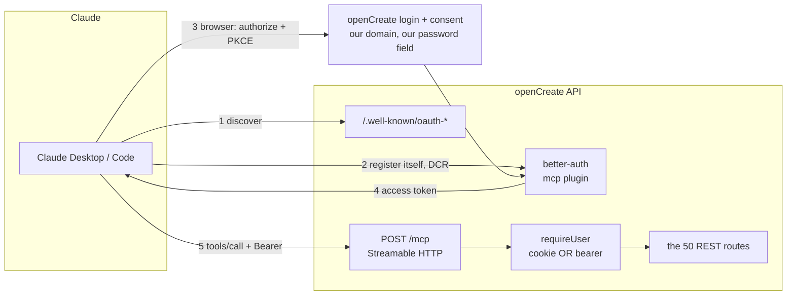

# ADR: `@opencreate/mcp` — MCP server wrapping the openCreate REST API

## Status

**Accepted — 2026-07-22** (owner decisions taken interactively during design).

Scope decisions already locked by the owner:

- **Purpose:** product-facing — expose openCreate's capabilities to Claude so a
  user can create content and whole film "projects" from Claude Desktop/Code
  (the Higgsfield-MCP analogue), NOT a dev-tooling server for building the repo.
- **Transport:** **local stdio now → remote HTTP + OAuth in Phase 2.** The core
  (ApiClient + tool registry) is built transport-agnostic so the "Connect
  button like Higgsfield" (which requires remote HTTP) is an additive Phase 2,
  not a rewrite.
- **Tool surface:** **all ~35 endpoints as one-tool-per-action.** The
  build-mcp-server skill flags that >~15 tools floods the context window and
  recommends search+execute; the owner was told and chose full one-per-action
  for explicitness. Revisit if context bloat shows up in practice.
- **Auth:** email+password from env → `POST /api/auth/sign-in/email` → session
  cookie held in memory → single re-login + retry on 401. **Zero backend
  changes.**
- **Framework:** official `@modelcontextprotocol/sdk` (TypeScript) — matches the
  all-TS monorepo and reuses `@opencreate/contracts` zod schemas.

## Context

openCreate is a generative-media platform (Fastify API on :8787 serving a Vite
SPA, single origin). It already exposes a full REST surface under `/api/*`:
films/cinema, generations (image/video), 3D assets, entities/portraits,
templates, catalog, credits, prompt-enhance. Auth is **session-cookie only**
(better-auth); there is no bearer/API-key mechanism. Every route calls
`app.requireUser(req)` and scopes queries by the caller's id.

The owner wants "connect from Claude and make a project" — the same experience
Higgsfield ships via its hosted MCP. Higgsfield's Connect-button/OAuth works
because it is a **remote HTTP** connector; a local stdio server cannot offer
that flow and instead takes credentials from its `env` block (the GitHub-MCP /
Postgres-MCP pattern).

## Decision

Build a new workspace package `packages/mcp` (`@opencreate/mcp`) that is a thin
MCP wrapper over the REST API:

1. **`ApiClient`** — the only component that knows about auth and `fetch`.
   Lazily signs in with `OPENCREATE_EMAIL`/`OPENCREATE_PASSWORD` against
   `/api/auth/sign-in/email`, caches the session cookie in memory, and on a 401
   re-logs-in once and retries. Maps the API's `{ error: { code, message, … } }`
   envelope to a readable MCP error.
2. **Tool registry** — a declarative `{ name, description, zodInput (from
   contracts), method, pathBuilder, responseShape }` list, registered on an
   `McpServer`. Reuses `@opencreate/contracts` schemas so client/server inputs
   can never drift.
3. **Entry point** (`bin: opencreate-mcp`) — boots `McpServer` +
   `StdioServerTransport`. Transport is the only Phase-2 swap point.

### Async generations

Video/render return `202 processing` and require polling; image returns `201`.
Submit tools (`generate_video`, `generate_shot_clip`, `render_film`) take a
`wait` flag (default true): the server polls to completion with a timeout
(~120s video / ~300s render) and returns the finished asset, else `{ id, status:
"processing" }` plus a hint to call `get_generation`/`get_render`. Image tools
also return an image content block (base64) for inline preview.

## Consequences

- **Positive:** works in the owner's Claude today with zero hosting and zero
  backend change; shared contracts kill input drift; transport-agnostic core
  keeps the remote/OAuth upgrade cheap.
- **Negative / risks:** ~35 tools is above the skill's recommended ceiling —
  accepted with eyes open, revisit if it degrades model performance. Env
  credentials are a plaintext secret in the MCP config (acceptable for a
  personal/local prototype; OAuth in Phase 2 removes it). Long-poll waits can
  hit MCP client timeouts — mitigated by the `wait` timeout + separate pollers.

## Out of scope (Phase 2+)

- Remote HTTP transport + OAuth 2.1 (CIMD/DCR) "Connect button" — the true
  Higgsfield parity.
- MCP resources (gallery/films as browsable resources) and prompts (slash-command
  workflows).
- Multi-tenant hosting / directory submission.

---

# Phase 2 — remote HTTP + OAuth, and a tool table that fits in a context window

**Accepted — 2026-08-25.** Phase 1 shipped and works. Two things changed since:
the product deployed to a public URL, and the API grew Shorts batch, Canvas,
Styles, openCreator and analytics — none of which the July tool table knows about.

The Phase 1 ADR named both follow-ups and predicted both costs. This section
decides them.

## P2.1 — The credential problem is the whole reason for remote

Phase 1 authenticates with `OPENCREATE_EMAIL` + `OPENCREATE_PASSWORD` from the
MCP client's env block. That is correct for one person on one laptop and
**structurally wrong for a service**: every user would have to paste their
account password into a JSON config file, in plaintext, on disk. There is no
version of that we would recommend to a customer.

So Phase 2 is not a performance upgrade. It is the change that makes the server
something we can offer at all.

## P2.2 — better-auth's `mcp` plugin, not a hand-rolled OAuth server

better-auth 1.6 ships an `mcp` plugin over its `oidc-provider`. It supplies
exactly the four things the MCP authorization spec requires and that are easy to
get subtly wrong by hand:

- `/.well-known/oauth-authorization-server` and `/.well-known/oauth-protected-resource`
- **Dynamic Client Registration** (RFC 7591) — Claude registers itself; we
  maintain no client allowlist
- **PKCE**, required, not optional
- Bearer access token → user resolution (`getMcpSession`)

Writing this ourselves would mean implementing an authorization server on the
same codebase that holds the credit ledger. The library is maintained, spec-
tracking, and already the thing minting our sessions. Three tables
(`oauth_application`, `oauth_access_token`, `oauth_consent`) join the schema
through the same explicit drizzle mapping every other better-auth table uses.

The login and consent screens are OUR pages, on our domain — the user types
their password into openCreate, never into a config file and never into Claude.

## P2.3 — The Bearer token is accepted by `requireUser`, in one place

An MCP access token is not a session cookie, so `requireUser` would reject it.
Two ways to bridge that, and only one of them scales:

Teaching **every route** about a second credential kind is 50 edits and 50
chances to forget one. Instead `requireUser` — which is already the single
authentication seam every protected route goes through — tries the cookie first
and falls back to resolving an MCP Bearer token. One function, one test, and
every existing and future route works over MCP with no per-route change.

The order matters and is deliberate: cookie first, because a browser request that
somehow carries both is a browser request.

## P2.4 — Tool calls run IN PROCESS, not back over the network

The remote server is mounted inside the API that serves the endpoints it calls.
It could still call itself over HTTP, which is the naive option and costs a real
network hop per tool call — and, worse, walks through our own rate limiter, so a
20-row Shorts batch could 429 itself.

So the remote transport dispatches through `app.inject()`: the request traverses
the real router, the real guards, the real validation, and the real error
envelope, without a socket. The tool table stays byte-identical between stdio and
remote — the only difference is which `ApiClient` implementation is handed in,
which is the seam Phase 1 built for exactly this.

## P2.5 — ~15 semantic tools, not ~60 endpoint tools

Phase 1 chose one-tool-per-endpoint "for explicitness", with the ADR recording
that this was above the recommended ceiling and to **revisit if context bloat
shows up in practice**. It has: the API is now 50 routes, and a faithful table
would put ~60 tool descriptions into every single request's context.

That cost is not abstract — it is paid on every message whether or not any tool
is used, and a model choosing between 60 near-identical names picks worse than
one choosing between 15.

So related endpoints collapse behind one tool with an `action`: `manage_film`
replaces create/get/update/delete, `manage_shots` replaces the five shot routes,
and so on. The **capabilities do not shrink** — every endpoint stays reachable.
Only the number of names the model must hold at once does.

This renames tools, which is a breaking change for anyone already connected.
Today that is one person, so the cost is now or never.

## P2.6 — Analytics tools are personal-only

`/api/me/usage` becomes a tool. The three `/api/admin/analytics/*` routes do
**not**. They read every user's spend and our provider invoices, and the value of
piping that through a chat client does not come close to the cost of one
mis-scoped token exposing it. The role check would still hold — this is a second
lock on the same door, chosen because the door opens onto other people's data.

## Container view

## Consequences

- A user connects openCreate to Claude with a URL and a browser login. No
  password in any config file.
- Revoking access is deleting a token row, not rotating a password.
- ~15 tools instead of ~60: less context on every request, better tool choice.
- Existing stdio + env-credential mode keeps working — same tool table, same
  dispatch, different transport. It stays the fastest way to test locally.
- Tool names change once. One connected user today; no deprecation window.
- The API now runs an authorization server. That is real surface area, and the
  reason it is a maintained library and not our own code.

## Rejected

- **Hand-rolled OAuth 2.1** — an authorization server written by us, next to the
  credit ledger, to save one dependency that better-auth already is.
- **API keys instead of OAuth** — simpler to build, and it puts a long-lived
  bearer secret back into a config file, which is the exact problem Phase 2
  exists to remove.
- **Keeping one tool per endpoint** — the July decision, explicitly marked
  revisitable, and the condition it named has arrived.
- **Exposing admin analytics as tools** — see P2.6.
