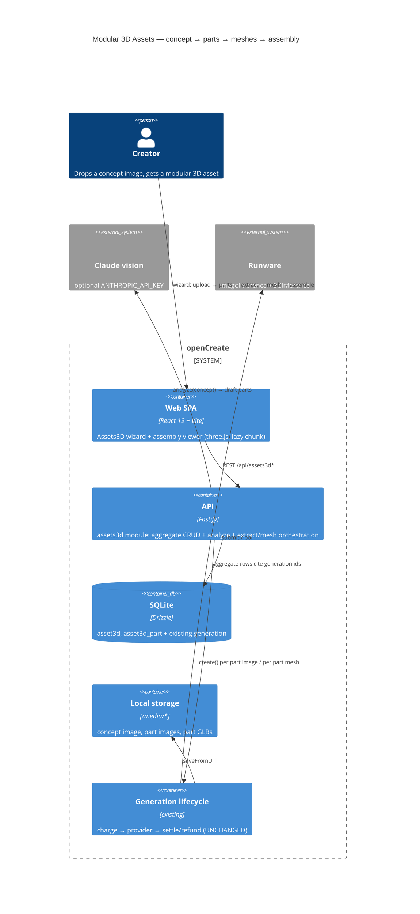
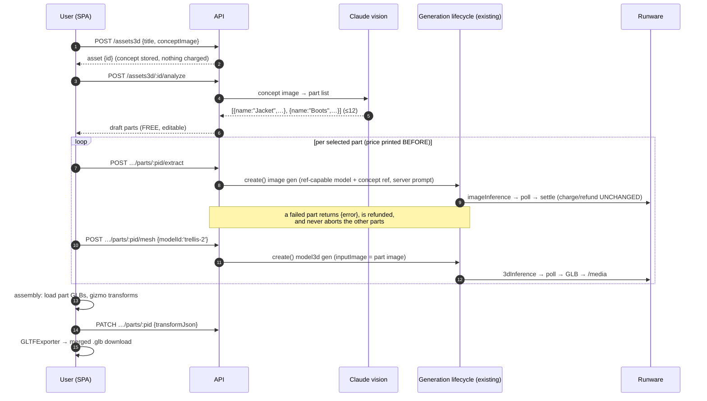
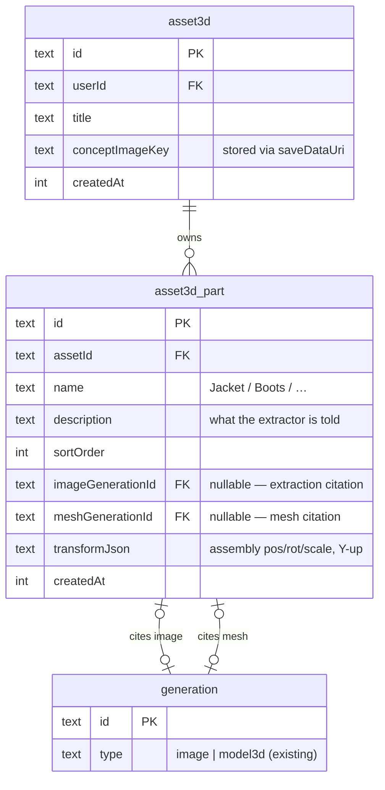
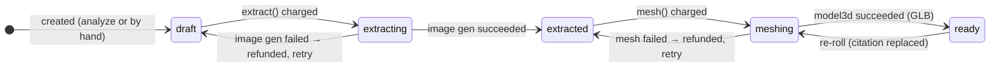

# ADR: Modular 3D Assets — concept image → named parts → per-part meshes → assembly

## Status

**Accepted — 2026-07-20** (owner approval; the backend built against this ADR was
already green at approval time — API 507/507 — and the frontend build proceeds
from Appendix F of `docs/superpowers/plans/2026-07-18-modular-3d-assets.md`).
Scope decisions already taken by the build owner:
module inside openCreate (not a separate product); MVP is a **linear wizard**
(node editor is a later phase); mesh providers per the discussion below.

## Context

The build owner studied **assethub.io** ("New, Clean and Organized 3D AI
Workflow") and wants the same capability. AssetHub's differentiator is NOT
image→3D (Meshy/Tripo already do that) — it is **modularity**:

1. Drop one concept image.
2. AI splits it into **named parts** (Body, Hair, Armor, Boots, Belt…), each
   becoming a clean standalone image.
3. Each part gets its **own mesh**; parts are assembled into one modular,
   editable, reusable asset. Export GLB → Blender/Maya pipelines.

AssetHub is an aggregator: meshes by Meshy/Rodin/Trellis/Tripo/Hunyuan/Hitem,
texturing by Nano Banana, credits-based pricing ($0 free tier → $960/yr studio).

**What openCreate already has** (accepted ADR `photo-to-3d-studio`, largely
implemented on `feat/studio3d`): `model3d` generations on the unchanged money
path via **Runware `3dInference`** (TRELLIS.2 6cr / Hunyuan3D Rapid 45cr /
Tripo v3.1 80cr, all → GLB), the `Mesh3dProvider` seam, `model_render` +
`model_share` (no ledger), a three.js viewer stack with explicit GPU disposal,
and the WebCodecs turntable. Also relevant precedents:

- **Soul Studio `portraits.ts`** — a server-side orchestration loop over N paid
  generations where each item settles/refunds independently and a failed item
  returns `{ generationId: null, error }` without aborting the batch.
- **Storyboard** — Claude (`ANTHROPIC_API_KEY`, optional) turns a script into
  draft shots, **nothing is charged** until the user generates each one.
- **Films/shots** — an aggregate that CITES generations by id instead of owning
  media, with drafts (`generationId = null`) generated one at a time.

So the delta for "AssetHub in openCreate" is exactly two things: **part
decomposition** and **assembly**. Everything else exists.

## Decision

Add **Modular 3D Assets**: an `asset3d` aggregate (concept + named parts) over
the existing generation lifecycle, a linear wizard UI, and a client-side
assembly viewer that exports one merged GLB.

### D1 — An asset is an aggregate that cites generations. No new money code.

New tables `asset3d` (id, userId, title, conceptImageKey, createdAt) and
`asset3d_part` (id, assetId, name, description, sortOrder,
`imageGenerationId` nullable, `meshGenerationId` nullable, `transformJson`,
createdAt). A part's image and mesh are **ordinary generations** — charged,
polled, settled, refunded by the untouched lifecycle; the part row only holds
the foreign keys, exactly as `shot.generationId` does in CinemaStudio. Deleting
an asset deletes rows, never the cited generations (they remain in the
library, same rule as films).

### D2 — Decomposition is two steps: a FREE analysis, then PAID per-part extraction.

- **Analyze** (`POST /api/assets3d/:id/analyze`): the concept image goes to
  Claude vision (same optional `ANTHROPIC_API_KEY` as storyboard) → a draft
  part list `{ name, description }[]` (capped at `MAX_PARTS = 12`). Free, like
  storyboard; 502 `provider_error` when the key is unset — the user can always
  add/edit/remove parts by hand, so the wizard works without the key.
- **Extract** (`POST /api/assets3d/:id/parts/:partId/extract`): one part → one
  **standard image generation** through `generationService.create()` — the
  reference-capable image model (server-side rule, the Soul Studio "model
  rule" precedent: today `flux-kontext-pro` / `nano-banana-pro`) with the
  concept image as the reference and a server-composed prompt: *"only the
  <part>, isolated on a neutral studio background, occluded regions completed,
  orthographic product shot"*. Prompts never leave the server
  (template-catalog rule). Charged at the model's normal image price; a failed
  extraction refunds itself and the part stays editable/retryable
  (portraits precedent).

### D3 — A part's mesh is a `model3d` generation from its extracted image.

`POST /api/assets3d/:id/parts/:partId/mesh { modelId }` validates the part has
a succeeded extraction, then calls `generationService.create()` with
`mode:'image'`, `inputImage` = the part image — the EXISTING Studio3D path,
tier picked by the user per part (default `trellis-2`, 6cr — cheap enough to
iterate). Re-generating a part's mesh replaces the citation (old generation
stays in the library, like a re-rolled portrait view replaces the sheet slot).

### D4 — Assembly is client-side; the preset contract does the presentation.

The assembly page loads each part's GLB into ONE `<Canvas>` (the D6 rules from
`photo-to-3d-studio` apply verbatim: own loader, explicit disposal, one canvas,
`frameloop="demand"`). Per-part transforms (position/rotation/scale gizmo) are
saved to `asset3d_part.transformJson` via PATCH — plain JSON, renderer-agnostic,
Y-up/meters (glTF convention). **Export = client-side `GLTFExporter`** over the
assembled group → one merged GLB download. No server assembly service, no new
render infra: the WebCodecs turntable and the CinemaStudio bridge work on the
assembled scene for free because they consume the same scene-preset contract.

### D5 — Runware `3dInference` stays the ONLY built mesh channel (v1).

The owner's provider picks (Tripo/Meshy API, Trellis on Vast.ai, Hunyuan via
fal) are all **already reachable through the existing Runware integration** —
Runware resells Tripo v3.1, TRELLIS.2, Hunyuan3D 3.1, Meshy-6 and Rodin under
one key, one client, one SSRF allowlist. The accepted Studio3D ADR rejected
self-hosting on arithmetic ($0.0256/model hosted vs $7–12/day GPU, break-even
~300–470 models/day) and rejected direct vendor APIs as a second
key/invoice for the same models; nothing in this feature changes that math —
part decomposition multiplies volume ~6×, still far below break-even. The
`Mesh3dProvider` seam already exists, so a direct Tripo adapter (needed only
if auto-rigging enters the roadmap) or a Vast.ai adapter stays a drop-in.
**Meshy-6 ($0.80) can be ADDED to the catalog as a fourth tier without any new
integration** if the owner wants the brand-name model visible.

### D6 — Web module `Assets3D`, a linear wizard, no cross-module imports.

`apps/web/src/modules/Assets3D/` + routes `_shell.assets.index.tsx` /
`_shell.assets.$assetId.tsx`. The wizard is stage-shaped, not page-shaped: one
route, the asset's state decides which stage is active — Upload → Parts
(checklist, editable, price-per-part printed BEFORE any charge) → Extraction
grid (per-part status card: processing / image / failed+refunded chip) → Mesh
grid (same, with tier picker) → Assembly (viewer + transforms + export).
Catalog and prices read at the route (the seam); generation polling reuses the
shared `['generation', id]` cache. The three.js graph stays in the lazy chunk.
4 UI states on every stage; every paid button prints its price first
(alertdialog for batch actions), per the house rules.

## Diagrams

### (a) C4 Container — where Modular Assets sits

### (b) Sequence — the wizard happy path (+ the failure rule)

### (c) Data model delta

### (d) Part state (derived, not stored)

Part status is **derived from the cited generations' statuses** at read time —
no status column to drift (the films/shots lesson).

## HTTP surface (new)

| Method | Path | Notes |
| --- | --- | --- |
| GET/POST | `/api/assets3d` | list / create (title + concept dataUri; nothing charged) |
| GET/PATCH/DELETE | `/api/assets3d/:id` | asset + parts + derived statuses / rename / delete rows only |
| POST | `/api/assets3d/:id/analyze` | Claude part suggestion; FREE; 502 without key |
| POST/PATCH/DELETE | `/api/assets3d/:id/parts[/:pid]` | manual part CRUD + transformJson save |
| POST | `/api/assets3d/:id/parts/:pid/extract` | charged image generation (server model rule + prompt) |
| POST | `/api/assets3d/:id/parts/:pid/mesh` | charged model3d generation `{modelId}` |

## Cost sketch (honest, catalog prices of 2026-07-17)

A 6-part character on the cheap path: 6 × extraction (image model price, e.g.
8cr kontext-pro) + 6 × `trellis-2` (6cr) ≈ **84 credits ≈ $0.5–0.8 raw** —
and each step is visibly priced before the click. AssetHub charges a
subscription for the same flow; our per-use ledger is the existing model.

## Options considered for decomposition

| | **A. VLM analyze + generative extraction** (chosen) | B. True segmentation (SAM/rembg) + inpaint | C. Prompt the mesh provider per part |
|---|---|---|---|
| How | Claude lists parts; ref-capable image model REDRAWS each part isolated | segment actual pixels, cut, inpaint holes | ask Tripo/Hunyuan for "just the jacket" |
| Fidelity to concept | high but generative (redrawn) | pixel-faithful | n/a |
| New infra | **none** — both calls exist today | SAM/rembg service (GPU or new vendor) | none |
| Occlusion handling | model completes hidden regions (the point) | inpainting quality is the risk | none |
| Verdict | **v1** | phase 2 if extraction drift annoys | not offered by any provider — rejected |

## Consequences

**Positive** — money path, lifecycle, storage, SSRF, viewer VRAM rules, turntable,
CinemaStudio bridge: all reused unchanged. API delta = 2 tables + 1 module of
thin routes over `generationService.create()` + one Claude call. The wizard is
honest about prices per step, and a failed part never poisons the batch.

**Negative / cost** — extraction is generative: the isolated part is a REDRAW,
not a crop, so style drift between parts is possible (mitigated by the shared
concept reference; measured in the field, escalated to option B if bad).
Assembly transforms are manual in v1 — no auto-placement (AssetHub does not
auto-assemble either). Claude-less installs lose auto-suggestion but not the
wizard. Multi-GLB scenes stress VRAM sooner — the existing disposal rules and
`MAX_PARTS = 12` cap bound it.

## Rejected alternatives

- **Node-based workflow editor as MVP** — owner chose the linear wizard;
  the node canvas is a later phase over the same aggregate.
- **Direct Tripo/Meshy keys and a Vast.ai Trellis worker in v1** — the accepted
  Studio3D arithmetic stands (see D5); the seam keeps both a drop-in.
- **Storing part status columns** — derived state only; two sources of truth
  about a generation's status is the bug class films already taught us.
- **Server-side GLB merge/export** — GLTFExporter in the client does it with
  zero new infra; a server merge appears only if DCC users need USDZ/FBX
  (Tripo direct exposes conversion — same trigger as auto-rigging).

## Open questions (resolve during the plan, not before)

- Which reference-capable image model extracts parts best (`flux-kontext-pro`
  vs `nano-banana-pro`) — decide by generating one real sheet, not by reading.
- Whether extraction should force a neutral-background style token or offer
  the user a style knob (v1 leans server-fixed).
- Gizmo library for assembly transforms (drei `TransformControls` vs
  hand-rolled) — drei is already a dependency; verify tree-shake cost.
- Whether `analyze` should also return per-part bounding boxes for a nicer
  parts-over-concept overlay UI (pure UX sugar, zero contract risk if added).
