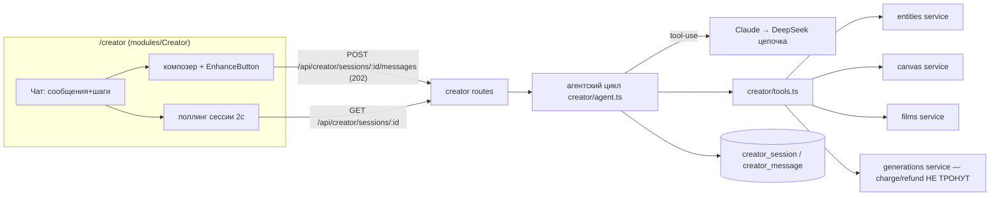
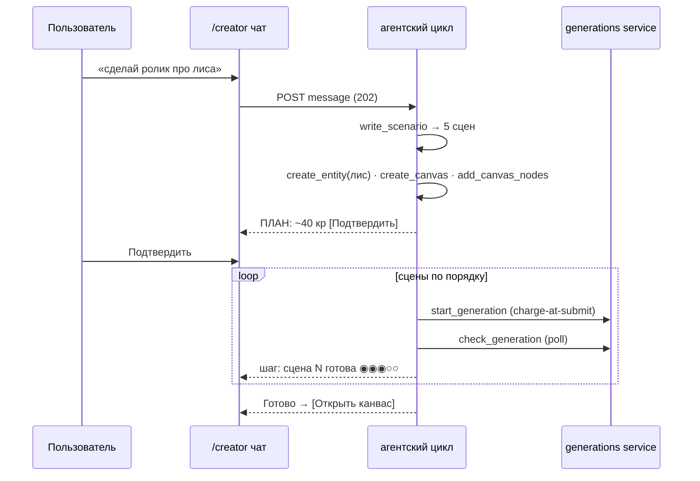
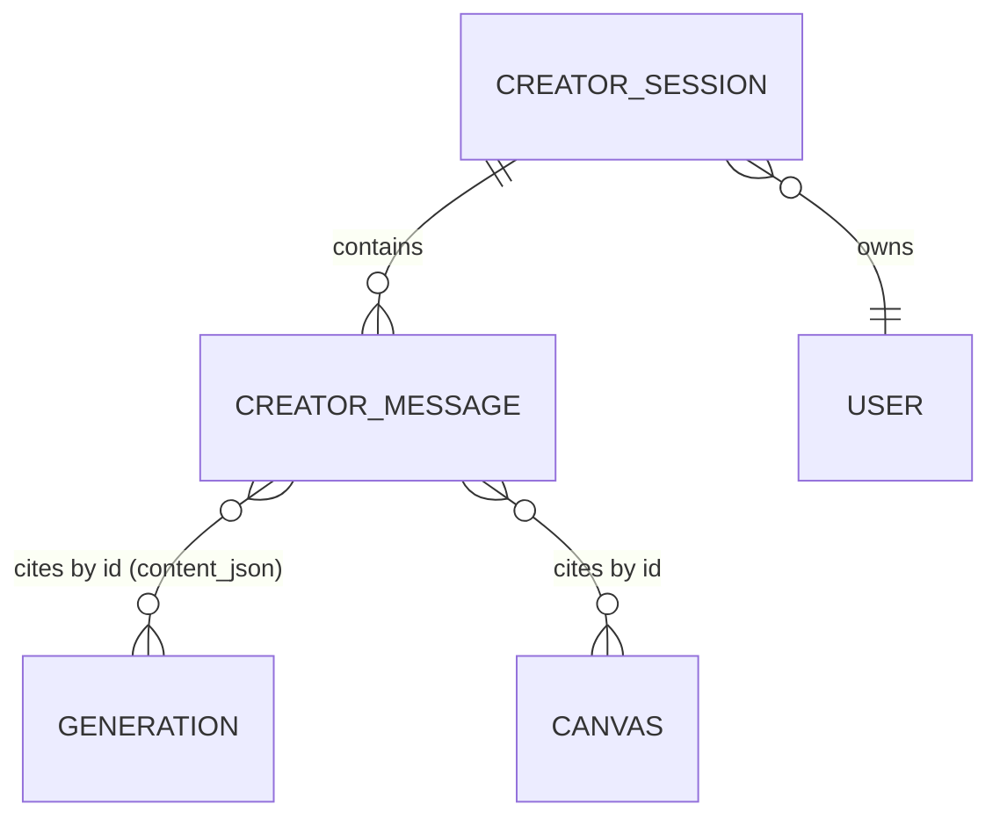

# ADR: openCreator — чат-агент с инструментами над всем продуктом

## Status

**Accepted — 2026-07-30** (владелец: «да давай запускай»). Форма (чат-агент) и
мозг (Claude → DeepSeek) выбраны владельцем в интервью; решения D1-D5 утверждены
вместе с архитектурой.

## Context

Владелец хочет «полный ИИ»: страницу openCreator, где пользователь пишет задачу
(«сделай ролик про лиса-космонавта»), а агент сам пишет сценарий, создаёт
персонажа, собирает канвас/фильм, запускает генерации и показывает прогресс и
результат. Всё, что агенту нужно, в продукте уже есть: entities (Soul), canvas
(ноды+рёбра+aggregate), films (storyboard), generations (charge/poll/refund),
catalog. Не хватает только оркестратора.

## Decisions (proposed)

### D1 — Агент исполняется на СЕРВЕРЕ, инструменты = наши сервисы напрямую

Новый модуль `apps/api/src/modules/creator/`. Инструменты агента — тонкие
обёртки над СУЩЕСТВУЮЩИМИ сервисами (entities, canvas, films, generations,
catalog) в том же процессе, с тем же `userId`-скоупингом; НЕ HTTP-self-calls и
НЕ packages/mcp (тот остаётся внешним интерфейсом для Claude Code). Деньги
идут только через `generationService.create()` — агент структурно не умеет
списывать иначе. Ноль нового money-кода.

MVP-набор инструментов:
`write_scenario` (чистый LLM, сцены+промпты) · `list_models` ·
`create_entity` (персонаж; портрет через обычную генерацию) ·
`create_canvas` / `add_canvas_nodes` (ноды+рёбра одним вызовом) ·
`start_generation` (charge-at-submit как у всех) · `check_generation` (poll) ·
`report_progress` (структурированный шаг для чата).

### D2 — Бюджет-гейт: один confirm на план, дальше автономно

Дух canvas-D5 («правка не должна молча запускать N списаний») для агента:
после `write_scenario` агент обязан вернуть ПЛАН с оценкой кредитов
(«5 сцен × Flash + 1 видео Swift ≈ 40 кр»); исполнение генераций начинается
только после подтверждения пользователем в чате (одна кнопка). Дальше —
автономно до конца или до `insufficient_credits`/провала. Инструменты
создания структур (персонаж, канвас, сценарий) бесплатны и confirm не требуют.

### D3 — Мозг: цепочка Claude → DeepSeek (нейтральный ToolCall-слой)

Как у энхансера: основной — Anthropic Messages API c tool-use
(ANTHROPIC_API_KEY уже питает storyboard), фолбэк — DeepSeek на DeepInfra
(OpenAI-совместимый function calling). Оба маппятся в нейтральный внутренний
тип `ToolCall`/`ToolResult`, чтобы цикл агента не знал, чей формат под ним.
Без ключей — 502 provider_error, boot остаётся здоровым (дисциплина
опциональных секретов).

### D4 — Сессии в БД, SPA поллит шаги (без SSE в MVP)

`creator_session` (id, user_id, title, status, created/updated) +
`creator_message` (id, session_id, role: user|assistant|tool, content_json,
created). POST message → 202, агентский цикл детачится (как DeepInfra-submit),
SPA поллит GET session каждые 2с и дорисовывает шаги. Перезагрузка страницы
теряет ноль состояния. SSE — осознанно потом.

### D5 — Веб-модуль Creator изолирован, результат = ссылки на артефакты

`apps/web/src/modules/Creator/`: страница `/creator` (в AppShell), список
сессий + чат. Карточки шагов агента (инструмент, статус, стоимость), карточки
результатов со ссылками «Открыть канвас/фильм/персонажа» — навигация, не
кросс-модульные импорты. Композер обязан иметь sparkle EnhanceButton
(правило владельца от 2026-07-30).

## Architecture

## Consequences

- Один новый API-модуль + один веб-модуль + 2 таблицы; деньги, Library, Soul,
  Canvas — нетронуты (агент лишь их клиент).
- Стоимость мозга: ~1-3¢ Claude за задачу (короткие tool-циклы), DeepSeek
  дешевле на фолбэке; генерации — по обычным ценам каталога после confirm.
- In-flight агентские циклы живут в памяти процесса (как DeepInfra-джобы):
  рестарт API оставляет сессию со статусом running — reaper переводит в failed
  по staleness (тот же паттерн, что stale generations).

## Build phases (после аппрува — свой план на каждую)

1. Backend: contracts + таблицы + brain-цепочка + tools + цикл + confirm-гейт.
2. Frontend: /creator чат с поллингом, карточки шагов/результатов, sparkle.
3. Расширение инструментов: films/storyboard, 3D, «дожать неудачные сцены».

Out of scope MVP: SSE-стриминг, голос, мультисессионная параллель,
автозапуск без confirm, память агента между сессиями.
