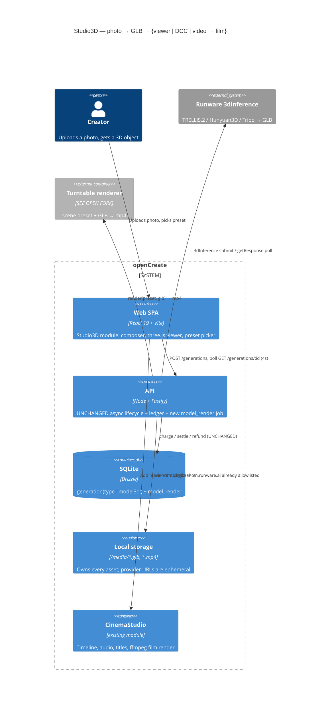
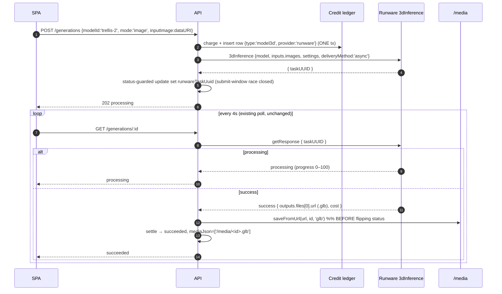
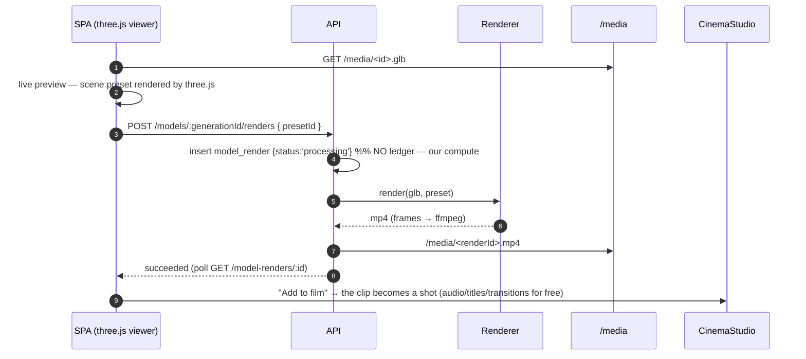
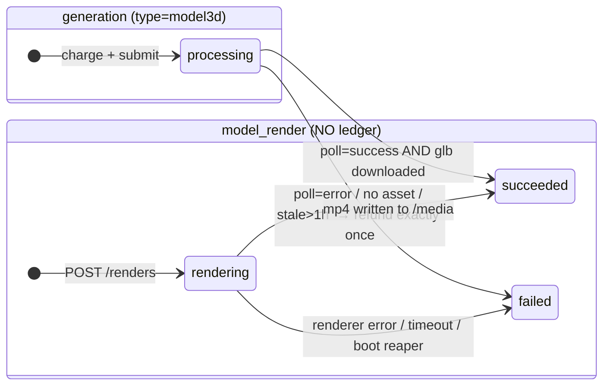
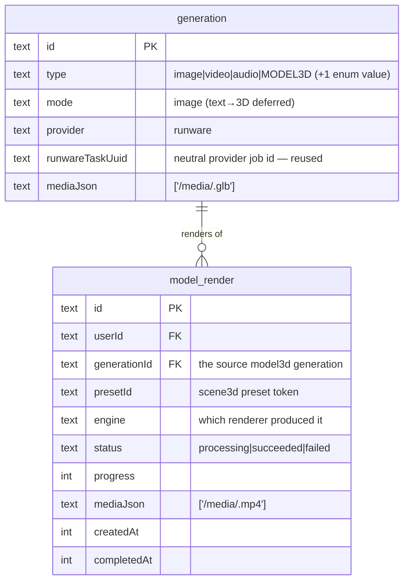

# ADR: Studio3D — photo → 3D model → presentable artifact (viewer, DCC export, video)

## Status

**Accepted — 2026-07-11.** The architecture gate passed with the build owner resolving the one open fork (the renderer) and the v1 scope:

- **Renderer = option A, the client-side WebCodecs path.** The server-rendered options (headless Chromium for parity, Blender/GPU for photorealism) remain designed but unbuilt; the scene-preset contract (D4) is what keeps that a one-worker change.
- **v1 ships all four exits:** photo → GLB + three.js viewer + download; turntable video from scene presets; the CinemaStudio bridge (the clip becomes a shot); and the public `/embed/:id` route with AR.

## Context

The product generates image, video and audio through one async lifecycle: charge-at-submit inside a single transaction → `202 processing` → the SPA polls `GET /generations/:id` every 4s → the API polls the provider → download the asset → settle, with refund-exactly-once on every failure path and a 1h stale reaper. Two seams already exist — `VideoProvider { submit; poll }` and `AudioProvider { submit }` — and CinemaStudio added the "a render is not a generation" precedent (`film_render`: its own table, its own status machine, ffmpeg, **no credit ledger**, boot reaper).

The ask: **a module that turns a photo into a 3D model, and then turns that model into something worth showing** — openable in Blender/DCC, renderable as a video, and embeddable on a page via three.js.

Three facts from the 2026-07-11 research frame the whole design:

1. **Runware already ships image→3D as a first-class task type** — `3dInference`, hosting Tripo v3.1, Hunyuan3D 3.1, Microsoft TRELLIS.2, Meshy-6 and Rodin Gen-2. Same request envelope as `imageInference`/`videoInference`, same `deliveryMethod: async` → `getResponse` polling, same 7-day TTL, same `im.runware.ai` asset host that is **already on our SSRF allowlist**. Output is **GLB** across every model. This is a task-type addition, not an integration.

2. **Self-hosting 3D is economically dead on arrival.** Runware resells TRELLIS.2 (MIT, the strongest open reconstructor) at **$0.0256/generation**. A dedicated RTX 4090 on Vast.ai costs **$7–12/day** including the storage that bills even while stopped → break-even is **~300–470 models/day**. TRELLIS.2 also wants **24 GB VRAM — the entire 4090 — on a box already holding Wan 2.2**, guaranteeing load-thrash and OOM. The economics that justified self-hosting *video* (a 9x COGS edge over a $0.13/clip baseline) **invert completely** for 3D: the hosted price is already at the floor.

3. **A GLB is not a product — a render is.** A mesh file is a developer artifact. What the user wants to see is a lit, moving, shareable object. That means a renderer, and the renderer is the only genuinely new capability in this module.

## Decision

Add **Studio3D**: a `model3d` generation type on the existing lifecycle, plus a **presentation layer** (scene presets + a viewer + a render job) that turns the mesh into a video, a DCC download, and an embeddable web object.

### D1 — A 3D model IS a generation. Not a new lifecycle.

Extend `generation.type` from `['image','video','audio']` to `+ 'model3d'`, and `assetExt()` with `model3d → glb`. A 3D job is structurally an async job exactly like video: charge-at-submit in one transaction, `202`, SPA polls, `poll()` settles, `failGeneration()` refunds exactly once, the 1h reaper sweeps stragglers. **The money path is not touched — not one line.** No new endpoint is needed to *create* a 3D model: `POST /api/generations` already takes `{ modelId, mode:'image', inputImage }` and derives the type from the catalog.

### D2 — Runware `3dInference` is the provider. The self-host seam is designed, not built.

The existing `RunwareClient` gains a `submit3d()` that speaks `taskType: '3dInference'`; polling reuses the **same `getResponse`** path the video flow already uses. `costUsd` comes from the response's `cost` field (which scales with quality settings — bill from the response, never from the list price).

A `Mesh3dProvider { submit; poll }` seam mirrors `VideoProvider` so a second backend stays a drop-in. **It is deliberately left unbuilt.** If it is ever built, the ComfyUI adapter must terminate its graph on the **core `SaveGLB` node** (`outputs[<node>]["3d"][0] = {filename, subfolder, type}`) — structurally identical to the `images[0]`/`videos[0]` shape our existing key-agnostic `resolveOutputFile()` already handles, so that adapter is nearly free. Wrapper packs (e.g. Hunyuan3D's `Hy3D21ExportMesh`) return a bare STRING that **never appears in `/history` outputs at all** and would hang the poller — the `SaveGLB` rule is the guard.

Catalog tiers (v1): **TRELLIS.2** `microsoft:trellis-2@4b` (fast, $0.0256) · **Hunyuan3D 3.1 Rapid** `tencent:hunyuan-3d@3.1-rapid` (standard, $0.225) · **Tripo v3.1** `tripo:v3.1@0` (quality, $0.40). Meshy-6 ($0.80) and Rodin held back until demand justifies the tier.

### D3 — A render is not a generation (the `film_render` precedent, reused verbatim).

New table **`model_render`** mirroring `film_render`: its own status machine, its own progress, `mediaJson`, boot reaper, **no credit ledger** — a render spends our compute, not a provider invoice. This is what produces the video, and it is the one place where the two rendering strategies differ (see the Open Fork).

### D4 — The scene preset is a shared contract, and it is the heart of "make it beautiful".

`packages/contracts/src/scene3d.ts` defines a **portable, renderer-agnostic scene preset** — HDRI environment + rotation + intensity, exposure, tone-mapping curve, background, floor/shadow-catcher, camera, and an orbit path. The SAME preset JSON is consumed by **three.js in the browser** (live preview) and by **whatever renders the final video**. One definition, N renderers — that is what makes the preview match the download, and what keeps the renderer a swappable implementation detail instead of an architectural commitment. Presets are named and server-owned (`studio`, `product`, `dramatic`, `neon`); the client sends a token, never a lighting rig.

**Four unit conventions are load-bearing — get them wrong and the two renderers silently diverge:**

1. **Exposure in EV (stops), not a multiplier.** Blender's `view_settings.exposure` is in stops; three's `toneMappingExposure` is a linear multiplier. Store `exposureEV`; three computes `2 ** exposureEV`. Storing the multiplier guarantees a mismatch.
2. **FOV is vertical.** three's `PerspectiveCamera.fov` is vertical degrees; Blender's `camera.angle` is horizontal by default. Store `fovVertical` + `aspect`.
3. **Up-axis is declared.** glTF/three are Y-up, Blender is Z-up. The importer fixes the *mesh*, but our camera path lives in the preset and must be converted.
4. **Tone curve is AgX, and only AgX.** three's `AgXToneMapping` is a deliberate port of Blender's AgX (its 4.0+ default view transform) — the only pair with real parity. three's ACES is a hand-fitted approximation that does *not* match Blender's. Restricting presets to AgX costs nothing and buys the largest parity win available.

**Honest scope of parity:** we can reliably reproduce *the same shot* — identical framing, silhouette, background, and a very close exposure/colour response. **Pixel parity is not achievable and must not be promised.** Ray-traced soft shadows, ambient occlusion and interreflection (Cycles) have no preset parameter that a browser env-map + faked contact shadow can match.

### D5 — Three exits, because "beautiful" means three different things.

1. **DCC / Blender** — download the GLB. Blender imports GLB natively (`bpy.ops.import_scene.gltf`), as do Unity, Unreal, Godot, Cinema4D, Spline. **No conversion service is needed for the primary case.** FBX/OBJ/USDZ conversion is deferred to a later phase (via Tripo direct, which exposes a conversion endpoint Runware does not).
2. **Video** — a turntable/cinematic mp4 from a scene preset. **And crucially it lands in the existing CinemaStudio timeline as a shot** — where it already gets audio, titles, transitions and a full film render. The 3D module ships a clip; the film module ships the film. *No new video infrastructure is built.*
3. **Web** — an interactive three.js viewer in the app, and (later) a public share/embed route.

### D6 — Web module `Studio3D`, with the 3D engine in a lazy chunk and VRAM owned by hand.

`apps/web/src/modules/Studio3D/` (public API via `index.ts`, no cross-module imports — the standard rule). New deps, versions verified 2026-07-11: **`three` 0.185.1** (178 KB gz) + **`@react-three/fiber` 9.6.1** (50 KB gz; peer range is literally `react >=19 <19.3` — our stack exactly, but React must stay pinned below 19.3) + **`@react-three/drei` 10.7.7** (tree-shaken to ~30–60 KB gz). R3F v10 / drei 11 are alpha and rename `state.gl` → `state.renderer` — **not now.** The whole graph loads only inside the viewer's **lazy route chunk** (`createLazyFileRoute`), so the landing/generator bundle is untouched.

**We do NOT use drei's `useGLTF` for user models.** Its suspense cache never frees VRAM (`useGLTF.clear()` drops the JS entry only — geometries, materials and textures stay resident on the GPU), and our model URLs are per-user and per-generation, i.e. *unbounded*. That makes the cache a monotonically growing VRAM leak **by design**, whose terminal symptom is WebGL context loss on the user's machine. Studio3D loads GLBs with its own `GLTFLoader` in an effect keyed by URL and disposes geometries/materials/textures explicitly on unmount. **Exactly one `<Canvas>` alive at a time.** This is not a micro-optimisation; it is the difference between a viewer that survives a browsing session and one that does not.

Two further rules that follow from the same reasoning: `dpr={[1,2]}` and `frameloop="demand"` (a turntable spinning forever in a background tab drains battery and invites the OOM that kills the context), and a **no-WebGL fallback** that renders the server-generated poster/video — which also covers crawlers and OG-preview bots, and is free because we generate those assets anyway.

Entry points: a `3D` tab in the Generator, a "make 3D" action on an Entity Library photo, and a `/studio3d` library + viewer route.

### D7 — The public embed is a separate route with a separate engine.

`<model-viewer>` 4.3.1 handles AR (iOS Quick Look + Android Scene Viewer) in a way we should not hand-roll. But its default build **bundles its own copy of three** (282 KB gz, self-contained) — shipping it on the same chunk as R3F pays for three twice. So the embed is a **dependency-light, unauthenticated `/embed/:id` route** rendering only model-viewer, no app shell, no R3F. The iframe snippet must carry `allow="xr-spatial-tracking"` or WebXR fails silently inside it. USDZ for iOS is **generated server-side** and passed as `ios-src` — model-viewer's client-side auto-generated USDZ routinely degrades materials.

### (a) C4 Container — where Studio3D sits

### (b) Happy path — photo → GLB

### (c) Presentation — preset → preview → render → film

### (d) State machines

### (e) Data model delta

## THE RENDERER FORK — RESOLVED: option A (client-side WebCodecs)

This was the only decision the existing architecture did not already settle, so it was escalated rather than assumed. All three options consume the **same preset JSON** (D4), which is exactly what makes the choice reversible — and what makes shipping A first a *staging decision* rather than a *ceiling*.

| | **A. Client (WebCodecs)** | **B. Server headless Chrome** | **C. Blender on the Vast GPU** |
|---|---|---|---|
| Renderer | our three.js scene, in the user's browser | **the same** three.js scene, in Playwright/Chromium | Blender EEVEE Next / Cycles + OptiX |
| Quality | WebGL PBR + HDRI + faked contact shadow | **identical to A, by construction** | **ray-traced** — real soft shadows, AO, GI |
| Preview↔final parity | 100% | 100% | "same shot", not same pixels |
| New infra | **none** | Playwright + Chromium in the API image (~400 MB) | FastAPI worker + Blender container on Vast |
| GPU cost | **$0** | $0 (software GL; slow but async) | $7–12/day kept warm |
| Ship time | days | ~1 week | 1–2 weeks + debugging |
| Risks | encode speed varies by device; mobile Safari can drop the WebGL context on a long encode. **Not** frame drops — a fixed-timestep WebCodecs loop is deterministic | render minutes are CPU-bound on our API box; needs a job queue so a render can't starve the API | **`NVIDIA_DRIVER_CAPABILITIES=graphics` is absent from stock Vast images → headless EEVEE dies** (Cycles/OptiX is the no-GL fallback); VRAM contention with Wan 2.2; new failure domain (orphan `blender -b`, half-written frame sequences) |

**On the client path, use WebCodecs — never `MediaRecorder`.** `MediaRecorder` is a *realtime* capture: any GC pause, jank or tab blur becomes a dropped frame, `requestAnimationFrame` is throttled on hidden tabs (the recording simply freezes), and the container support is split — **Chrome/Firefox write WebM, Safari writes only MP4**. A `VideoEncoder` driven at a fixed timestep (`t = i / fps`) into an `OffscreenCanvas` has none of these properties: no realtime constraint, no dropped frames, and it can render *above* display resolution. Mux with **`mediabunny`** (`mp4-muxer`/`webm-muxer` are both deprecated in its favour; ~17 KB, tree-shakable). Support is Chrome 94+, Firefox 130+, and Safari 16.4+ for the *video-only* subset — which is all a silent turntable needs.

**Decision: A.** B is the pragmatic middle if we later want the asset produced server-side without buying a GPU; C is the only path to photorealism. It is worth stating explicitly that **B buys parity and C buys photorealism — they are not the same purchase.** We ship A, learn whether the video is what people actually want, and then spend on the renderer with evidence instead of hope. Two consequences are accepted knowingly: a client-rendered clip is *slower* on weak devices (its *quality* is deterministic — a fixed-timestep encode drops no frames), and a very long encode on mobile Safari can lose the WebGL context, which the viewer must surface as a UI state rather than a crash.

## Consequences

**Positive**
- The entire money path, generation lifecycle, storage layer, SSRF allowlist, poll throttle and stale reaper are **reused unchanged**. The API delta is one enum value, one asset extension, one Runware task type, one table, and three routes.
- Self-hosting is *avoided on evidence* — hosted TRELLIS.2 at $0.0256 is cheaper than the electricity of running it ourselves.
- The video exit reuses **all** of CinemaStudio (timeline, audio, titles, ffmpeg film render). The 3D module ships a clip, not a video pipeline.
- The scene preset makes the renderer a swappable implementation detail rather than an architectural commitment.

**Negative / cost**
- `three` + R3F + drei is a genuinely new frontend dependency family (~260 KB gz combined) — contained to a lazy route chunk, but a new surface: **WebGL context loss, manual GPU disposal, and a no-WebGL fallback are now our problem** and must be built, not hoped away (D6).
- **No provider-side moderation signal is documented on `3dInference`** — and do not send a `safety` param (Runware has already rejected it on ByteDance and Wan 2.7). The §9.4 NSFW gate therefore does not fire for 3D. This is the same documented gap as `wan-2-2`; input photos are user-supplied, so the risk is inherited from the image path rather than newly created.
- Provider GLBs are 5–50 MB, and **the texture is the problem, not the geometry** (a 200k-tri mesh is ~7 MB of buffers; one 2048² PNG albedo is 4–12 MB). v1 serves the original; phase 2 adds a `gltf-transform optimize --compress meshopt --texture-compress webp` step (5–10× reduction, typically 25 MB → 3–4 MB) that keeps the original for DCC download and serves a compressed twin to the viewer. **meshopt, not Draco** — a ~25 KB decoder vs 200 KB+, and it decodes an order of magnitude faster on the phone's main thread. KTX2 waits until we show grids of models, which is when VRAM (not file size) starts biting.
- A client-rendered video is capped by the user's machine *in speed*, not in quality — a fixed-timestep WebCodecs encode is deterministic. That is the accepted cost of not buying a GPU on day one.

## Rejected alternatives

- **Self-hosted TRELLIS.2 / Hunyuan3D on the existing ComfyUI box.** Rejected on arithmetic: hosted is $0.0256 vs $7–12/day of GPU, break-even ~300–470 models/day, and it needs the full 24 GB the 4090 already gives to Wan 2.2. Hunyuan3D additionally carries a **territorial licence carve-out excluding the EU, UK and South Korea** — unacceptable for a consumer product. The seam is designed so this stays a one-file decision if volume ever inverts the maths.
- **Tripo3D / Meshy direct as the primary provider.** Rejected: a second vendor, key and invoice for models Runware already resells. Tripo direct becomes *necessary* only if auto-rigging + animation retargeting (which Runware does not expose) enters the roadmap — at which point it is a fallback that graduates into a feature.
- **Stability SPAR3D.** Rejected outright: the Community Licence is free for commercial use **only below $1M annual revenue** — a landmine in a product we intend to grow.
- **Headless three.js in *Node* (`headless-gl`, node-webgpu) for server rendering.** Rejected: `headless-gl` is stale and silently falls back to software rendering, and headless WebGPU in Node still produces blank frames. Note this does **not** rule out option B in the fork — running our real three.js scene inside a **real Chromium** (Playwright) is a different proposition and remains on the table.
- **`MediaRecorder` for the client video.** Rejected on determinism, not taste: it captures in realtime, so jank and tab-blur become dropped frames, and its container support splits Chrome (WebM) from Safari (MP4). WebCodecs at a fixed timestep has neither problem.
- **A separate 3D lifecycle / a `model3d` table of its own.** Rejected: it is an async provider job with a charge and a refund — it *is* a generation. A parallel lifecycle would fork the money path, which is the one thing in this codebase that must never be forked.

## Open questions (resolve during the plan, not before)

- Credit prices per tier (map $0.0256 / $0.225 / $0.40 onto the existing margin policy).
- Whether text→3D (`mode:'text'`, which Tripo supports at $0.30) ships in v1 or waits — the plumbing is free, the composer UX is not.
- Whether the public share/embed route (`<model-viewer>` + USDZ for iOS Quick Look AR) is phase 2 or phase 3.
- Background removal in front of the generator: every provider produces materially better meshes from a clean cutout, and Runware exposes `imageAutoFix`. Do we lean on the provider's, or add our own pre-step?
