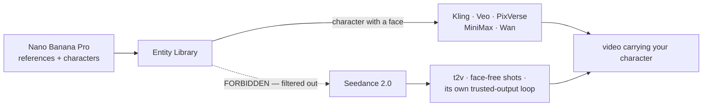

# ADR: Seedance 2.0 direct from ByteDance (ModelArk) as a third video provider

## Status

**Accepted and implemented** (2026-07-11), on the user's explicit instruction to build the direct channel *after* being shown that the cost case for it had collapsed (see "The number that changed" below). The user chose the direct channel with that correction in hand.

## Context

Video generation already runs behind the `VideoProvider` seam introduced by [[wan-selfhost-video-provider]]: `submit()` → `poll()`, with every money-path invariant (charge-at-submit, refund-once, stale reaper, poll throttle) owned by the service and untouched by which backend runs. Two providers existed: `runware` (the aggregator, always on) and `wan-runpod` (our self-hosted ComfyUI pod, env-gated). Seedance **2.0 was not in the catalog at all** — only Seedance 1.5 Pro, via Runware.

This ADR adds a third: `bytedance`, talking to BytePlus ModelArk directly.

## The number that changed (read this before citing the older research)

`docs/research/2026-07-07-seedance-direct-vs-runware.md` concluded that Runware **overcharges ~72%** on Seedance 2.0 ($0.80 vs $0.46 for a 5s 720p clip), and set a volume trigger of 2 000–5 000 clips/month for going direct.

**That $0.46 is wrong for our use case.** ByteDance's rate for Seedance 2.0 depends on whether the input contains a **video**:

| Input | 720p | 1080p |
|---|---|---|
| Video included | $0.0043 / 1k tokens | $0.0047 |
| **No video** (text→video, image→video) | **$0.0070 / 1k tokens** | **$0.0077** |

The research quoted the *video-input* rate. We only ever send text or an image, so we always pay the higher one. ByteDance's own deduction ratio confirms it: 4.3 × 1.6279 = 7.00.

Corrected, with tokens = `w × h × 24fps × duration / 1024` (validated against a real ModelArk response: 243 000 predicted vs 246 840 actual for a 5s 1080p clip):

| 5s 720p clip | Cost |
|---|---|
| ByteDance direct | **$0.756** |
| Runware | **$0.80** |
| Saving | **$0.044 — about 5%, not 72%** |

At 1 000 clips/month the direct channel saves **~$44**, not ~$336. **The cost argument for this integration does not survive contact with the real rate card.** It was built anyway, deliberately, for the non-price reasons below.

## Decision

Add `bytedance` as a third `VideoProvider`, gated on `ARK_API_KEY`, and expose Seedance 2.0 as the `seedance-2-0` ("Auteur") catalog model.

What it actually buys us, now that cost does not:

- **The model itself.** Seedance 2.0 was absent from the catalog; this is the flagship, and it is not merely a cheaper 1.5.
- **Direct control of levers an aggregator flattens** — `generate_audio`, 4k, durations to 15s, `resolution`/`ratio` as first-class fields.
- **No aggregator in the path** for the model we expect to lean on hardest.

What it costs us: a second billing model (token-metered, not per-second), a 24-hour asset TTL, ByteDance's own rate limits (180 RPM / 3 concurrent on an individual account), and one more provider to keep alive.

## Consequences

### The real constraint: Seedance 2.0 refuses real human faces

The 2.0 series **rejects any uploaded image or video containing a real human face** (`InputImageSensitiveContentDetected.PrivacyInformation` — "the input image may contain a real person"). This is input moderation on the whole `content` array, not a quirk of one mode. ByteDance's only sanctioned paths for portraits are: their own model outputs from the last 30 days, their preset digital-character library, or identity-verified real-person assets.

**This collides head-on with the Entity Library** ([[entity-library-reference-tagging]]), whose entire premise is portrait references (`referenceMode: 'portrait'`, ACE++). A face generated by *our* Flux models is not on ByteDance's trust list, and their classifier judges the pixels, not the provenance — so a photorealistic Flux portrait is expected to be refused. **(Expected, not verified: this is an inference from the trust list being limited to ByteDance's own models. First live test on a real key must confirm it.)**

We ship i2v **enabled** anyway, because it genuinely works for everything that is not a face — landscape, product, animal, illustration — and gate the failure honestly:

- A refusal at submit throws `ArkError { statusCode: 400, apiCode: 'content_blocked' }`.
- A moderation kill at poll returns `{ status: 'error', blocked: true }`.
- Both settle through the **existing refund path** and persist `errorCode: 'content_blocked'`, so the user is told *"Seedance 2.0 does not accept images containing real human faces"* and gets their credits back — instead of retrying the same portrait against an opaque `provider_error`.

The catalog description says so in the model picker, before a credit is spent.

### Facts the implementation is pinned to (each one breaks the integration silently if changed)

- **Model id is `dreamina-seedance-2-0-260128`.** The `dreamina-` prefix is mandatory on 2.0 and absent on 1.x — do not "normalize" it. Without it: `404 InvalidEndpointOrModel.NotFound`.
- **Seedance 2.0 REJECTS `seed`, `camera_fixed`, `frames`, `service_tier`** under the strict (non-legacy) parameter method. The adapter never sends them, and **drops a caller-supplied seed on purpose**.
- **`generate_audio` defaults to TRUE.** Left implicit we would pay for and ship a soundtrack that collides with CinemaStudio's own audio tracks at render. Pinned to `false`.
- **`ratio` defaults to `adaptive`** — the model would pick an aspect the user never chose. Always sent explicitly.
- **`duration: -1` is legal and means "model picks the length"** — and duration drives billing. Never forwarded from user input.
- **Assets live on `*.volces.com`, not the API's `*.bytepluses.com`.** Allowlisting the API domain passes the SSRF gate for zero real downloads and fails every actual one. `ARK_ASSET_HOST = tos-ap-southeast-1.volces.com`, auto-added to `ASSET_HOST_ALLOWLIST` only when `ARK_API_KEY` is set.
- **Finished videos are HARD-DELETED after 24h.** The existing `saveFromUrl` copy-out on the settle path already covers this; nothing may be served from a ByteDance URL.
- **Seedance is served from `ap-southeast-1` ONLY.** The host is a constant, not a configurable region — a configurable one could only ever be set wrong.
- **`DELETE /tasks/{id}` is overloaded**: it cancels a *queued* task but **permanently destroys the record** of a finished one. We never call it.
- **Model activation is per-account**: an un-activated model returns `404 ModelNotOpen`, which reads exactly like a bad model id.

### Pricing

`seedance-2-0` is priced at **130 credits / 5s** (260 / 10s) against a **$0.756** wholesale cost — ~42% margin at 1 credit = $0.01. It is pinned to `resolutionProfile: 'hd'` (720p): left to the tier ladder, its `premium` tier would read the fhd table and render 1080p at **$1.87/clip**, silently multiplying cost by ~2.5×. A catalog test asserts the price stays above wholesale, because the 35-credit standard tier **does not cover Seedance 2.0 at any provider**.

### Seam change

`VideoPollResult`'s error variant gained `blocked?: boolean` — distinct from the existing `nsfw` flag, which marks a finished-but-unsafe *output*. `blocked` marks a provider that produced nothing because it refused the *input*. Both settle to `content_blocked` + refund; only the explanation differs.

`registerCatalogRoutes` now takes a `ReadonlySet<VideoProviderId>` of configured backends instead of a `comfyConfigured` boolean — with a second optional provider the boolean would have become two, then three.

## Alternatives rejected

- **Add Seedance 2.0 via Runware** (one catalog line, zero new code, +$0.044/clip). Rejected by the user in favour of the direct channel, with the corrected economics on the table.
- **Wait for volume.** The old research's 2 000–5 000 clips/month trigger was computed from the wrong rate; at the real 5% delta that trigger is meaningless, so "wait for the trigger" was not a coherent option to wait for.

## Resolution of the face constraint (2026-07-11, same day)

The owner moved reference-image generation to **Nano Banana Pro** (Gemini 3 Pro Image, `google:4@2`, via the existing Runware image path — no new provider). This **does not** unlock faces on Seedance 2.0, and it was important to say so before building on the assumption that it would: ByteDance's trust list is closed and explicit —

> Only outputs generated by **ModelArk** are trusted, while outputs from **other platforms are not supported**.

Nano Banana is a Google model, so a Nano Banana portrait is refused exactly as a Flux one is. Swapping the image model changes reference *quality*, not the *policy*.

The architecture that follows — and it needs almost no new code, because the entity-library ADR already built the mechanism:

**The enforcement is the capability flag, not a special case.** `seedance-2-0` carries no `referenceMode`, so:
- `ModelSelect.tsx` filters the picker to reference-capable models the moment an entity is tagged — Seedance 2.0 simply disappears;
- `service.ts` re-validates (`if (!model.referenceMode) throw`), because "a capability the client can lie about is not a capability";
- a portrait attached as a plain i2v first frame still reaches ByteDance and is refused there — which is what the `content_blocked` + refund path above exists for.

Character shots therefore route to Kling / Veo / PixVerse / MiniMax / Wan, none of which carry a real-face policy. Seedance 2.0 keeps t2v and face-free i2v. Two catalog tests pin this: `seedance-2-0` must never declare a `referenceMode`, and **no** reference-capable model may be ByteDance-backed — so a future "helpful" edit cannot silently open a credit-burning path into ByteDance's moderation.

The 30-day trust window, the Seedream-Lite-only trust source, and the digital-character / authorized-asset paths are all **moot under this design** — we never feed a face into Seedance 2.0 at all.

### Why this is the only design where a character lives forever (researched 2026-07-11, after the decision)

Follow-up research into the alternative — "generate references with Seedream so Seedance 2.0 accepts them" — found it is **structurally worse than it looks**, which retroactively hardens the decision above. If anyone reopens this, start here:

- **There is no permanent identity for a synthetic character on ByteDance, at any price.** A permanent `asset://` id is issued *only* to a real, consenting human who completes liveness verification by scanning a QR code with their own BytePlus account; every upload is face-matched against that verified person. An AI-generated face has no live human to verify. So a custom character under Seedance 2.0 is *inherently* a 30-day-renewable object — **never a permanent one**. That is a platform ceiling, not an implementation gap.
- **The obvious refresh mechanism does not exist.** `seed` is **not supported on Seedream 5.0 at all** (only on the legacy `seedream-3-0-t2i`, which itself disclaims reproducibility: *"exact duplication is not guaranteed"*). You cannot re-mint an expiring portrait from a stored prompt+seed. The only renewal path is a **trust chain** — portrait → Seedance 2.0 video with `return_last_frame` → that last frame is trusted for a fresh 30 days → new anchor. It costs a video generation per refresh, drifts the face on every hop, and **must run before the window lapses**: *"expired outputs cannot be used as input assets"*, and with no seed there is nothing to regenerate from. Miss the window and the character is **unrecoverable**. (That chain is an *inference* from the trust table, never stated as a supported pattern — it would need empirical validation before anything is built on it.)
- **A naming trap sits directly on the critical path.** `seedream-5-0-260128` **is** the Lite model (the ids `seedream-5-0` and `seedream-5-0-lite` are the same model), and **Lite text-to-image is the only trusted image source**. Picking `dola-seedream-5-0-pro` "for better quality" is **not trusted** — the whole video step would break silently. Lite is also the *cheaper* model ($0.035/image vs $0.045+), so compliance and cost point the same way; there is no tension to trade off, only a trap to fall into.
- Trust is **content-based, not URL-based** (*"compressing or forwarding files may invalidate trust verification"*), so any such pipeline would have to preserve provider bytes **exactly** — no re-encode, resize, metadata strip, or CDN re-compression anywhere. Our storage would need an explicitly byte-preserving path.
- Trust is also **per-ByteDance-account** (*"cross-account use is not supported"*), which forbids sharding tenants across Ark accounts.

Net: routing characters to Kling / Veo / PixVerse / MiniMax / Wan is not a workaround for the face policy — **it is the only branch in which a user's character is permanent.** The Seedream branch buys Seedance 2.0's animation quality at the price of characters that expire, drift, and can be lost outright.

## Open items

1. **Verify the face-refusal on a live key.** Now a lower-stakes check than it was: the routing rule above means a tagged character never reaches Seedance 2.0, so this only governs the plain-i2v-first-frame path (attach a photorealistic portrait as a seed frame → expect a refundable `content_blocked`).
2. **Confirm the pay-as-you-go rate** post-resource-pack. Packs are *optional* (billing falls through to PAYG), but the PAYG token rate is assumed equal to the pack rate and is unverified.
3. **Decide on `generate_audio`.** Currently forced off. Seedance 2.0's native synced audio is a headline feature and appears to cost no extra tokens — worth a product decision, not a silent default.
4. 4k is not offered: H.265/HEVC output plays poorly inline, and the rate limit collapses to 15 RPM / 1 concurrent.
