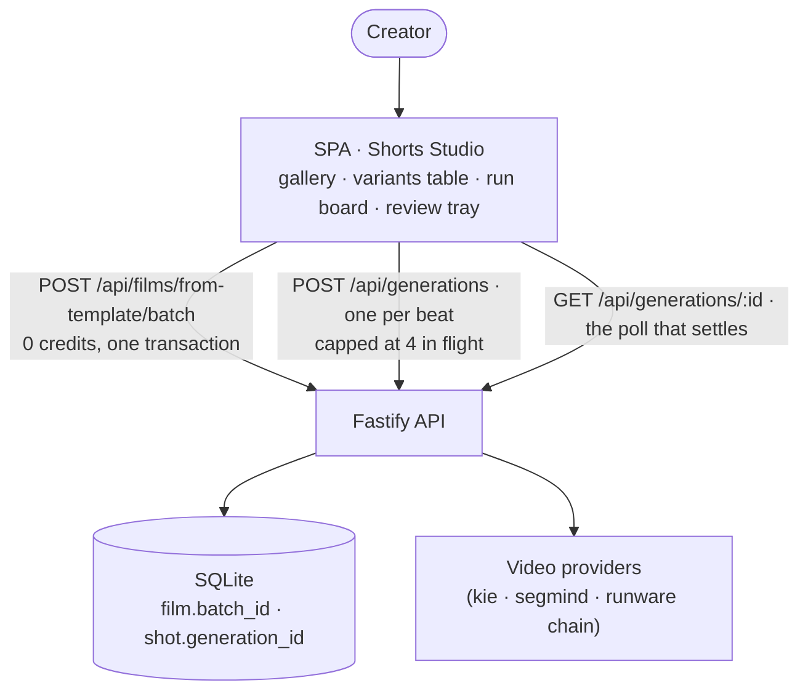
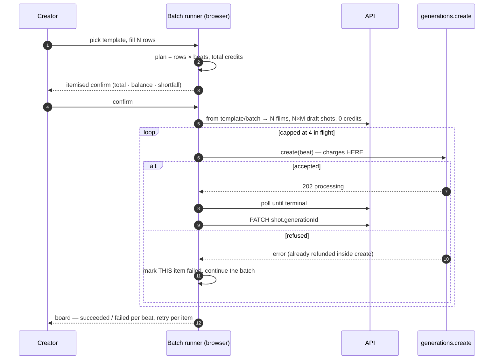
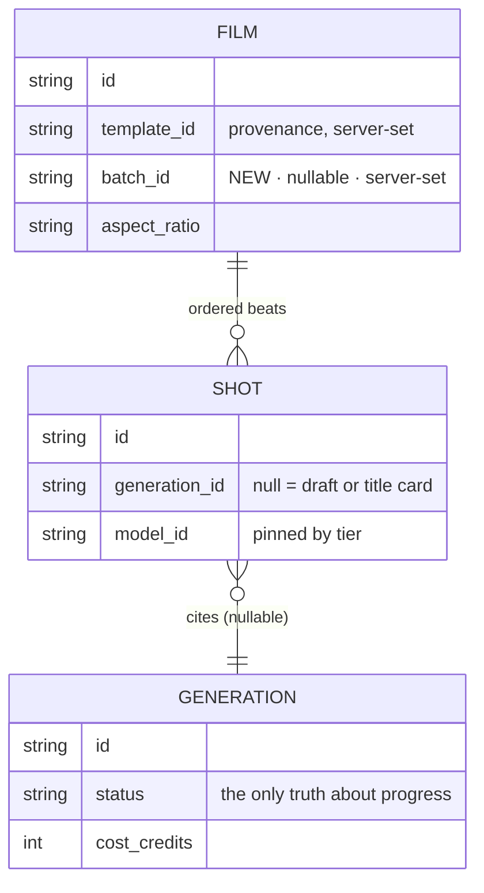

# ADR: Shorts Studio — a vertical template shelf and a batch runner over its shots

- **Status:** PROPOSED — architecture gate, awaiting owner approval
- **Date:** 2026-08-20
- **Related:** [[template-catalog]], [[cinema-studio]], [[canvas-mode]], [[modular-3d-assets]]

## Context

The owner asked for a "Shorts Studio": a large assortment of templates for the formats
that currently perform, and a tool that produces such videos **in batches** rather than
one at a time.

Three research streams fed this decision (2026-08-20): a survey of what short-form formats
actually work and where 2026 video models break; a teardown of how competing products
(higgsfield, Kling, Pika, Creatify, Canva, OpusClip) present template libraries and bulk
generation; and a map of what this codebase already does.

### What the codebase already does, which decided most of this

The reuse map is unambiguous, and it shrinks the feature dramatically:

> A Shorts Studio is **a template that instantiates a 9:16 film, plus a batch runner over
> its shots**. Everything except the batch runner already exists and is production-hardened.

Specifically: templates are authored as code with per-tier model pinning and closed knob
sets; `POST /api/films/from-template` creates one film plus N shots in ONE transaction for
**zero credits**; every shot then generates through the single money path
(`generations.create`), which charges before the provider call, refunds exactly once on
every failure path, and is polled by the SPA itself. Five of the fifteen existing templates
are already 9:16.

And the gap is equally precise:

> There is **no queue, no batch row, no job group, and no server-side fan-out** anywhere in
> the repo. The two closest analogues are both client-orchestrated: `useRunBranch` (Canvas)
> and `ExtractStage` (Assets3D).

### What the market says, which decided the rest

The competitive teardown found one unclaimed position:

> **Nobody has combined a broad template catalogue with a spreadsheet-driven matrix runner.**
> Canva has the merge and no AI video templates. Creatify has the matrix and one template
> type. Higgsfield has 64 templates and hands batch to a chat agent capped at 10 parallel.

The strongest evidence is not a competitor feature but its absence: third parties ship
**Chrome extensions** that bolt a queue onto higgsfield, and two independent ones converged
on the same five capabilities — spreadsheet import, a visible queue, per-row config,
automatic retry, bulk download. When users write browser extensions to add your missing
feature, the feature is specified.

Two more findings we adopt directly:

- **"The exact credit cost is shown on the Generate button before you confirm"** — cost on
  the commit control, live-updating. Yet **nobody prices a BATCH before running it.**
- **Nobody has built bulk review.** Forty clips are worthless if reviewing them is forty
  modal opens. OpusClip's ranked, skimmable, multi-select tray is the only good answer in
  the field, and it exists outside the template category entirely.

### The constraint this feature exists to satisfy

The template-catalog ADR already considered batch generation and rejected it **with a
condition attached**:

> **Rejected:** a "Generate all" button. It is the same trap with a better name. It can come
> back later as an **explicit, itemised confirmation step** — not as the default path.

This ADR is that condition being met, not that decision being overturned. Applying a
template stays free; a batch spends only behind an itemised total the user reads first.

## Decision

### 1. A "short" is a film. Shorts Studio adds a shelf, not a media type

`TemplateCategory` widens by one value, `shorts`. A shorts template is an ordinary
`Template` with `aspectRatio: '9:16'` and few beats. No new media type, no new render path,
no new editor: a finished short is a film, and the browser's WebCodecs export already
produces the mp4.

**Rejected:** a parallel "Short" entity. It would duplicate the timeline, the export, the
cast/reference plumbing and the money path to express "a film that happens to be short and
vertical".

### 2. The batch is a LABEL ON FILMS, not a queue

One nullable column, `film.batch_id`, written server-side when films are created through the
batch endpoint — the same provenance discipline `film.template_id` already follows (server
establishes it; a client cannot claim it).

There is no batch table, no job rows, no status machine, no worker. Batch progress is
**derived**, exactly as Assets3D derives part status: each shot cites a `generation_id`, and
that generation's live status is the truth.

A reload reconstructs the board along this chain — and the chain matters, because an earlier
draft of this ADR named the client's `['generation', id]` cache as the second source, which
is wrong: that cache is memory and a reload is exactly when it is empty. The real chain is
`GET /api/films?batchId=…` → each film's shots → `shot.generation_id` →
`GET /api/generations/:id`. The cache is a same-session optimisation, never the record.

**Rejected:** a `batch` + `batch_item` table pair with a server worker. It would introduce
the project's first background worker and a second source of truth about whether a clip
exists, when the row that already answers that question is `shot.generation_id`. The MVP
invariant is explicit: settlement is driven by the SPA's polls, and the stale reapers exist
precisely because of that choice.

### 3. The runner is client-orchestrated, parallel, and capped

Shaped after `useRunBranch` (plan → itemised confirm → run → per-item live state → cancel
outside React), but **parallel with a concurrency cap** rather than sequential. Portraits is
sequential because each view references the previous one; independent beats have no such
dependency, and a shorts batch is N independent films × M independent beats.

Failure is per item, following `ExtractStage`: one rejection records against its own item and
**never aborts the batch**. Nothing is refunded by the runner — `generations.create` has
already refunded internally by the time the error arrives.

The cap starts at **4 concurrent submits**, chosen to stay clear of the 20/min route limit
and to keep one runaway batch from monopolising a provider account shared with interactive
use.

### 4. The batch is priced before it runs, itemised, on the button

The confirm dialog states rows × beats × per-clip credits = total, the balance, and the
shortfall if any, with **Trim** and **Top up** as the two actions. A null price disables
confirm — a dialog is the last place to invent a number.

This is the load-bearing rule of the feature and the condition the template-catalog ADR set.

### 5. Reusable assets stay separate from per-run knobs

Cast entities, style packages and voices are durable inventory, already modelled. A batch row
supplies **knob values only**. Conflating the two is what makes batch incoherent: forty clips
need one brand and one face, chosen once, not per row.

### 6. The beat grid is 8 seconds, and that is arithmetic, not taste

The vertical tier ladder is `seedance-1-5-pro` (draft) / `wan-2-7` (standard) /
`veo-3-1-fast` (premium). Their native duration tables are 5·8·10·12, 5·8·10·15 and
**4·6·8** — an intersection of exactly **{8}**. `assertTemplatesValid` runs at boot and
**fails the deploy** if any tier model cannot natively serve a template's ratio and every
clip duration, so a shorts template on this ladder has one legal clip length.

**A tier must be REACHABLE, and the boot check does not test that.** This section first
named `pixverse-v6` for draft, on the reasoning that the existing 9:16 templates use it.
Every card passed every check and not one of them could have rendered a frame in
production: pixverse and veo route to Runware, whose deployed key is a placeholder, and
wan-2-7 routes to a DashScope account with no key at all. `assertTemplatesValid` compares a
model against a ratio and a duration; it has no opinion about whether that model's provider
is configured, and the catalogue gate that hides unreachable MODELS does not hide a TEMPLATE
that pins one.

So the rule this section now carries is the one that was missing: **a shelf's cheapest tier
must run on a provider this deployment can actually reach**, and a template whose only
reachable tier cannot serve its format does not belong on the shelf at all. Draft moved to
`seedance-1-5-pro` (kie.ai, verified live) at an identical 56 credits for 8s, so nothing
about price or the beat grid moved. Standard and premium stay pinned and light up when their
keys exist — their tier notes say so in the product's own words rather than leaving a user
to discover it after paying.

> **Amendment, 2026-08-20 — the draft tier is now `seedance-1-5-pro`, not `pixverse-v6`.**
> The decision above is unchanged and so is the arithmetic: `seedance-1-5-pro` serves 9:16 at
> 4·5·8·10·12, the intersection with the other two is still exactly **{8}**, and it costs the
> same 56 credits at 8s, so every shorts card still prices at 168 / 405 / 420. What forced the
> swap is a gap this section did not anticipate: **`assertTemplatesValid` checks ratio and
> duration, not whether a provider is reachable.** On production none of the original triple
> could generate — `pixverse-v6` and `veo-3-1-fast` route to Runware (placeholder key) and
> `wan-2-7` to Alibaba DashScope (unset key) — so the shelf passed every check and failed on
> the first real click. `seedance-1-5-pro` runs on kie.ai, which is verified working. Standard
> and premium stay pinned to their unreachable providers deliberately: aiming all three tiers
> at one working model would make the tier picker a lie. Every shorts card instead carries a
> tier note saying which tiers work today, and a test pins that all three notes exist.
> *Recorded by the template author; the §6 decision text is the architect's to revise.*

This is a gift rather than a limit: 8s is what the models generate natively and what
creators cut on, and it makes a short's price trivially legible — beats × the tier's
8s price. A template wanting other lengths must name a different triple and prove it
against the same boot check.

### 7. The runner is paced to the limits that already exist

`POST /api/generations` is rate-limited to **20/min** — every submit spends provider
money — and the global wall is 300 req/min per IP. A clip polling every 4s costs ~15
req/min, so roughly twenty clips in flight consume the entire global budget on polling
alone.

The runner therefore caps **4 submits in flight**, paces submits under the 20/min bucket,
and leans on the shared `['generation', id]` cache so N subscribers to one clip cost one
poll, not N.

**A batch is capped at 20 rows, and that is the same 20.** An earlier draft said an
oversized batch would simply queue behind the cap, which reads as "any size is creatable" and
would have invited someone to later raise the row cap to match. What a user may ASK for and
what the system can DELIVER inside a minute are deliberately the same number, so the board
never promises a throughput that does not exist. Rows beyond 20 are rejected at the contract,
before anything is written.

### 8. Knob budget is a per-template discipline

The field data is unambiguous: effect templates converge on 0–2 knobs, commercial templates
on 6–10, nobody ships twenty. A shorts template with more than three knobs is mis-specified —
it is a Cinema template wearing the wrong shelf.

### 9. A batch VARIES by default — the policy risk is in the product thesis

YouTube's Inauthentic Content Policy (clarified July 2026) demonetises *repetitive
mass-produced* AI video, with a three-strike path ending in permanent removal from the
partner programme. A batch template runner is, structurally, a mass-production machine.

So variation is not a nicety here, it is the feature's licence to exist. Every shorts
template must expose at least one knob whose values change what is ON SCREEN — the hook
line, the subject, the setting — and the variants table treats "N identical rows" as the
degenerate case, not the happy path. Templates whose only knob is cosmetic are
mis-specified for this shelf.

**Hard-blocked from this shelf:** synthetic-persona templates on health or finance topics.
That is a named demonetisation trigger, and no batch throughput is worth it.

### 10. Loopability is a template property with an enforced frame anchor

Since 2025-03-31 YouTube counts every replay as an additional view, and replay rate is one
of its strongest distribution signals. A visual match-cut loop needs the last frame to
rhyme with the first — laborious to shoot, nearly free to generate on models with
first/last-frame conditioning.

A shorts template therefore declares `loopable`, and a loopable one must state the return
to frame 1 in its final beat's authored prompt. Optimal length for the mechanic is 20–25s,
which on the 8s grid is **three beats**.

### 11. The model never renders text, and the frame is composed for the platform's UI

Text rendering is the second-worst failure mode in 2026 models and the only one that is
free to eliminate: captions, logos, packaging and lower-thirds are composited, never
prompted. Authored prompts must actively suppress in-frame text.

Framing is likewise a prompt-level constraint, not an overlay concern. The cross-platform
safe box on 1080×1920 is roughly x 90–900, y 200–1420 — nothing load-bearing may sit in
the bottom ~26% or right ~17%, where the platform's own UI lives. Every shorts template
carries that framing language: subject in the upper two-thirds, empty lower third.

Burned-in captions are a compositor feature and are **deferred** — but the templates ship
text-free from day one, so adding the compositor later changes nothing about them.

### 12. Each template declares its disclosure tier

`none` (stylised/fantastical — no label required) · `description` (non-photoreal, label in
the expanded description) · `in-player` (photoreal people/places/events — the label rides
in the player on YouTube, and TikTok's C2PA detection applies it whether we self-disclose
or not).

This is metadata from day one because retrofitting compliance costs far more than carrying
a field, and the EU already requires machine-readable provenance on AI ad content.

**A consequence worth stating plainly:** stylised formats are cheaper, more reliable AND
less policy-exposed than photoreal ones, because stylisation makes model failure read as
aesthetic rather than error. The shelf therefore leads with stylised and no-face formats;
talking-head and street-interview formats are the demo-friendly ones that generate the
support tickets, and they ship later.

## Diagrams

### Container view

### The run, including the failure path

### What the batch is, as data

## Consequences

**Good.** The feature is mostly assembly: the money path, template instantiation, per-shot
generation, polling and export are untouched and already hardened. No new background worker,
no second source of truth, no schema beyond one nullable column. A batch survives a reload
because it was never in memory to begin with.

**Costly.** A shorts batch is the largest single spend the product offers — ten shorts ×
four beats on a standard tier is roughly 1,400 credits. The itemised confirm is therefore
not a nicety but the feature's safety mechanism, and it must be tested as such.

**Accepted limits.** The runner stops if the tab closes: submitted generations continue and
settle on the next visit (their rows exist server-side), but no NEW submits happen while the
tab is shut. This is the same property every other spend surface in the product has, and
fixing it means the background worker this ADR declines to build.

**Deferred.** CSV/spreadsheet import (the variants table ships first, import is a reader on
top of it); bulk download as a zip; per-template spend analytics; user-published templates.

## Alternatives rejected

- **Server-side batch worker with a job table** — see §2. Introduces background workers, a
  second progress truth, and a queue to reconcile against a money path that already refunds.
- **"Generate all" on the existing Cinema timeline** — the trap the template-catalog ADR
  named. Same spend, no itemisation, no per-item recovery.
- **One generation per short (a single long clip)** — cheaper and simpler, but throws away
  the beat grid the models generate natively and the cut points creators actually use.

## Implementation — phase 1, server side (2026-08-20)

The ADR's own status is unchanged; this records what of it now EXISTS in the API, so a
reader of the decision does not have to diff the code to find out.

Decisions §1, §2, §4 (server half) and §6 are built. §3 (the client-orchestrated runner),
the itemised confirm dialog and the shorts templates themselves are not — no template
declares `category: 'shorts'` yet, so the shelf exists in the contract and is empty in the
gallery.

**What shipped**

| Piece | Where |
|---|---|
| `'shorts'` category | `templateCategorySchema` — widening the enum IS the shelf |
| `film.batch_id` (nullable) + `idx_film_user_batch` | `db/schema.ts`, `db/ddl.ts`, micro-migration in `db/client.ts` |
| `POST /api/films/from-template/batch` | `modules/templates/routes.ts`, 10/min, 201 `{ batchId, films: FilmDetail[] }` |
| `GET /api/films?batchId=` | `modules/films/routes.ts` — the board's whole persistence |

**Three things worth knowing before touching this code**

- **All N films commit in ONE transaction.** better-sqlite3 is synchronous, so nothing is
  awaited between the inserts. A batch lands whole or not at all.
- **Every row is validated before the first write.** `TemplateService.planFilm` does the
  substitution and the knob checks and touches no database; `instantiateBatch` plans all
  rows, then writes. One bad row is a 400 with an empty library behind it — there is no
  partial success and no per-row error list.
- **The index is NOT in `FILM_DDL`.** `CREATE TABLE IF NOT EXISTS` is a no-op on an
  existing volume, so `batch_id` does not exist there until the `ALTER TABLE` runs — which
  is after the DDL exec. An index declared alongside the table would pass every fresh
  install and brick every deployed one. It is its own constant, exec'd right after the
  column guard, and `test/db-ddl.test.ts` boots a legacy file to keep it that way.

**Still true, and tested as such:** the batch charges nothing. `apps/api/test/templates-batch.test.ts`
asserts the balance is untouched after a three-row batch at the premium tier, and no code
on this path imports the credit ledger.

**The cap is 20 rows** (§7's arithmetic): `POST /api/generations` is limited to 20/min, so a
batch bigger than the bucket cannot be *run* faster than the limiter releases it. Capping
creation at the same number keeps what the user can ask for and what the system can deliver
in a minute the same number.
