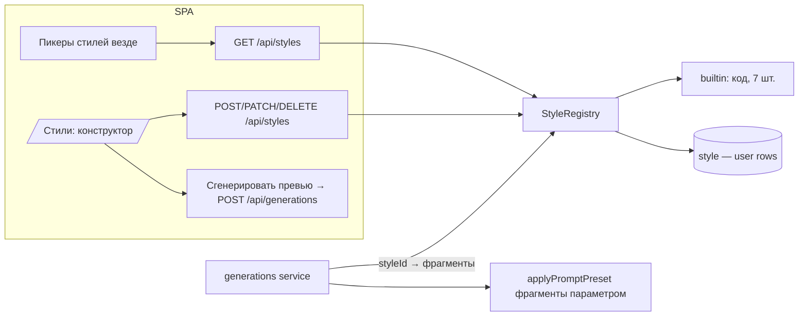

# ADR: Style Studio — пользовательские стили видео как единый реестр

## Status

**Accepted — 2026-07-31** (владелец: «да»).

## Context

Сегодня «стиль» — закрытый enum из 7 значений в КОНТРАКТАХ
(`styleIdSchema`) с серверной таблицей фрагментов (`STYLE_PRESETS`: positive
fragment + negative + recommendedModelId). Композер и Cinema рендерят пикеры из
этих же таблиц; сервер компонует промпт через `applyPromptPreset`; фильмы,
шоты и шаблоны хранят `styleId`. Добавить стиль = новый релиз.

Владелец хочет: стиль — самостоятельная сущность-«конструктор», которую любой
пользователь собирает промптами; архитектура расширяемая; «стили как модели в
бэке» — сервер резолвит стиль по id в момент генерации, как резолвит модель по
каталогу.

## Decisions (proposed)

### D1 — Один реестр, два источника; wire-id открывается

Серверный **StyleRegistry** резолвит стиль по id из двух источников:
1. **Builtin** — те же 7 стилей, остаются кодом (сид-каталог, как CATALOG у
   моделей). Их id неизменны — обратная совместимость всех фильмов/шаблонов.
2. **Пользовательские** — новая таблица `style`, скоуп по владельцу.

Wire-контракт: `promptPreset.styleId` и `film.defaultStyleId` становятся
открытой строкой (`z.string().min(1).max(60)`); валидность проверяет СЕРВЕР в
момент использования (builtin ИЛИ свой стиль вызывающего) — ровно как
`modelId` валидируется против каталога, а не enum'ом. Чужой/несуществующий id
→ 400 до списания.

### D2 — Сущность расширяемая через kind + config

```
style (
  id TEXT PK,                    -- uuid
  user_id TEXT NOT NULL FK,      -- владелец; builtin в БД НЕ живут
  name TEXT NOT NULL,            -- «Неоновый нуар», ≤60
  kind TEXT NOT NULL DEFAULT 'prompt',  -- дискриминатор конструктора
  fragment TEXT NOT NULL,        -- EN positive, ≤500 (модели лучше видят EN)
  negative TEXT DEFAULT '',      -- EN negative, ≤300
  recommended_model_id TEXT,     -- совет пикеру, не принуждение (как builtin)
  config_json TEXT DEFAULT '{}', -- задел: lora/reference/strength — без миграций
  preview_generation_id TEXT,    -- превью стиля: ЦИТИРУЕТ генерацию (не владеет)
  created_at, updated_at
)
```

MVP-kind ровно один: `'prompt'`. Будущие виды (`'lora'`, `'reference'`)
добавляются значением kind + полями в config_json — без ломки таблицы и wire.
Превью — обычная платная генерация, стиль её цитирует (дисциплина канваса D1).

### D3 — Точка применения: applyPromptPreset получает резолвленные фрагменты

`applyPromptPreset` остаётся чистой функцией в контрактах, но берёт фрагменты
стиля ПАРАМЕТРОМ (`StyleFragments = { fragment, negative }`), а не лезет в
таблицу сама. Сервер перед компоновкой резолвит id через реестр (builtin →
код; user → БД + ownership). Композиция промпта не меняется ни на символ —
меняется только источник фрагментов.

### D4 — API: styles-модуль, CRUD как у сущностей

`GET /api/styles` → builtin (с бейджем) + свои, одним списком — то, из чего
пикеры рендерятся вместо импорта STYLE_PRESETS.
`POST /api/styles` · `PATCH /api/styles/:id` · `DELETE /api/styles/:id` —
owner-scoped (foreign = 404, builtin менять/удалять нельзя — 400). Удаление
стиля НЕ трогает фильмы/шоты, где он был использован: styleId остаётся в
строках, резолв при следующей генерации даст честный 400 «стиль удалён»
(как удалённая генерация в шоте читается пустым слотом).
Бесплатно всё, кроме превью (обычный charge-путь генерации).

### D5 — Web: модуль Styles + пикеры переезжают на реестр

`apps/web/src/modules/Styles/`: страница «Стили» (список: builtin-бейджи +
мои карточки с превью; конструктор: имя, фрагмент с **обязательным sparkle
EnhanceButton**, негатив, рекомендуемая модель, кнопка «Сгенерировать превью»).
Все текущие пикеры стилей (композер /create, Cinema inspector, шаблоны)
переключаются с чтения STYLE_PRESETS на `GET /api/styles` — один источник,
пользовательские стили автоматически появляются везде, где есть выбор стиля.

### D6 — Деньги: ноль нового money-кода

Стиль — текст. Единственная трата — превью, и она идёт обычным
charge-at-submit путём генераций. Реестр НИКОГДА не списывает.

## Architecture



```mermaid
sequenceDiagram
  participant U as Пользователь
  participant S as /styles конструктор
  participant API as styles API
  participant G as generations service

  U->>S: имя + фрагмент (+sparkle) + негатив
  S->>API: POST /api/styles → { styleId }
  U->>S: «Сгенерировать превью» (по желанию)
  S->>G: POST /api/generations { styleId } — обычный charge
  G-->>S: превью; PATCH style.previewGenerationId
  Note over U,G: дальше стиль виден во ВСЕХ пикерах
  U->>G: генерация в Cinema/композере со своим styleId
  G->>G: резолв: builtin ИЛИ свой → фрагменты → компоновка
```

```mermaid
erDiagram
  USER ||--o{ STYLE : owns
  STYLE }o--o| GENERATION : "preview cites"
  SHOT }o--o| STYLE : "styleId (строка, резолв при генерации)"
  FILM }o--o| STYLE : "defaultStyleId"
```

## Consequences

- Один новый API-модуль + таблица + веб-модуль; композиция промпта, деньги,
  фильмы, шаблоны — не тронуты. Enum → строка это ЕДИНСТВЕННОЕ контрактное
  изменение, и оно расширяющее (все старые значения валидны).
- Builtin-стили остаются кодом → шаблоны и дефолты не зависят от БД.
- Пикеры получают асинхронный источник (был синхронный импорт) — 4 состояния
  по стандарту.
- config_json/kind дают расширение до LoRA/reference-стилей без миграций wire.

## Build phases (после аппрува)

1. Backend: contracts (styleId → строка, StyleFragments в applyPromptPreset) +
   таблица + реестр + CRUD + резолв в generations. 
2. Web: модуль Styles (список+конструктор+превью) + перевод пикеров на реестр.
3. (потом) kind='reference': стиль из референс-картинки; шаринг стилей.

Out of scope MVP: публичные/шаримые стили, LoRA-обучение, версии стилей,
модерация каталога.

## Amendment 2026-07-31 — стиль-пакет: промпт + референсы (accepted)

Владелец: «стили создаём промптами И референсами — удобный пакет стиля».
Реализуем задел D2 без ломки:

### A1 — Пакет, а не либо/либо

Стиль может нести ОДНОВРЕМЕННО фрагменты и референс-картинки (до 3).
`kind` остаётся 'prompt' (пакет — это возможность, не новый вид);
референсы — колонка `reference_images_json` `[{id, path}]`, зеркально
`shot.reference_images_json` (пути из saveDataUri, raster-only гард).

### A2 — Применение через существующий референс-канал

Резолв стиля возвращает `{ fragment, negative, referenceImagePaths }`.
generations читает пути → data URI (`readAsDataUri`) → вливает в серверный
`referenceImages`-канал (тот же, что entity-фото и shot-references), С УЧЁТОМ
модельных гейтов. Порядок при переполнении maxReferenceImages: сначала
entity/shot-рефы, стилевые дропаются первыми — стиль амбиентен.

### A3 — Несовместимая модель: рефы дропаются молча

Прецедент владельца 2026-07-24 (shot references): «refs are simply dropped
silently (no charge) for such models». Фрагменты применяются всегда; рефы —
только там, где модель умеет (referenceMode / r2v). Никаких отказов.

### A4 — API/UI

`POST /api/styles/:id/references { dataUri }` (201, cap 3) ·
`DELETE /api/styles/:id/references/:refId` — зеркало shot-references.
Конструктор: блок «Референсы стиля» — клик/драг/вставка (shared readImageFile),
тумбы с удалением. Превью-генерация автоматически использует пакет целиком.
