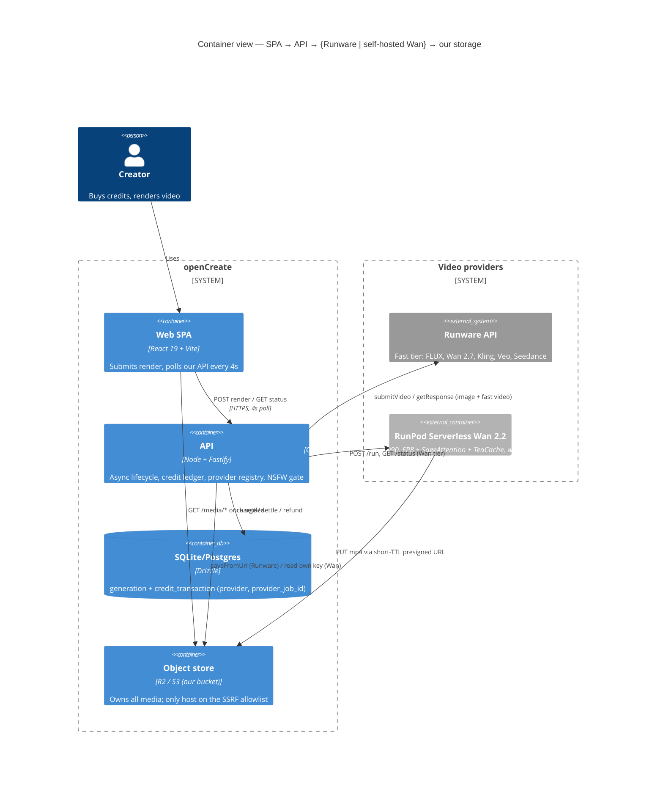
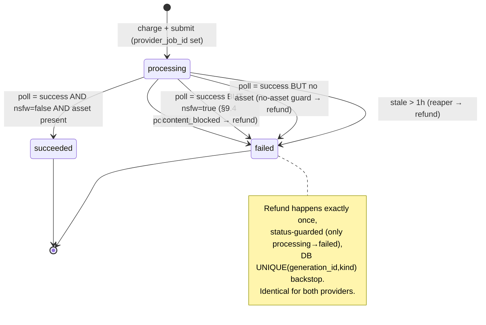

# ADR: Self-hosted Wan 2.2 video as a second provider (RunPod-serverless), behind a provider abstraction

## Status

**Proposed — pending user approval + spike.** No implementation, scaffolding, dependencies, or catalog exposure happens until (1) the user approves this ADR and (2) the feasibility spike ([[wan-runpod-feasibility-spike]]) passes its go/no-go gates. This is a design-only record.

## Context

The MVP ([[opencreate-mvp-architecture]]) generates video through a **single closed provider — Runware** — inside a well-tested async lifecycle: submit → `202 processing` → SPA polls our API every 4s → API polls the provider → settle (charge-at-submit, refund-on-failure), with a transactional credit ledger, own media storage (`StorageProvider.saveFromUrl` behind an SSRF host allowlist), a 1h stale-processing reaper, and a §9.4 NSFW gate.

The product is an **async "premium render" model**: a 5-minute latency budget is acceptable and sold at a premium, so **cold start is a non-issue**. Our commercial baseline to beat is **Seedance 1.5 Pro on Runware = $0.13/clip, ~60s, live and zero-ops.**

Three facts frame the decision (all verified, July 2026):

1. **Wan 2.2 A14B is the only *open* Wan** (Apache-2.0, dual high-noise/low-noise 14B experts). Wan 2.5/2.6/2.7 are **closed, API-only** — self-hosting a newer Wan is not merely hard, it is **impossible** (no weights exist to host). Wan 2.7 already ships on our Runware tier and stays there.
2. **"Free weights ≠ free compute."** Open weights remove a license/API fee but move the entire cost + operational burden onto us: GPUs, a ComfyUI image, quantization re-tuning as Wan updates, a network volume, on-call, and — critically — **moderation parity** (Runware supplies `NSFWContent`; a self-hosted worker supplies nothing unless we build it).
3. On the only GPU tier that beats the baseline (RTX 4090, FP8), the arithmetic says self-host COGS is **~$0.014/clip vs $0.13** — a ~9x per-clip edge — **but** the two numbers that decide feasibility (real cold-start seconds `C` and warm gen seconds `G` on our exact optimized stack) are **unmeasured**. Everything else is arithmetic on verified rates; those two are the spike.

## Decision

Introduce **one small provider seam** and route a **second, self-hosted video provider** through the **existing, unchanged** async lifecycle. Keep Runware as the fast tier.

1. **Provider abstraction (the whole seam).** A new `VideoProvider { submit(); poll() }` mirrors the two operations the lifecycle already performs. It uses provider-neutral types (`VideoSubmitInput`, `VideoSubmitResult`, and a `VideoPollResult` discriminated union `processing | success | error` renamed off Runware nouns to `assetUrl` / `costUsd` / `nsfw`). The generation service resolves a provider from a registry keyed by the catalog entry's `provider`, persists whatever job handle `submit()` returns, and polls with it. **Every money-path invariant is preserved byte-for-byte** — the union the service switches on is identical; only the provider CALL and three COLUMN NAMES change. `create()`, `get()`, `failGeneration()`, `settleStaleGenerations()`, the poll throttle, and refund idempotence are UNCHANGED.

2. **RunPod-serverless-first for Wan.** Serverless (pay-per-active-second, scale-to-zero) is the launch topology: it is roughly **volume-independent** and wins on bursty/early traffic because idle costs nothing and cold start is a non-issue for an async product. A dedicated pod only wins above ~575 clips/day/GPU and is deferred to a later "migrate the hot volume" step.

3. **Keep Runware as the fast tier.** The existing `RunwareClient` is wrapped by a thin adapter (the client file itself UNCHANGED); the image path stays Runware-only and is never routed through the registry. Closed newer models (Wan 2.7, Kling, Veo, Seedance) stay on Runware. Self-hosting is offered as a **premium "Cinema" async tier**, not a replacement.

4. **Delivery keeps the storage invariant.** The RunPod worker uploads the finished MP4 **directly into OUR object store** via a short-TTL presigned PUT minted per job at submit time. The only host added to the config-driven `ASSET_HOST_ALLOWLIST` is **our own bucket domain** — RunPod compute is never allowlisted (SSRF surface stays closed). `storage/local.ts` is UNTOUCHED.

5. **Additive, reversible DB change.** Expand → backfill → (contract deferred): add `provider TEXT NOT NULL DEFAULT 'runware'`, `provider_job_id TEXT`, `provider_cost_usd TEXT` via the idempotent DDL bootstrap; backfill from the legacy `runware_task_uuid` / `runware_cost_usd`; **keep** the legacy columns for instant rollback.

6. **Moderation parity is a HARD prerequisite.** Self-hosted Wan has no provider-side NSFW check. The worker MUST run an equivalent classifier on output frames and return `nsfw`, which the adapter maps to `VideoPollResult.nsfw` so the existing §9.4 gate fires unchanged. **Default-deny: the `wan-2-2` catalog entry does not ship until the worker returns a trustworthy `nsfw` flag.**

### (a) C4 Container — where the second provider sits



### (b) Happy path — async Wan render

```mermaid
sequenceDiagram
    autonumber
    participant SPA
    participant API
    participant Ledger as Credit ledger
    participant Reg as VideoProvider registry
    participant RP as RunPod /run·/status
    participant Store as Our object store
    SPA->>API: POST /generations (model=wan-2-2)
    API->>Ledger: charge (atomic) + insert row {provider:'wan-runpod', provider_job_id:null}
    API->>Store: mint short-TTL presigned PUT for renders/<jobId>.mp4
    API->>Reg: provider = registry['wan-runpod']
    API->>RP: submit() → POST /run {prompt, air, w, h, dur, putUrl}
    RP-->>API: { id }  (RunPod mints the job id)
    API->>API: status-guarded update set provider_job_id = id
    API-->>SPA: 202 processing
    loop every 4s (unchanged SPA polling)
        SPA->>API: GET /generations/:id
        API->>RP: poll() → GET /status/<id>
        alt IN_QUEUE / IN_PROGRESS
            RP-->>API: processing (cold start: worker loads FP8 weights from network volume, ~40s once)
            API-->>SPA: processing (+ progress or null)
        else COMPLETED
            RP->>Store: worker already PUT mp4 to our bucket
            RP-->>API: success { assetUrl=our-bucket key, costUsd=execTime*rate, nsfw:false }
            API->>API: §9.4 gate on nsfw → settle (asset already ours; no extra egress)
            API-->>SPA: succeeded + media url
        end
    end
```

### (c) Failure path — error/timeout → refund exactly once

```mermaid
sequenceDiagram
    autonumber
    participant SPA
    participant API
    participant Ledger as Credit ledger
    participant RP as RunPod /status
    Note over API: row is 'processing', already charged at submit
    alt RunPod reports terminal error
        SPA->>API: GET /generations/:id (4s poll)
        API->>RP: poll() → GET /status/<id>
        RP-->>API: FAILED / TIMED_OUT / CANCELLED → error {sanitized}
        API->>Ledger: failGeneration() — status-guarded: only processing→failed refunds
        Ledger-->>API: refund once (UNIQUE(generation_id,kind) backstop)
        API-->>SPA: failed (credits returned)
    else Worker/queue stuck, no terminal status
        Note over API: stale-processing reaper (1h STALE_PROCESSING_MS)
        API->>API: settleStaleGenerations() → failGeneration()
        API->>Ledger: refund once (idempotent; no-op if a settler already flipped it)
        Note over Store: orphan renders/<jobId>.mp4 (if any) reaped by bucket lifecycle rule
    end
```

### (d) Generation state machine (unchanged by this ADR)



## Cost model (per 5s 720p clip — baseline to beat: Seedance $0.13, zero-ops)

Verified hourly rates: 4090 community **$0.34/hr** ($0.0000944/s); H100 PCIe **$1.99/hr** ($0.000553/s); H100 SXM **$3.29/hr** ($0.000914/s). Warm gen `G`: 4090 FP8 ~260s unopt / ~110s optimized (SageAttention INT8 + TeaCache); H100 SXM ~284s / ~120s opt. Cold start `C` (weights on network volume) planned midpoint ~40s — **the spike's primary unknown.**

Serverless bills the 100%-util rate for the seconds you run and idle is free, so **serverless $/clip is roughly volume-independent**:

| Path | Tier + stack | $/clip (warm) | $/clip (cold, sparse) | vs $0.13 |
|---|---|---|---|---|
| **Serverless (launch)** | **4090 FP8 opt** | **$0.0104** | **$0.0142** | **beats 3–9x** even worst-case (× flex premium → ~$0.015–0.042) |
| Serverless | 4090 FP8 unopt (warm) | $0.0245 | — | beats ~5x |
| Serverless | H100 PCIe opt | $0.072 | $0.094 | thin ~1.4–1.9x |
| Serverless | H100 SXM opt | $0.110 | $0.146 | **ties / loses** |
| Dedicated pod | 4090 FP8 opt @100% / 70% / 30% | $0.0104 / $0.0149 / $0.0347 | — | wins only when saturated |
| Dedicated pod | H100 SXM opt @70% | $0.157 | — | loses |

**Break-evens.** (1) Dedicated 4090 = $8.16/day flat ≈ **575 clips/day** to match serverless at 110s/clip → below that, serverless wins (no idle bill). (2) Self-host (4090 serverless ~$0.014) beats the $0.13 API by ~9x from clip #1 on pure COGS; including ops amortization (~$500–1000/mo for image upkeep, quant re-tuning, on-call), payback is **~150–300 clips/day** — below that, Seedance's zero-ops wins despite the higher sticker price. **Network volume** is a fixed **~$5–7/mo** (100GB) that eliminates ~30GB re-download per cold start.

**Headline:** at meaningful volume, self-hosted Wan 2.2 on a 4090 serverless endpoint costs **~$0.01–0.04/clip vs our live $0.13** — a 3–9x COGS edge — **if and only if** the spike confirms `G ≤ ~180s`, `C ≤ ~90s`, `$/clip ≤ $0.05`, and quality ≥ Seedance. H100 does not beat the baseline and is a quality/VRAM fallback only.

## Consequences

**Positive**
- New premium "Cinema" async tier at a fraction of API COGS, with margin controlled by catalog credit pricing (independent of provider cost).
- One tiny seam; the money-critical lifecycle, ledger, routes, storage SSRF gate, and 4s SPA polling are **untouched**. Existing generation-lifecycle tests keep passing on the `runware` registry key.
- Presigned-PUT delivery keeps every asset in our store from birth with **zero extra egress** and **no SSRF-allowlist widening to RunPod**.
- Additive, reversible schema (legacy columns retained) → instant rollback to the old binary.

**Negative / cost**
- We own GPU ops: a pinned ComfyUI image, weights on a region-pinned 100GB network volume (~$5–7/mo, couples the endpoint to one region's GPU pool), quant re-tuning as Wan updates, and quality-regression ownership.
- **Moderation parity is now our responsibility** — a worker-side NSFW classifier is a hard gate before launch; also consider pre-submit prompt/image screening Runware likely did for us.
- `provider_cost_usd` for RunPod is an **operator estimate** (`executionTime × gpuRatePerSecond`), not an invoice line — margin dashboards must treat the two providers' cost figures as differently sourced (not a credit-correctness risk).
- RunPod `/run` is not idempotent: a retried submit after a timeout could orphan a job. Mitigation — retry ONLY on pre-response transient network/5xx and persist ONLY the first `provider_job_id`; a rare orphan wastes a few worker-seconds but cannot double-charge or double-store. Orphan bucket objects need a `renders/` lifecycle rule.
- Two unmeasured numbers (`C`, `G`) gate the whole economics/latency case → resolved only by the spike.

## Rejected alternatives

- **Dedicated pod from day one** — a flat $8.16/day 4090 only beats serverless above ~575 clips/day/GPU; early async-premium traffic is bursty and well below that, so we'd pay for idle. Serverless first; migrate the hot volume to a reserved pod later once sustained volume justifies it.
- **Self-host a newer Wan (2.6/2.7)** — **impossible**: 2.5/2.6/2.7 are closed, API-only; no open weights exist. Newer Wan stays on the Runware fast tier.
- **LTX-2.3 (or similar) instead of Wan 2.2** — plausibly cheaper/faster at lower quality; **worth benchmarking** as an alternative self-host target in or after the spike (same worker+provider seam, different workflow JSON). Not chosen now because Wan 2.2 A14B is the strongest open baseline against Seedance and the seam is model-agnostic — swapping the model later is a workflow change, not an architecture change.
- **Staying Runware-only** — zero ops and simplest, but forgoes the ~9x COGS edge on high-volume video and leaves us fully dependent on one provider's pricing. Kept as the fallback if any spike gate fails.
- **H100 as the primary serverless tier** — ties or loses to $0.13; retained only as a quality/VRAM escalation if FP8 on 24GB proves too tight at 720p.
- **base64 or RunPod-hosted return URL for delivery** — base64 risks truncation against RunPod's ~20MB serverless response cap and doubles egress; a RunPod URL adds a second download and forces allowlisting RunPod (SSRF surface). Presigned PUT to our bucket avoids both.

## Open questions (carried into the spike / first tuning pass)

- Object-store choice for presigned PUT (our R2/S3 with a custom public domain recommended, so the allowlisted host is fully controlled).
- Whether the Wan worker emits incremental `progress` for the SPA bar, or only queue/running/done (coarse states → `null` progress until completion; acceptable UX difference — confirm with frontend).
- Whether to expose `provider` in the public catalog response (recommend stripping it — infra signal).
- Per-provider stale threshold: keep the shared 1h or add a shorter wan-runpod timeout given the ~5-min target and cold-start behavior.
- Exact Wan 2.2 A14B model tag / optimized invocation and the GPU-specific `gpuRatePerSecond` to seed accurate cost estimates.

See the concrete, measurable plan and the exact user-provided prerequisites in [[wan-runpod-feasibility-spike]].
