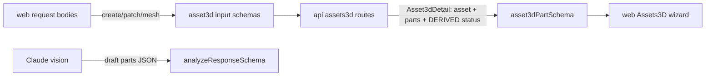

# asset3d.ts — AI component doc

> AI-facing sidecar for `asset3d.ts`. Created 2026-07-18. Keep this in sync with the code on every change.

## Purpose
Wire contracts for Modular 3D Assets (ADR modular-3d-assets): the `asset3d`
aggregate and its `asset3d_part` children, which CITE generations by id instead
of owning media — the Film/Shot pattern applied to concept→parts→meshes→assembly.

## What it does (for an AI reader)
- Responsibilities: validate the create/patch/mesh request bodies and the read
  DTOs for the `/api/assets3d*` surface; validate the FREE analyze RESPONSE on
  the way out of the model. Encodes two invariants in the type system: (1) part
  citations are nullable generation ids the SERVER sets via extract/mesh — never
  present on any input; (2) part `status` is DERIVED at read time and serialized
  on the DTO only — no input schema carries it, there is no status column.
- Public API / exports / props / endpoints:
  `MAX_PARTS` (12), `partStatusSchema`/`PartStatus`,
  `partTransformSchema`/`PartTransform`, `asset3dSchema`/`Asset3d`,
  `asset3dPartSchema`/`Asset3dPart`, `createAsset3dInputSchema`/`CreateAsset3dInput`,
  `updateAsset3dInputSchema`/`UpdateAsset3dInput`,
  `createAsset3dPartInputSchema`/`CreateAsset3dPartInput`,
  `updateAsset3dPartInputSchema`/`UpdateAsset3dPartInput`,
  `meshPartInputSchema`/`MeshPartInput`, `asset3dDetailSchema`/`Asset3dDetail`,
  `asset3dListSchema`/`Asset3dList`, `analyzePartSchema`/`AnalyzePart`,
  `analyzeResponseSchema`/`AnalyzeResponse`.
- Inputs → Outputs: unknown JSON → typed input/DTO; API routes return the 400
  error envelope on parse failure. `extract` has NO input schema on purpose —
  the server composes the model + prompt (server-model rule), so its POST body
  is empty; `analyze` has no request body either (only the validated response).
- Side effects: none (pure zod schemas).

## Dependencies
- Imports / depends on: `zod` only. Deliberately imports nothing from other
  contract modules (no coupling) — exported after `./generation` in `index.ts`
  only for reader ordering, not a code dependency.
- Used by: `apps/api` `modules/assets3d/*` (route body validation + DTO
  construction: `toPartDto` must satisfy `asset3dPartSchema`, `analyze.ts`
  validates against `analyzeResponseSchema`), `apps/web` `modules/Assets3D/*`
  (later build). Tested in `src/asset3d.test.ts`.

## Diagram

## Key decisions / gotchas
- Part `status` (`partStatusSchema`: `draft|extracting|extracted|meshing|ready`)
  is DERIVED from the cited generations at read time and appears ONLY on the read
  DTO — never persisted (no status column, the films/shots second-source-of-truth
  lesson) and REJECTED on every input schema.
- `imageGenerationId`/`meshGenerationId` are nullable citations the server sets
  via the extract/mesh routes; they are absent from create/patch inputs so a
  client can never fabricate provenance.
- `dataUriImage` uses an anchored `^data:image/(png|jpe?g|webp);base64,` regex
  (not `.startsWith`, which has a prefix-boundary hole — model-render.ts
  precedent). svg is excluded (stored-XSS); URLs are rejected (SSRF — the API
  never fetches user-supplied URLs). 14MB cap tracks `generation.inputImage`.
- `updateAsset3dPartInputSchema.transform`: `null` clears the assembly transform,
  ABSENT means untouched — the PATCH handler distinguishes the two.
- `meshPartInputSchema` is `{ modelId }` only: the tier is the sole client input;
  the server supplies the part image and composes the job (server-model rule).
- `partTransformSchema` is renderer-agnostic Vec3 position/rotation/scale, Y-up /
  meters (glTF convention), rotation in Euler radians XYZ.
- No new `apiErrorCode` needed: analyze reuses the existing `provider_error`
  (502) when `ANTHROPIC_API_KEY` is unset, exactly like storyboard.

## Commits
- _no commit yet_
