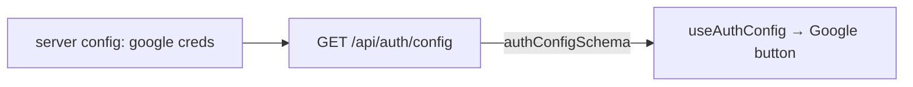

# auth-config.ts — AI component doc

> AI-facing sidecar for `auth-config.ts`. Created 2026-07-23. Keep this in sync with the code on every change.

## Purpose
The shared wire contract for `GET /api/auth/config` — the public runtime flag telling the SPA which optional sign-in providers the server has enabled, so the client never drifts from the server's real config (ADR google-oauth).

## What it does (for an AI reader)
- Responsibilities: define `authConfigSchema` = `{ googleEnabled: boolean }` and its inferred type.
- Public API / exports: `authConfigSchema`, `type AuthConfig`.
- Inputs → Outputs: none (a schema definition).
- Side effects: none.

## Dependencies
- Imports / depends on: `zod`.
- Used by: `apps/api` (the `/api/auth/config` route response), `apps/web` (`useAuthConfig` typing the `api<AuthConfig>()` call), exported via `packages/contracts/src/index.ts`.

## Diagram

## Key decisions / gotchas
- `googleEnabled` is true iff BOTH Google creds are set (the pair better-auth's provider gates on) — never expose the creds themselves, only the boolean.
- Extensible: future optional providers add sibling booleans here.

## Commits
- _no commit yet_
