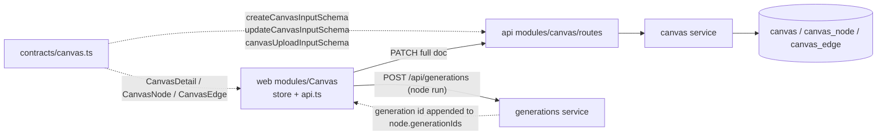

# canvas.ts — Canvas Mode wire contracts

> AI-facing sidecar for `canvas.ts`. Created 2026-07-29. Keep this in sync with the code on every change.

## Purpose

Wire-format source of truth for Canvas Mode (ADR `docs/wiki/decisions/canvas-mode.md`):
the node-graph document (`canvas` / `canvas_node` / `canvas_edge`) that the SPA
edits and `/api/canvases` persists. The canvas is an **aggregate that CITES
generations** — exactly like `film.ts` — so no schema here carries money, media
bytes, or provider state.

## What it does (for an AI reader)

- Responsibilities: define the zod schemas + inferred types for the canvas
  document, its CRUD inputs, and the upload-node byte channel. No logic, no I/O.
- Public API / exports:
  - `canvasNodeKindSchema` / `CanvasNodeKind` — the 7 MVP kinds
    (`image` · `video` · `upload` · `character` · `upscale` · `remove-bg` · `note`).
  - `canvasViewportSchema` / `CanvasViewport` — `{ x, y, zoom }`, zoom clamped 0.05–4.
  - `canvasNodeConfigSchema` / `CanvasNodeConfig` — bounded per-kind editor state.
  - `canvasNodeSchema` / `CanvasNode`, `canvasEdgeSchema` / `CanvasEdge`.
  - `canvasSchema` / `Canvas` (list row), `canvasDetailSchema` / `CanvasDetail` (full doc),
    `canvasListSchema` / `CanvasList`.
  - `createCanvasInputSchema` / `CreateCanvasInput`, `updateCanvasInputSchema` / `UpdateCanvasInput`.
  - `canvasUploadInputSchema` / `CanvasUploadInput`, `canvasUploadResultSchema` / `CanvasUploadResult`.
- Inputs → Outputs:
  - `POST /api/canvases` ← `{ title }` → `Canvas`
  - `GET /api/canvases` → `CanvasList`
  - `GET /api/canvases/:id` → `CanvasDetail`
  - `PATCH /api/canvases/:id` ← `UpdateCanvasInput` (full document) → `CanvasDetail`
  - `POST /api/canvases/:id/uploads` ← `{ dataUri }` → `{ uploadUrl: '/media/…' }`
- Side effects: none (pure schemas).

## Dependencies

- Imports / depends on: `zod` only.
- Used by: `apps/api/src/modules/canvas/routes.ts` (input parse),
  `apps/api/src/modules/canvas/service.ts` (DTO types),
  `apps/web/src/modules/Canvas/*` (store + typed API calls).
  Exported via `packages/contracts/src/index.ts`.

## Diagram

## Key decisions / gotchas

- **Every collection is bounded, on purpose.** PATCH carries the FULL document
  (debounced autosave, last-write-wins, single owner), so an unbounded array is
  an unbounded write: 200 nodes / 400 edges / 50 generation ids per node / 2000-char
  strings. The bounds ARE the contract — the ADR accepts O(doc) autosave only at
  MVP scale.
- **`config` is one loose-but-bounded object, not a discriminated union.** The
  server never interprets config; it only stores it. Node RUNS go through
  `POST /api/generations`, which re-validates strictly against the catalog model.
  A union here would force a contract change on every editor field tweak for no
  server-side safety gain. `z.object` strips unknown keys in zod 4, so junk keys
  are dropped rather than persisted.
- **`uploadUrl` must start with `/media/`.** It is server-minted by the upload
  route; the prefix check stops a client from writing an arbitrary URL into the
  doc and having the editor render (or a later feature fetch) it.
- **`canvasUploadInputSchema.dataUri` is data-URI-only**, never a URL — the same
  SSRF rule as `addShotReferenceInputSchema` and `generation.inputImage`, with the
  same ~14MB post-base64 cap.
- **`generationIds` is append-only history, no FK.** Deleting a generation from the
  Library must leave an empty version on the node, never cascade the canvas away
  (same "cite, never own" rule as `shot.generation_id`).
- Node ids are **client-minted** and only need to be unique within one canvas —
  the document is replaced whole on save, so the server never joins on them.

## Commits

- _pending — see the Task 1 commit for Canvas Mode contracts_
