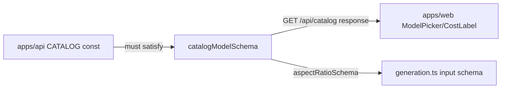

# catalog.ts — AI component doc

> AI-facing sidecar for `catalog.ts`. Created 2026-07-06. Keep this in sync with the code on every change.

## Purpose
Contracts for the curated model catalog: aspect ratios, tiers, and the image/video model shapes (discriminated union on `type`) that `GET /api/catalog` returns and the web Generator renders pickers from.

## What it does (for an AI reader)
- Responsibilities: validate catalog entries; encode the pricing split — image models have flat `credits`, video models have `durationOptions` + `creditsByDuration` (record keyed by stringified seconds).
- Public API / exports: `aspectRatioSchema`/`AspectRatio`, `modelTierSchema`/`ModelTier`, `catalogImageModelSchema`, `catalogVideoModelSchema`, `catalogAudioModelSchema`, `catalogModel3dSchema`, `mesh3dProviderSchema`/`Mesh3dProviderId`, `catalogModelSchema` (union), `CatalogModel`/`CatalogImageModel`/`CatalogVideoModel`/`CatalogAudioModel`/`CatalogModel3d`, `catalogResponseSchema`.
- Inputs → Outputs: unknown JSON → typed catalog model or `{ models: CatalogModel[] }`.
- Side effects: none (pure schemas).

## Dependencies
- Imports / depends on: `zod`.
- Used by: `apps/api` `modules/catalog/catalog.ts` (CATALOG entries must parse; tested in `test/catalog.test.ts`), `apps/web` Generator model/aspect/duration pickers and pricing page; `aspectRatioSchema` reused by `generation.ts`.

## Diagram

## Key decisions / gotchas
- Discriminated union on `type` keeps image-vs-video pricing type-safe: `credits` required for images, `creditsByDuration` for videos.
- `creditsByDuration` keys are strings (JSON object keys); look up with `String(duration)`.
- `air` regex loosely validates Runware AIR ids like `runware:100@1` / `klingai:kling-video@3-pro`; real existence is checked by `verify-catalog.ts` against the live API.

## Key decisions (2026-07-08)
- `supportsSafetyParam?: boolean` on video models: Runware's `safety` task parameter is model-specific — ByteDance/Seedance models reject it with `unsupportedParameter` (verified live). Optional+absent means "accepts safety" so existing entries stay untouched; only exceptions opt out. Additive change — web consumes types only.

## Key decisions (2026-07-09)
- `provider?: 'runware' | 'wan-runpod'` on `catalogVideoModelSchema` (+ exported `videoProviderSchema` / `VideoProviderId`): routes a video model to the API's VideoProvider seam. Optional + absent = Runware, so every existing entry stays valid. Image models have no `provider` (always Runware). Additive — web consumes types only.

## Key decisions (2026-07-09) — CinemaStudio audio
- Added `catalogAudioModelSchema` (`type: 'audio'`) as a third discriminated-union member: flat `credits` (per song/utterance, like image — NOT per-duration like video), `audioKind: 'music' | 'tts'`, optional `voices` (TTS only). Exports `audioKindCatalogSchema`, `AudioKindCatalog`, `CatalogAudioModel`. Audio has no aspect ratio but `catalogBase.aspectRatios` requires ≥1, so audio entries carry a throwaway ratio the service never reads (audio path skips resolution). `resolutionFor` is never called for audio.

## Key decisions (2026-07-11) — Studio3D model3d
- Added `catalogModel3dSchema` (`type: 'model3d'`) as a fourth discriminated-union member, Task 1 of the photo-to-3d-studio plan. Flat `credits` (one mesh per generation) mirrors image/audio, not video's per-duration table. Same "throwaway aspect ratio, service skips resolution" trick as audio — a 3D mesh has no 2D aspect ratio. Adds `pbr?: boolean` so the composer can tell the user whether a model outputs full PBR maps (metallic/roughness/normal) or bare albedo. Adds `mesh3dProviderSchema` (`'runware' | 'comfy-3d'`) + `Mesh3dProviderId`, mirroring `videoProviderSchema`: `'runware'` is the only backend actually built (Runware's `3dInference` task); `'comfy-3d'` is a designed-but-unbuilt self-host seam (ADR D2 — hosted TRELLIS.2 pricing beats running our own GPU for this). Purely additive: existing image/video/audio entries and their consumers are unaffected. This lands the contract only — apps/api and apps/web exhaustive switches over `type` do not yet handle `'model3d'` and will fail typecheck until later Studio3D tasks add that branch; that gap is intentional here, not a regression.

## Commits
- 5c5d863 feat(contracts): shared zod schemas for catalog, generations, credits, user, errors
- 45ce33e feat: design-system v4 (Card/surfaces) + Seedance direct via ByteDance ArkC
