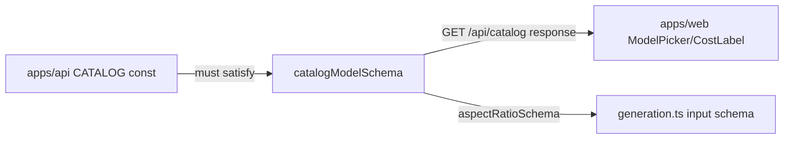

# catalog.ts — AI component doc

> AI-facing sidecar for `catalog.ts`. Created 2026-07-06. Keep this in sync with the code on every change.

## Purpose
Contracts for the curated model catalog: aspect ratios, tiers, and the image/video model shapes (discriminated union on `type`) that `GET /api/catalog` returns and the web Generator renders pickers from.

## What it does (for an AI reader)
- Responsibilities: validate catalog entries; encode the pricing split — image models have flat `credits`, video models have `durationOptions` + `creditsByDuration` (record keyed by stringified seconds).
- Public API / exports: `aspectRatioSchema`/`AspectRatio`, `modelTierSchema`/`ModelTier`, `catalogImageModelSchema`, `catalogVideoModelSchema`, `catalogModelSchema` (union), `CatalogModel`/`CatalogImageModel`/`CatalogVideoModel`, `catalogResponseSchema`.
- Inputs → Outputs: unknown JSON → typed catalog model or `{ models: CatalogModel[] }`.
- Side effects: none (pure schemas).

## Dependencies
- Imports / depends on: `zod`.
- Used by: `apps/api` `modules/catalog/catalog.ts` (CATALOG entries must parse; tested in `test/catalog.test.ts`), `apps/web` Generator model/aspect/duration pickers and pricing page; `aspectRatioSchema` reused by `generation.ts`.

## Diagram

## Key decisions / gotchas
- Discriminated union on `type` keeps image-vs-video pricing type-safe: `credits` required for images, `creditsByDuration` for videos.
- `creditsByDuration` keys are strings (JSON object keys); look up with `String(duration)`.
- `air` regex loosely validates Runware AIR ids like `runware:100@1` / `klingai:kling-video@3-pro`; real existence is checked by `verify-catalog.ts` against the live API.

## Commits
- 5c5d863 feat(contracts): shared zod schemas for catalog, generations, credits, user, errors
